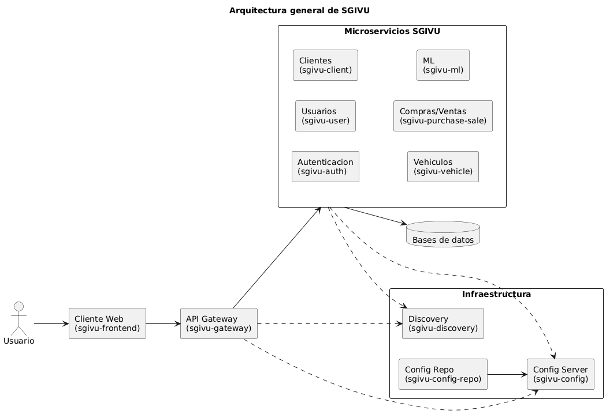

# SGIVU

## Descripción

Documentación central del sistema SGIVU (backend, frontend, ML e infraestructura) con guías de arquitectura, orquestación y scripts auxiliares.

## Arquitectura

## Diagramas

- [Pipeline de construcción](docs/diagrams/img/02-build-pipeline.png)

- [Flujo BFF y Refresh Token](docs/diagrams/img/03-bff-refresh-token-flow.png)

## Tecnologías

- Backend: Spring Boot, Spring Cloud, PostgreSQL, Redis.
- Frontend: Angular.
- ML: FastAPI, scikit-learn.
- Infraestructura: Docker, Docker Compose, Nginx, AWS.
- Observabilidad: Actuator, Micrometer, Zipkin.

## Configuración

- Configuración centralizada en `sgivu-config` y repositorio Git de configuración.
- Soporte para perfil `native` en `sgivu-config` para cargar configuraciones locales sin necesidad de Git.
- Variables de entorno base en `infra/compose/sgivu-docker-compose/.env.example`.
- Versiones documentadas validadas con `scripts/check-readme-boot-version.sh`.

## Ejecución Local

- Stack completo con Docker Compose: `infra/compose/sgivu-docker-compose/run.bash --dev`.
- Alternativa: ejecutar cada servicio siguiendo su README.

## Endpoints Principales

- Gateway: `http://localhost:8080`
- Auth: `http://localhost:9000`
- Config: `http://localhost:8888`
- Discovery: `http://localhost:8761`
- Frontend: `http://localhost:4200`
- ML: `http://localhost:8000`
- Zipkin (opcional): `http://localhost:9411`

## Seguridad

- **Patrón BFF (Backend For Frontend):** Implementado vía `sgivu-gateway`, que actúa como BFF encargado de almacenar y servir el `access_token` y el `refresh_token` necesarios para la aplicación Angular. Aunque los tokens son creados por `sgivu-auth`, el gateway centraliza su gestión.
- OAuth 2.1/OIDC con JWT emitidos por `sgivu-auth`.
- Claves internas para comunicación service-to-service.
- Nunca versionar secretos ni `.env` reales.

## Redis

Redis se usa **exclusivamente en `sgivu-gateway`** para persistir sesiones HTTP (patrón BFF). El gateway almacena en la sesión web los tokens OAuth2 del usuario y respalda dicha sesión en Redis, lo que permite escalar el gateway horizontalmente sin perder estado de sesión.

- **Dependencias**: `spring-session-data-redis` y `spring-boot-starter-data-redis-reactive` en `sgivu-gateway`.
- **Configuración**: `sgivu-config-repo/sgivu-gateway.yml` define `spring.session.store-type: redis`, namespace `spring:session:sgivu-gateway` y conexión vía `${REDIS_HOST}`, `${REDIS_PORT}`, `${REDIS_PASSWORD}`.
- **Cookie de sesión**: `RedisSessionConfig.java` configura la cookie `SESSION` con `HttpOnly`, `SameSite=Lax` y `Path=/`.
- **Docker**: Servicio `sgivu-redis` (imagen `redis:7`) con autenticación por contraseña y volumen persistente `redis-data`.
- **Variables de entorno**: `REDIS_HOST` (default `sgivu-redis`), `REDIS_PORT` (default `6379`), `REDIS_PASSWORD` (requerida).
- **No se usa** para rate limiting, caché ni operaciones directas con `RedisTemplate`.

## Servicios y Componentes

### Backend

- [sgivu-auth](apps/backend/sgivu-auth/README.md) — Servicio de autenticación y autorización (OAuth 2.1/OIDC, JWT).
- [sgivu-gateway](apps/backend/sgivu-gateway/README.md) — Gateway de API con enrutamiento y rate limiting (actúa como BFF para tokens).
- [sgivu-config](apps/backend/sgivu-config/README.md) — Servidor de configuración centralizada.
- [sgivu-discovery](apps/backend/sgivu-discovery/README.md) — Registro y descubrimiento de servicios (Eureka).
- [sgivu-user](apps/backend/sgivu-user/README.md) — Servicio de gestión de usuarios.
- [sgivu-vehicle](apps/backend/sgivu-vehicle/README.md) — Servicio de gestión de vehículos.
- [sgivu-purchase-sale](apps/backend/sgivu-purchase-sale/README.md) — Servicio de compra-venta.
- [sgivu-client](apps/backend/sgivu-client/README.md) — Servicio de gestión de clientes.

### Frontend

- [sgivu-frontend](apps/frontend/sgivu-frontend/README.md) — Aplicación Angular.

### Machine Learning

- [sgivu-ml](apps/ml/sgivu-ml/README.md) — Servicio de ML con FastAPI.

### Infraestructura

- [sgivu-docker-compose](infra/compose/sgivu-docker-compose/README.md) — Orquestación local con Docker Compose.
- [sgivu-config-repo](https://github.com/stevenrq/sgivu-config-repo/blob/main/README.md) — Repositorio centralizado de configuración para todos los servicios (Git-based Config Server).

## Dockerización

- Cada servicio cuenta con `Dockerfile` y scripts `build-image.bash` cuando aplica.
- Stack integrado vía Docker Compose en `infra/compose/sgivu-docker-compose`.

## Build y Push Docker

- Orquestador: `infra/compose/sgivu-docker-compose/build-and-push-images.bash`.
- Servicios individuales: `apps/**/build-image.bash` cuando existe.

## Despliegue

- Infra sugerida: VPC privada con EC2/ECS/EKS, RDS y ALB.
- Exponer públicamente solo el gateway; el resto en red interna.

### Nginx (Producción)

Nginx actúa como único punto de entrada público (ver `infra/nginx/sites-available/default.conf`):

- **Auth Server** (puerto 9000): `/login`, `/oauth2/*`, `/.well-known/*` — flujos OIDC directos, sin pasar por Gateway.
- **Gateway** (puerto 8080): `/v1/*`, `/docs/*`, `/auth/session` — APIs de negocio y BFF.
- **Frontend**: S3 como fallback catch-all para la SPA Angular.

Esta separación permite escalar Auth y Gateway independientemente y simplifica reglas de firewall (solo 80/443 expuestos).

## Monitoreo

- Actuator en servicios Spring y health checks en FastAPI.
- Trazas y métricas vía Zipkin/Prometheus si están habilitados.

## Solución de Problemas

- Puertos ocupados: revisa mapeos en Compose y detén procesos locales.
- Config Server inaccesible: valida `SPRING_CONFIG_IMPORT` o `SPRING_CLOUD_CONFIG_URI`.
- Mismatch de versiones: ejecuta `./scripts/check-readme-boot-version.sh`.

## Contribuciones

1. Fork → branch → PR
2. Añadir tests para cambios funcionales
