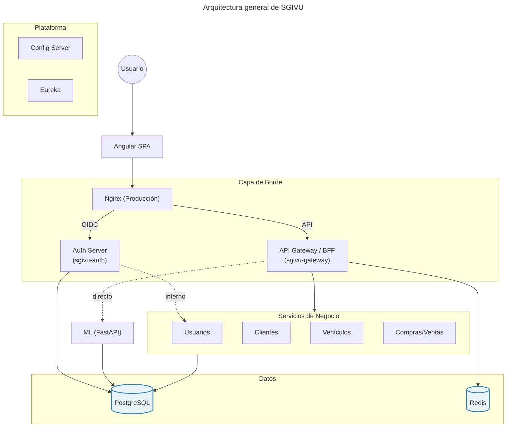

# SGIVU

## Descripción

Documentación central del sistema SGIVU (backend, frontend, ML e infraestructura) con guías de arquitectura, orquestación y scripts auxiliares.

## Tecnologías

- Backend: Spring Boot, Spring Cloud, PostgreSQL, Redis.
- Frontend: Angular.
- ML: FastAPI, scikit-learn.
- Infraestructura: Docker, Docker Compose, Nginx, AWS.
- Observabilidad: Actuator, Micrometer.

## Arquitectura


```mermaid
---
title: Arquitectura general de SGIVU
id: 057930b9-c967-4950-84d4-16f589829c2c
---
flowchart TB
    usuario((Usuario))

    subgraph edge ["Capa de Borde"]
        nginx["Nginx (Producción)"]
        gateway["API Gateway / BFF<br>(sgivu-gateway)"]
        auth["Auth Server<br>(sgivu-auth)"]
    end

    subgraph services ["Servicios de Negocio"]
        direction LR
        user["Usuarios"]
        client["Clientes"]
        vehicle["Vehículos"]
        purchase_sale["Compras/Ventas"]
    end

    ml["ML (FastAPI)"]

    subgraph data ["Datos"]
        direction LR
        postgres[("PostgreSQL")]
        redis[("Redis")]
    end

    subgraph platform ["Plataforma"]
        direction LR
        config["Config Server"]
        discovery["Eureka"]
    end

    usuario --> spa["Angular SPA"]
    spa --> nginx
    nginx -- "OIDC" --> auth
    nginx -- "API" --> gateway

    gateway --> services
    gateway -. "directo" .-> ml
    gateway --> redis
    auth -. "interno" .-> user

    services & auth & ml --> postgres

    classDef db fill:#e8f4f8,stroke:#2b7fb3,stroke-width:2px;
    class postgres,redis db;
```

> **Nota:** Cada microservicio posee su propio esquema en PostgreSQL. Redis persiste sesiones HTTP del Gateway (patrón BFF). Todos los servicios se registran en Eureka y obtienen configuración de Config Server.

## Documentación

La documentación técnica completa del proyecto está construida con Mintlify y se encuentra en el directorio `docs/`.

### Acceso Local

Para ejecutar la documentación localmente:

```bash
cd docs
npm i -g mint
mint dev
```

La documentación estará disponible en `http://localhost:3000`.

### Documentación en Producción

La documentación desplegada estará disponible en: [https://sgivu.mintlify.app](https://sgivu.mintlify.app)

## Configuración

- Configuración centralizada en `sgivu-config` y repositorio Git de configuración.
- Soporte para perfil `native` en `sgivu-config` para cargar configuraciones locales sin necesidad de Git.
- Variables de entorno base en `infra/compose/sgivu-docker-compose/.env.example`.

## Flujo de Desarrollo

El punto de entrada único es el `Makefile` raíz. Ver todos los comandos con `make help`.

### Prerrequisitos

- Linux — en Windows, trabajar dentro de **WSL**
- Docker + Docker Compose
- JDK 25 y `make` + `gh` (`sudo apt install make gh`)
- `uv` y `pre-commit` (los instala `make setup`)

### Primer uso

```bash
make setup   # instala uv/pre-commit, hooks de git, venv de sgivu-ml y .env.dev
```

### Comandos frecuentes

```bash
make dev                        # infra en Docker + apps en host con hot-reload
make dev-status                 # estado de las apps en host
make dev-down                   # apaga todo
make up                         # stack completo dockerizado (alternativa a dev)
make test                       # tests de todos los servicios
make test SERVICE=sgivu-user    # tests de un servicio
make lint / make format         # Spotless (Java) + black/pylint (Python)
make logs SERVICE=sgivu-user    # logs de un contenedor
make db-shell DB=user           # psql a una base de datos
make deploy                     # despliega a EC2 (vía GitHub Actions)
```

Los scripts de orquestación están en `infra/compose/sgivu-docker-compose/scripts/` (el Makefile delega en ellos); consulte su `README.md` para parámetros avanzados.

### Calidad de código

- **pre-commit** formatea/valida en cada commit: black + pylint (Python), Spotless con google-java-format (Java), chequeos genéricos (YAML, llaves privadas, archivos grandes).
- Saltar un hook puntualmente: `SKIP=spotless-java git commit ...`
- El commit de formateo masivo inicial está listado en `.git-blame-ignore-revs`; configure `git config blame.ignoreRevsFile .git-blame-ignore-revs` para que `git blame` lo ignore.

## Endpoints Principales

- Gateway: `http://localhost:8080`
- Auth: `http://localhost:9000`
- Config: `http://localhost:8888`
- Discovery: `http://localhost:8761`
- Frontend: `http://localhost:4200`
- ML: `http://localhost:8000`

## Seguridad

- **Patrón BFF (Backend For Frontend):** Implementado vía `sgivu-gateway`, que actúa como BFF encargado de almacenar y servir el `access_token` y el `refresh_token` necesarios para la aplicación Angular. Aunque los tokens son creados por `sgivu-auth`, el gateway centraliza su gestión.
- OAuth 2.1/OIDC con JWT emitidos por `sgivu-auth`.
- Claves internas para comunicación service-to-service.
- Nunca versionar secretos ni `.env` reales.

## Redis

Redis se usa en dos servicios, con namespaces independientes:

- **`sgivu-gateway`** — Persistencia de sesiones HTTP (patrón BFF). Tokens OAuth2 (`access_token`, `refresh_token`) y `SecurityContext` se almacenan en Redis para escalar el gateway horizontalmente sin perder sesiones. Namespace: `spring:session:sgivu-gateway`. TTL deslizante 7 días.
- **`sgivu-purchase-sale`** — Caché del dashboard (`dashboard-summary`, TTL 60 s). Definido en `CacheConfig.java`, invalidado con `@CacheEvict` en create/update/delete de contratos. Namespace: `sgivu:cache:purchase-sale:`.

Ambos comparten el mismo contenedor Redis pero no se solapan.

- **Configuración**: el config repo define la conexión en `sgivu-gateway-{dev,prod}.yml` y `sgivu-purchase-sale-{dev,prod}.yml` usando los placeholders `${DEV_REDIS_HOST}` / `${PROD_REDIS_HOST}` (y equivalentes para puerto y contraseña).
- **Cookie de sesión** (gateway): `RedisSessionConfig.java` configura `SESSION` con `HttpOnly`, `SameSite=Lax`, `Path=/`.
- **Keep-alive**: Angular hace ping a `/auth/session` cada 20 min para mantener vivo el TTL deslizante.
- **Docker**: Servicio `sgivu-redis` (imagen `redis:7`) con autenticación por contraseña y volumen `redis-data`.
- **Variables de entorno**: `DEV_REDIS_HOST` / `PROD_REDIS_HOST` (default `sgivu-redis`), `DEV_REDIS_PORT` / `PROD_REDIS_PORT` (default `6379`), `DEV_REDIS_PASSWORD` / `PROD_REDIS_PASSWORD` (requerida).
- **No se usa** para rate limiting ni operaciones directas con `RedisTemplate`.

## Servicios y Componentes

### Backend

- [sgivu-auth](apps/backend/sgivu-auth/README.md) — Servicio de autenticación y autorización (OAuth 2.1/OIDC, JWT).
- [sgivu-gateway](apps/backend/sgivu-gateway/README.md) — API Gateway (Spring Cloud Gateway, WebFlux) y BFF para la SPA: gestiona la sesión OAuth2, hace token relay y aplica circuit breakers a los servicios downstream.
- [sgivu-config](apps/backend/sgivu-config/README.md) — Servidor de configuración centralizada.
- [sgivu-discovery](apps/backend/sgivu-discovery/README.md) — Registro y descubrimiento de servicios (Eureka).
- [sgivu-user](apps/backend/sgivu-user/README.md) — Servicio de gestión de usuarios.
- [sgivu-vehicle](apps/backend/sgivu-vehicle/README.md) — Servicio de gestión de vehículos.
- [sgivu-purchase-sale](apps/backend/sgivu-purchase-sale/README.md) — Servicio de compra-venta.
- [sgivu-client](apps/backend/sgivu-client/README.md) — Servicio de gestión de clientes.

### Frontend

- [sgivu-frontend](https://github.com/stevenrq/sgivu-frontend) — Aplicación Angular (repositorio independiente, desplegado en un hosting estático en la nube).

### Machine Learning

- [sgivu-ml](apps/ml/sgivu-ml/README.md) — Servicio de ML con FastAPI.

### Infraestructura

- [sgivu-docker-compose](infra/compose/sgivu-docker-compose/README.md) — Orquestación local con Docker Compose.
- [sgivu-config-repo](https://github.com/stevenrq/sgivu-config-repo/blob/main/README.md) — Repositorio centralizado de configuración para todos los servicios (Git-based Config Server).

## Dockerización

- Cada servicio cuenta con `Dockerfile` y scripts `build-image.sh` cuando aplica.
- Stack integrado vía Docker Compose en `infra/compose/sgivu-docker-compose`.

## Build y Push Docker

- Los `Dockerfile` de los servicios Java son **multi-stage**: el build de Maven ocurre dentro de Docker, por lo que `docker build` (o `make image SERVICE=...`) es autocontenido.
- Las imágenes se etiquetan con el SHA corto de git + `latest` desde el pipeline de deploy. Los compose files las referencian como `stevenrq/<servicio>:${TAG:-latest}`.
- Build local de una imagen: `make image SERVICE=sgivu-user` (etiqueta `latest`).
- Scripts legacy (`build-and-push-images.sh`, `build-image.sh`) se mantienen como fallback y ahora etiquetan `latest`.

## CI/CD (GitHub Actions)

- **CI** (`.github/workflows/ci.yml`): en cada push/PR detecta qué servicios cambiaron (paths-filter) y solo para esos ejecuta Spotless + `mvn verify` (Java) o black + pylint + pytest (Python). También valida la sintaxis de los compose files cuando cambia `infra/`.
- **CD** (`.github/workflows/deploy.yml`): **manual**. Construye las 9 imágenes, las publica en Docker Hub (`<sha-corto>` y `latest`) y por SSH actualiza `TAG=` en el `.env` de EC2 y recrea los contenedores, con smoke check del gateway.

```bash
make deploy                              # despliegue completo
make deploy SERVICES=sgivu-user,sgivu-ml # reinicia solo esos servicios
make deploy TAG=abc1234                  # rollback a un tag ya publicado (sin build)
make deploy-watch                        # seguir el run en vivo
```

Secrets requeridos en GitHub (`gh secret set <NOMBRE>`): `DOCKERHUB_USERNAME`, `DOCKERHUB_TOKEN`, `EC2_HOST`, `EC2_USER`, `EC2_SSH_KEY`, `AUTH_KEYSTORE_B64`.

## Despliegue

- Despliegue actual: **EC2 única** con Docker Compose (`infra/compose/sgivu-docker-compose/docker-compose.yml`) y Nginx en el host.
- Exponer públicamente solo Nginx (80/443) y, por Nginx, enrutar a Gateway, Auth y al bucket S3 de la SPA. El resto de servicios queda en la red interna del compose.
- El despliegue normal es vía `make deploy` (GitHub Actions). `copy-from-local-to-remote.sh` queda como fallback de emergencia (ya no sincroniza `.env*` ni `*.pem`).

### Nginx (Producción)

Nginx actúa como único punto de entrada público (ver `infra/nginx/sites-available/default.conf`):

- **Auth Server** (puerto 9000): `/login`, `/oauth2/*`, `/.well-known/*` — flujos OIDC directos, sin pasar por Gateway.
- **Gateway** (puerto 8080): `/v1/*`, `/docs/*`, `/auth/session` — APIs de negocio y BFF.
- **Frontend**: S3 como fallback catch-all para la SPA Angular.

Esta separación permite escalar Auth y Gateway independientemente y simplifica reglas de firewall (solo 80/443 expuestos).

## Monitoreo

- Actuator en servicios Spring y health checks en FastAPI.

## Solución de Problemas

- Puertos ocupados: revisa mapeos en Compose y detén procesos locales.
- Config Server inaccesible: valida `SPRING_CONFIG_IMPORT` o `SPRING_CLOUD_CONFIG_URI`.

## Contribuciones

1. Fork → branch → PR
2. Añadir tests para cambios funcionales
