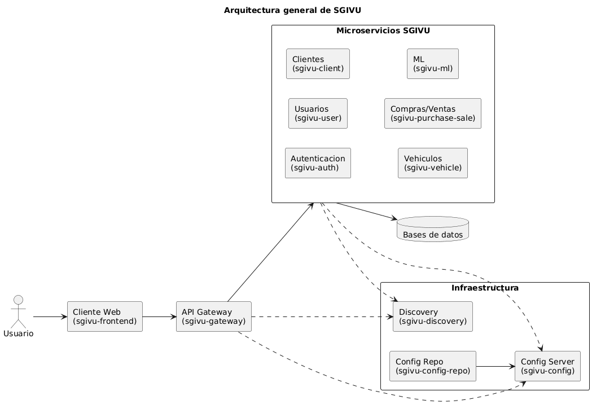

# SGIVU - documentación del sistema

## Descripción

Documentación central del sistema SGIVU (backend, frontend, ML e infraestructura) con guías de contribución, arquitectura, orquestación y scripts auxiliares.

## Arquitectura y Rol

- Índice general de documentación para todos los componentes del sistema.
- Referencia a diagramas PlantUML y scripts de validación.
- Enlaces a documentación específica: `infra/compose/sgivu-docker-compose/README.md`, `apps/backend/*/README.md`, `apps/frontend/sgivu-frontend/README.md`, `apps/ml/sgivu-ml/README.md`.

## Tecnologías

- Backend: Spring Boot, Spring Cloud, PostgreSQL, Redis.
- Frontend: Angular.
- ML: FastAPI, scikit-learn.
- Infraestructura: Docker, Docker Compose, AWS.
- Observabilidad: Actuator, Micrometer, Zipkin.

## Configuración

- Configuración centralizada en `sgivu-config` y repositorio Git de configuración.
- Soporte para perfil `native` en `sgivu-config` para cargar configuraciones locales sin necesidad de Git.
- Variables de entorno base en `infra/compose/sgivu-docker-compose/.env.example`.
- Versiones documentadas validadas con `scripts/check-readme-boot-version.sh`.

## Ejecución Local

- Stack completo con Docker Compose: `infra/compose/sgivu-docker-compose/run.bash --dev`.
- Alternativa: ejecutar cada servicio siguiendo su README.
- Validar versiones: `./scripts/check-readme-boot-version.sh`.

## Endpoints Principales

- Gateway: `http://localhost:8080`
- Auth: `http://localhost:9000`
- Config: `http://localhost:8888`
- Discovery: `http://localhost:8761`
- Frontend: `http://localhost:4200`
- ML: `http://localhost:8000`
- Zipkin (opcional): `http://localhost:9411`

## Seguridad

- **Patrón BFF (Backend For Frontend):** Implementado vía `sgivu-gateway`, que actúa como BFF encargado de almacenar y servir el `access_token` y el `refresh_token` necesarios para la aplicación Angular. Aunque los tokens son creados por `sgivu-auth`, el gateway centraliza su gestión.
- OAuth 2.1/OIDC con JWT emitidos por `sgivu-auth`.
- Claves internas para comunicación service-to-service.
- Nunca versionar secretos ni `.env` reales.

## Servicios y Componentes

### Backend

- [sgivu-auth](apps/backend/sgivu-auth/README.md) — Servicio de autenticación y autorización (OAuth 2.1/OIDC, JWT).
- [sgivu-gateway](apps/backend/sgivu-gateway/README.md) — Gateway de API con enrutamiento y rate limiting (actúa como BFF para tokens).
- [sgivu-config](apps/backend/sgivu-config/README.md) — Servidor de configuración centralizada.
- [sgivu-discovery](apps/backend/sgivu-discovery/README.md) — Registro y descubrimiento de servicios (Eureka).
- [sgivu-user](apps/backend/sgivu-user/README.md) — Servicio de gestión de usuarios.
- [sgivu-vehicle](apps/backend/sgivu-vehicle/README.md) — Servicio de gestión de vehículos.
- [sgivu-purchase-sale](apps/backend/sgivu-purchase-sale/README.md) — Servicio de compra-venta.
- [sgivu-client](apps/backend/sgivu-client/README.md) — Servicio de gestión de clientes.

### Frontend

- [sgivu-frontend](apps/frontend/sgivu-frontend/README.md) — Aplicación Angular.

### Machine Learning

- [sgivu-ml](apps/ml/sgivu-ml/README.md) — Servicio de ML con FastAPI.

### Infraestructura

- [sgivu-docker-compose](infra/compose/sgivu-docker-compose/README.md) — Orquestación local con Docker Compose.
- [sgivu-config-repo](https://github.com/stevenrq/sgivu-config-repo/blob/main/README.md) — Repositorio centralizado de configuración para todos los servicios (Git-based Config Server).

## Dependencias

## Dockerización

- Cada servicio cuenta con `Dockerfile` y scripts `build-image.bash` cuando aplica.
- Stack integrado vía Docker Compose en `infra/compose/sgivu-docker-compose`.

## Build y Push Docker

- Orquestador: `infra/compose/sgivu-docker-compose/build-and-push-images.bash`.
- Servicios individuales: `apps/**/build-image.bash` cuando existe.

## Despliegue

- Infra sugerida: VPC privada con EC2/ECS/EKS, RDS y ALB.
- Exponer públicamente solo el gateway; el resto en red interna.

## Monitoreo

- Actuator en servicios Spring y health checks en FastAPI.
- Trazas y métricas vía Zipkin/Prometheus si están habilitados.

## Troubleshooting

- Puertos ocupados: revisa mapeos en Compose y detén procesos locales.
- Config Server inaccesible: valida `SPRING_CONFIG_IMPORT` o `SPRING_CLOUD_CONFIG_URI`.
- Mismatch de versiones: ejecuta `./scripts/check-readme-boot-version.sh`.

## Buenas Prácticas y Convenciones

- Código en inglés; documentación en español; commits en inglés con Conventional Commits.
- Mantener README y diagramas sincronizados con cambios de puertos o flujos.

## Diagramas

- Arquitectura general: `docs/diagrams/01-system-architecture.puml`.
- Pipeline de build: `docs/diagrams/02-build-pipeline.puml`.
- Flujo BFF y Refresh Token: `docs/diagrams/03-bff-refresh-token-flow.puml`.

## Autor

- Steven Ricardo Quiñones (2025)
