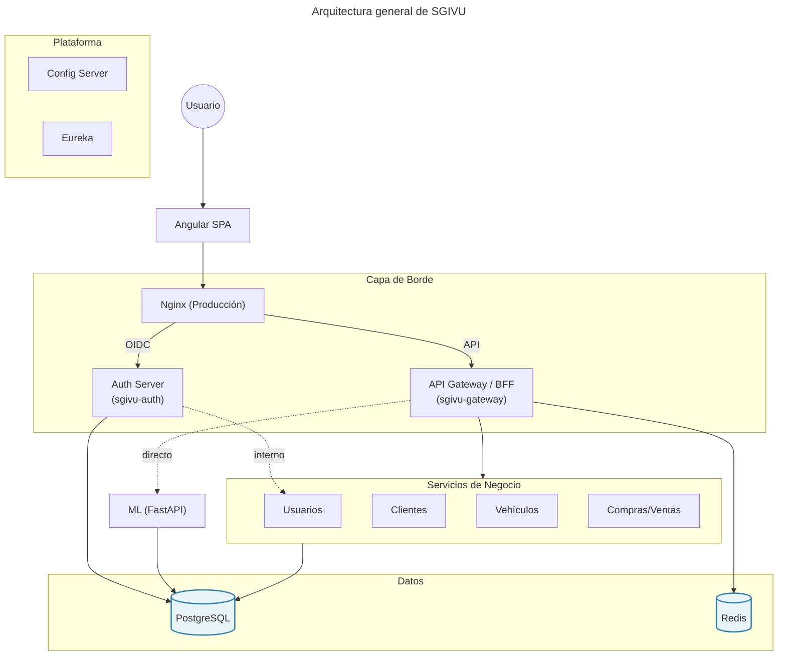
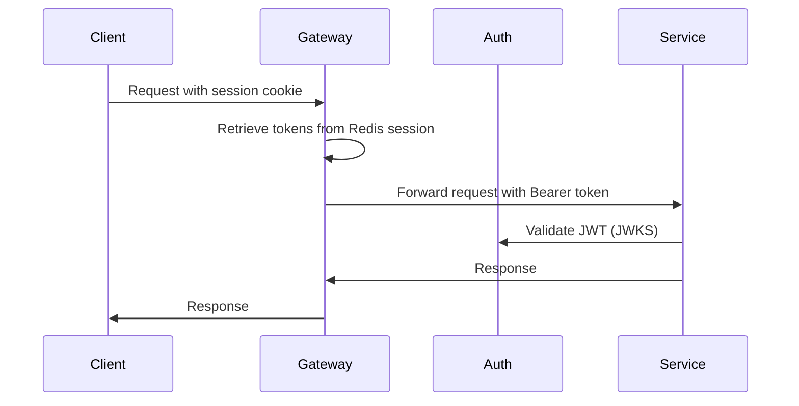
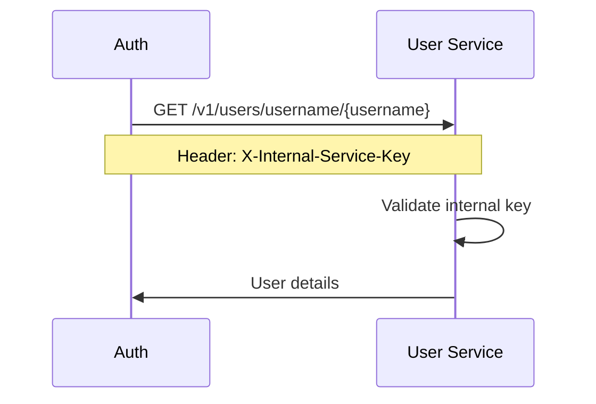

# Arquitectura del Sistema

SGIVU está construido sobre una arquitectura moderna de microservicios nativa en la nube que aprovecha Spring Cloud, descubrimiento de servicios, configuración centralizada y OAuth 2.1/OIDC para la seguridad. La plataforma está diseñada para escalabilidad horizontal, resiliencia y observabilidad.

## Descripción General de la Arquitectura

<Note>
El siguiente diagrama ilustra la arquitectura completa del sistema.
</Note>



## Capas Arquitectónicas

### 1. Capa Pública

**Nginx como Proxy Inverso**

Nginx sirve como punto de entrada público único, enrutando el tráfico según patrones de URL:

- **Servidor de Autorización** (puerto 9000): `/login`, `/oauth2/*`, `/.well-known/*` — Flujos OIDC
- **API Gateway** (puerto 8080): `/v1/*`, `/docs/*`, `/auth/session` — APIs de negocio y BFF
- **Frontend**: S3 como catch-all para la SPA Angular

<Info>
Esta separación permite escalar de forma independiente los servicios de Auth y Gateway, y simplifica las reglas de firewall (solo los puertos 80/443 expuestos).
</Info>

### 2. Capa de Borde

#### API Gateway (sgivu-gateway)

**Puerto**: 8080 | **Tecnología**: Spring Cloud Gateway (WebFlux)

El gateway implementa el patrón **BFF (Backend for Frontend)** y cumple múltiples roles:

<CardGroup cols={2}>
  <Card title="Proxy de Autenticación" icon="shield">
    - Cliente OAuth2 para flujo PKCE
    - Gestión de sesiones vía Redis
    - Relay de tokens a servicios backend
    - Endpoint `/auth/session` para la UI
  </Card>
  <Card title="API Gateway" icon="door-open">
    - Proxy de rutas a microservicios
    - Circuit breakers (Resilience4j)
    - Filtros globales (trazado, ID de usuario)
    - Manejo de fallbacks
  </Card>
</CardGroup>

**Componentes Clave:**

- **Almacenamiento de Sesiones en Redis**: Permite escalado horizontal sin pérdida de sesiones
- **Filtro de Relay de Tokens**: Reenvía automáticamente los tokens OAuth2 a los servicios downstream
- **Circuit Breaker**: Previene fallos en cascada con rutas de fallback
- **Filtros Globales**:
  - `AddUserIdHeaderGlobalFilter`: Inyecta `X-User-ID` desde los claims del JWT

**Ejemplo de Configuración de Rutas:**

```yaml
spring:
  cloud:
    gateway:
      routes:
        - id: vehicle-service
          uri: lb://sgivu-vehicle
          predicates:
            - Path=/v1/vehicles/**
          filters:
            - TokenRelay=
            - CircuitBreaker=name:vehicleCircuitBreaker,fallbackuri:forward:/fallback/vehicle
```

#### Servidor de Autorización (sgivu-auth)

**Puerto**: 9000 | **Tecnología**: Spring Authorization Server

Implementa OAuth 2.1 / OpenID Connect con emisión de tokens JWT:

- **Tipos de Token**: Tokens de acceso (JWT), Tokens de actualización
- **Flujos**: Authorization Code con PKCE
- **Firma de Tokens**: Keystore JKS con RS256
- **Almacenamiento**: PostgreSQL para clientes, autorizaciones, consentimientos y sesiones
- **Validación de Usuarios**: Delega a `sgivu-user` vía API interna

**Características de Seguridad:**

<Steps>
  <Step title="Registro de Clientes">
    Clientes por defecto registrados al iniciar:
    - `sgivu-gateway` (aplicación principal)
    - `postman-client` (pruebas)
    - `oauth2-debugger-client` (depuración)
  </Step>
  <Step title="Claims del JWT">
    Los tokens incluyen claims personalizados:
    - `sub`: ID del usuario
    - `username`: Nombre de inicio de sesión
    - `rolesAndPermissions`: Array de permisos
    - `isAdmin`: Indicador booleano
  </Step>
  <Step title="Validación de Tokens">
    Endpoint JWKS en `/oauth2/jwks` para distribución de clave pública
  </Step>
</Steps>

<Warning>
El archivo de keystore (`keystore.jks`) debe proporcionarse vía gestor de secretos en producción. Los secretos de cliente por defecto son solo para desarrollo.
</Warning>

### 3. Capa de Plataforma

#### Servidor de Configuración (sgivu-config)

**Puerto**: 8888 | **Tecnología**: Spring Cloud Config Server

Gestión de configuración centralizada que soporta dos modos:

**Modo Git (Producción)**
```yaml
spring:
  cloud:
    config:
      server:
        git:
          uri: https://github.com/stevenrq/sgivu-config-repo.git
          default-label: main
```

**Modo Nativo (Desarrollo)**
```yaml
spring:
  profiles:
    active: native
  cloud:
    config:
      server:
        native:
          search-locations: file:/config-repo
```

**Estructura del Repositorio de Configuración:**

Cada microservicio tiene hasta tres archivos siguiendo la resolución de Spring Cloud Config:

- `{servicio}.yml` — configuración compartida/por defecto
- `{servicio}-dev.yml` — sobrescrituras para el perfil de desarrollo
- `{servicio}-prod.yml` — sobrescrituras para el perfil de producción

```
sgivu-config-repo/
├── sgivu-discovery.yml / -dev.yml / -prod.yml
├── sgivu-gateway.yml / -dev.yml / -prod.yml
├── sgivu-auth.yml / -dev.yml / -prod.yml
├── sgivu-user.yml / -dev.yml / -prod.yml
├── sgivu-client.yml / -dev.yml / -prod.yml
├── sgivu-vehicle.yml / -dev.yml / -prod.yml
└── sgivu-purchase-sale.yml / -dev.yml / -prod.yml
```

<Info>
No existe un `application.yml` global; las valores compartidos viven en cada archivo base por servicio. Los archivos de perfil solo sobrescriben lo que difiere del base.
</Info>

#### Descubrimiento de Servicios (sgivu-discovery)

**Puerto**: 8761 | **Tecnología**: Netflix Eureka Server

Proporciona registro y descubrimiento de servicios:

- **Verificaciones de Salud**: Heartbeats periódicos desde los servicios registrados
- **Balanceo de Carga**: Balanceo de carga del lado del cliente vía `LoadBalancerClient`
- **Resolución de Servicios**: Servicios referenciados por URIs `lb://nombre-servicio`
- **Dashboard**: Interfaz web en `http://localhost:8761` para monitoreo

**Ejemplo de Configuración del Cliente:**
```yaml
eureka:
  client:
    service-url:
      defaultZone: http://sgivu-discovery:8761/eureka/
  instance:
    prefer-ip-address: true
    instance-id: ${spring.application.name}:${random.value}
```

### 4. Capa de Servicios de Negocio

#### Servicio de Usuarios (sgivu-user)

**Tecnología**: Spring Boot 4.0.1, Spring Data JPA, PostgreSQL

**Responsabilidades:**
- CRUD de usuarios con validación de fortaleza de contraseña
- Gestión de roles y permisos
- Gestión de entidades de persona
- API interna para el Servidor de Autorización (`/v1/users/username/{username}`, autorizada por `X-Internal-Service-Key`)

**Esquema de Base de Datos:**
- `users` — Credenciales y estado de usuarios
- `persons` — Información personal
- `roles` — Definiciones de roles
- `permissions` — Permisos granulares
- `users_roles`, `roles_permissions` — Relaciones muchos a muchos

**Modelo de Permisos:**
```
user:create, user:read, user:update, user:delete
person:create, person:read, person:update, person:delete
role:create, role:read, role:update, role:delete
permission:read
```

#### Servicio de Vehículos (sgivu-vehicle)

**Tecnología**: Spring Boot 4.0.1, AWS SDK S3

**Responsabilidades:**
- Gestión del catálogo de vehículos (automóviles, motocicletas)
- Búsqueda avanzada con múltiples criterios
- Gestión de estados (disponible/no disponible)
- Gestión de imágenes vía AWS S3 con URLs prefirmadas

**Flujo de Integración con S3:**

<Steps>
  <Step title="Solicitar URL de Carga">
    El cliente solicita una URL prefirmada al backend
    ```bash
    POST /v1/vehicles/{vehicleId}/images/presigned-upload
    ```
  </Step>
  <Step title="Carga Directa a S3">
    El cliente sube la imagen directamente a S3 usando la URL prefirmada
  </Step>
  <Step title="Confirmar Carga">
    El cliente notifica al backend para registrar los metadatos de la imagen
    ```bash
    POST /v1/vehicles/{vehicleId}/images/confirm-upload
    ```
  </Step>
</Steps>

**Características de Gestión de Imágenes:**
- Formatos soportados: JPEG, PNG, WebP
- Designación de imagen principal
- Configuración automática de CORS para orígenes permitidos
- Seguimiento de metadatos en PostgreSQL

#### Servicio de Clientes (sgivu-client)

**Tecnología**: Spring Boot 4.0.1, Spring Data JPA

**Responsabilidades:**
- Gestión de clientes (personas y empresas)
- Gestión de direcciones con datos geográficos
- Búsqueda avanzada y filtrado
- Contadores y estadísticas de clientes

**Modelo de Entidades:**
```
clients (abstract)
├── persons (individual clients)
└── companies (corporate clients)
    └── addresses
```

#### Servicio de Compraventa (sgivu-purchase-sale)

**Tecnología**: Spring Boot 4.0.1, OpenPDF, Apache POI

**Responsabilidades:**
- Gestión del ciclo de vida de contratos
- Transacciones de compra y venta
- Seguimiento del estado de contratos
- Generación de informes (PDF, Excel, CSV)
- Integración con los servicios de Usuario, Cliente y Vehículo

**Flujo de Contratos:**
1. Creación del contrato con referencias a cliente, usuario y vehículo
2. Transiciones de estado (borrador → activo → completado/cancelado)
3. Generación de documentos
4. Informes y analíticas

### 5. Capa de Aprendizaje Automático

#### Servicio ML (sgivu-ml)

**Puerto**: 8000 | **Tecnología**: FastAPI, scikit-learn, Python 3.12

**Responsabilidades:**
- Pronóstico y predicción de demanda
- Entrenamiento y reentrenamiento de modelos
- Ingeniería de características
- Versionado y persistencia de modelos

**Endpoints de la API:**

| Endpoint | Método | Descripción |
|----------|--------|-------------|
| `/health` | GET | Verificación de salud |
| `/v1/ml/predict` | POST | Solicitar predicción con características |
| `/v1/ml/predict-with-history` | POST | Predicción con datos históricos para visualización |
| `/v1/ml/retrain` | POST | Ejecutar reentrenamiento del modelo |
| `/v1/ml/actuals` | POST | Registrar valores reales para calibración/monitoreo |
| `/v1/ml/models/latest` | GET | Obtener metadatos del último modelo |
| `/v1/ml/models/latest/feature-importance` | GET | Importancia de features del último modelo |
| `/v1/ml/drift-report` | GET | Reporte de drift del modelo |

**Persistencia de Modelos:**
- Artefactos almacenados vía `joblib`
- Almacenamiento opcional en PostgreSQL para versiones de modelos
- Snapshots de características de entrenamiento
- Registro de predicciones para monitoreo

**Seguridad:**
- Validación de JWT vía descubrimiento OIDC
- Soporte de clave interna entre servicios (`X-Internal-Service-Key`)
- Propagación de tokens desde el Gateway

### 6. Capa de Datos

#### Bases de Datos PostgreSQL

Cada servicio tiene su propia base de datos siguiendo el patrón de **base de datos por servicio**:

```
sgivu_auth_db       — OAuth2 clients, authorizations, sessions
sgivu_user_db       — Users, roles, permissions, persons
sgivu_vehicle_db    — Vehicles, images metadata
sgivu_client_db     — Clients (persons/companies), addresses
sgivu_purchase_sale_db — Purchase/sale contracts
sgivu_ml_db         — ML models, features, predictions
```

**Gestión de Migraciones:**
- Flyway para migraciones de esquema versionadas
- Migraciones en `src/main/resources/db/migration/V{version}__{description}.sql`
- Datos semilla en `R__seed_data.sql` (repetible)

#### Redis

**Propósitos**:
- **Sesiones HTTP** en `sgivu-gateway` (patrón BFF) — namespace `spring:session:sgivu-gateway`.
- **Caché de agregados del dashboard** en `sgivu-purchase-sale` — namespace `sgivu:cache:purchase-sale:`, TTL 60 s, invalidado con `@CacheEvict` en create/update/delete de contratos.

**Configuración (perfil `dev`, en el config repo):**
```yaml
spring:
  data:
    redis:
      host: ${DEV_REDIS_HOST:host.docker.internal}
      port: ${DEV_REDIS_PORT:6379}
      password: ${DEV_REDIS_PASSWORD}
```

En el perfil `prod` se usa el prefijo `PROD_`.

**Cookie de Sesión (gateway):**
- Nombre: `SESSION`
- Atributos: `HttpOnly`, `SameSite=Lax`, `Path=/`
- Permite escalado horizontal sin pérdida de sesiones

<Info>
Redis **no** se usa para rate limiting ni acceso directo con `RedisTemplate`. Solo sesiones (gateway) y caché de agregados (purchase-sale).
</Info>

#### AWS S3

**Propósito**: Almacenamiento de imágenes de vehículos

**Características:**
- URLs prefirmadas para carga/descarga directa del cliente
- Configuración de CORS para orígenes permitidos
- Políticas de bucket para acceso mínimo
- Validación de tipo de imagen (JPEG, PNG, WebP)

## Patrones de Comunicación

### Comunicación Síncrona

**APIs REST con Relay de Tokens OAuth2:**



**Servicio a Servicio (Interno):**



### Descubrimiento de Servicios

Los servicios se comunican usando nombres lógicos resueltos vía Eureka:

```java
// Gateway route configuration
uri: lb://sgivu-vehicle  // Resolved to http://<vehicle-instance-ip>:<port>
```

### Circuit Breaking

Resilience4j proporciona patrones de circuit breaker en el Gateway:

```yaml
resilience4j:
  circuitbreaker:
    instances:
      vehicleCircuitBreaker:
        failure-rate-threshold: 50
        wait-duration-in-open-state: 10s
        sliding-window-size: 10
```

## Observabilidad y Monitoreo

### Verificaciones de Salud

**Spring Boot Actuator:**

```bash
GET /actuator/health
```

**FastAPI (ML Service):**

```bash
GET /health
GET /actuator/health
```

### Métricas

Actuator expone el endpoint `/actuator/metrics` para consulta directa de métricas de JVM y HTTP.

## Arquitectura de Despliegue

### Desarrollo Local

```bash
cd infra/compose/sgivu-docker-compose
docker compose -f docker-compose.dev.yml up -d
```

### Producción (AWS EC2)

El despliegue productivo actual corre sobre **una única instancia EC2** orquestado con Docker Compose. Nginx se instala en el host (no en un contenedor) y actúa como punto de entrada público. La SPA de Angular se sirve estáticamente desde **S3 website hosting** con Nginx como fallback final.

<CardGroup cols={2}>
  <Card title="Red / Borde" icon="network-wired">
    - EC2 única accesible vía nombre público (p.ej. `ec2-...compute-1.amazonaws.com`)
    - Nginx en el host enruta `/login`, `/oauth2/*`, `/.well-known/*` → auth, `/v1/*`, `/auth/session`, `/docs/*` → gateway, `/` → bucket S3 de la SPA
  </Card>
  <Card title="Cómputo" icon="server">
    - Docker Compose (`docker-compose.yml`) levanta los 7 servicios backend + ML + Postgres + Redis
    - Imágenes publicadas en Docker Hub (`stevenrq/sgivu-*:0.1.0`)
  </Card>
  <Card title="Datos" icon="database">
    - PostgreSQL 16 en contenedor (con 6 bases de datos, una por servicio)
    - Redis 7 en contenedor (sesiones del gateway y caché de purchase-sale)
    - S3 para imágenes de vehículos y hosting de la SPA
  </Card>
  <Card title="Seguridad" icon="lock">
    - Security groups restringiendo puertos expuestos (solo 80/443 y los necesarios)
    - Variables sensibles en `.env` (no versionado)
    - Keystore JKS montado como volumen en el contenedor `sgivu-auth`
  </Card>
</CardGroup>

<Note>
Evolucionar a ECS/EKS + RDS + ElastiCache + ALB + WAF + Secrets Manager es una dirección razonable para escalar, pero **no refleja el estado actual**. Mantener esta distinción evita confusión operacional.
</Note>

**Topología actual:**

```
Internet
   |
  EC2 (host) -- Nginx
   |
   +-- sgivu-gateway (contenedor, 8080)
   +-- sgivu-auth    (contenedor, 9000)
   +-- sgivu-user, sgivu-client, sgivu-vehicle, sgivu-purchase-sale (contenedores)
   +-- sgivu-ml      (contenedor, 8000)
   +-- sgivu-config  (contenedor, 8888)
   +-- sgivu-discovery (contenedor, 8761)
   +-- postgres:16   (contenedor)
   +-- redis:7       (contenedor)

S3 website (catch-all fallback desde Nginx) → SPA Angular
S3 bucket                                    → imágenes de vehículos
```

## Pipeline de Construcción

**Proceso de Construcción:**

<Steps>
  <Step title="Construcción Maven (Servicios Java)">
    ```bash
    ./mvnw clean package
    ```
  </Step>
  <Step title="Construcción de Imagen Docker">
    ```bash
    ./build-image.sh          # construye localmente
    ./build-image.sh --push   # construye y publica en Docker Hub
    docker build -t stevenrq/{service}:0.1.0 .
    ```
  </Step>
  <Step title="Publicar en Registro">
    ```bash
    # Orchestrated build and push
    cd infra/compose/sgivu-docker-compose
    ./build-and-push-images.sh
    ```
  </Step>
  <Step title="Desplegar">
    En la EC2 productiva, ejecutar `docker compose pull && docker compose up -d` (o usar `infra/compose/sgivu-docker-compose/rebuild-service.sh` para reconstruir un servicio puntual).
  </Step>
</Steps>

## Consideraciones de Seguridad

### Flujo de Autenticación (Patrón BFF)

**Authorization Code con PKCE:**

1. El usuario inicia sesión desde la app Angular
2. El Gateway redirige al Servidor de Autorización con el challenge PKCE
3. El usuario se autentica
4. El Servidor de Autorización emite tokens (acceso + refresh)
5. El Gateway almacena los tokens en la sesión respaldada por Redis
6. El Gateway emite una cookie de sesión al cliente
7. El cliente incluye la cookie en las solicitudes subsiguientes
8. El Gateway recupera los tokens de la sesión y los retransmite a los servicios

**Renovación de Tokens:**

El Gateway renueva automáticamente los tokens de acceso usando el refresh token cuando expiran.

### Autenticación entre Servicios

**Clave Interna de Servicio:**

```bash
X-Internal-Service-Key: {shared-secret}
```

<Warning>
Nunca expongas la clave interna de servicio públicamente. Almácenala en variables de entorno o en un gestor de secretos.
</Warning>

### Protección de Datos

- **Cifrado en tránsito**: HTTPS/TLS en Nginx (terminación TLS) para toda la comunicación externa
- **Cifrado en reposo**: cifrado del lado del servidor en S3 para imágenes de vehículos
- **Gestión de secretos**: archivos `.env` para desarrollo/producción actual; evolución futura hacia AWS Secrets Manager o HashiCorp Vault
- **Credenciales de base de datos**: nunca en código ni en repositorios Git; se inyectan como variables de entorno (`${VAR_NAME}`) resueltas por el Config Server

## Solución de Problemas

### Problemas Comunes

| Problema | Diagnóstico | Solución |
|----------|-------------|----------|
| Errores 401/403 | Fallo en validación de token | Verificar URL del issuer, endpoint JWKS, claims del token |
| Servicio no registrado en Eureka | Config Server inalcanzable | Verificar `eureka.client.service-url.defaultZone` |
| Pérdida de sesión tras reinicio | Redis no configurado | Verificar conexión a Redis y configuración de sesión |
| Circuit breaker abierto | Servicio downstream fallando | Verificar salud del servicio, logs y rutas de fallback |
| Configuración no carga | Config Server no disponible | Asegurar que `SPRING_CLOUD_CONFIG_URI` sea correcto |

### Comandos de Verificación de Salud

```bash
# Gateway
curl http://localhost:8080/actuator/health

# Auth Server
curl http://localhost:9000/actuator/health

# User Service
curl http://localhost:8081/actuator/health

# Eureka Dashboard
open http://localhost:8761

# Config Server
curl http://localhost:8888/actuator/health
curl http://localhost:8888/sgivu-gateway/dev
```

## Siguientes Pasos

<CardGroup cols={2}>
  <Card title="Funcionalidades" icon="stars" href="/features">
    Explora la documentación detallada de funcionalidades
  </Card>
  <Card title="Referencia API" icon="code" href="/api/auth/oauth2">
    Navega los endpoints y esquemas de las APIs
  </Card>
</CardGroup>
