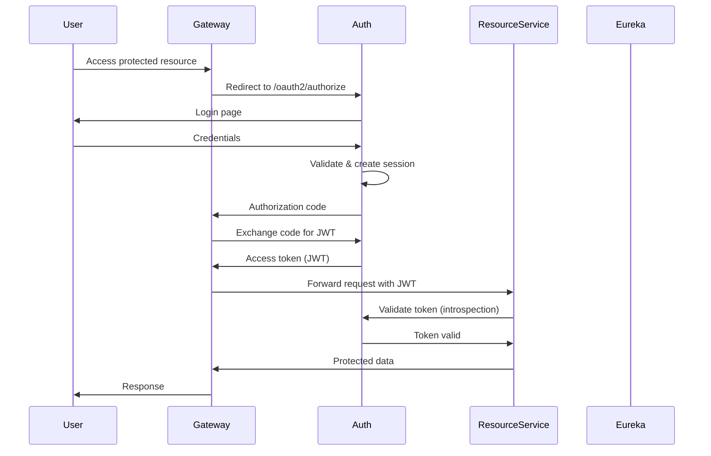

## Arquitectura del Sistema

SGIVU sigue un patrón de arquitectura de microservicios con gestión de configuración centralizada mediante Spring Cloud Config. El sistema consiste en múltiples servicios especializados que se comunican a través de una combinación de descubrimiento de servicios, API Gateway y autenticación OAuth2.

### Componentes Principales

<CardGroup cols={2}>
  <Card title="Config Server" icon="gear">
    Gestión de configuración centralizada que sirve archivos YAML desde este repositorio
  </Card>
  <Card title="Servicio de Descubrimiento" icon="radar">
    Registro de servicios basado en Eureka para descubrimiento dinámico
  </Card>
  <Card title="API Gateway" icon="door-open">
    Punto de entrada único que maneja enrutamiento, autenticación OAuth2 y gestión de sesiones
  </Card>
  <Card title="Servicio de Autenticación" icon="shield-halved">
    Servidor de autorización OAuth2 que gestiona autenticación y emisión de tokens JWT
  </Card>
</CardGroup>

### Servicios de Negocio

<CardGroup cols={2}>
  <Card title="Servicio de Usuarios" icon="user">
    Gestión de usuarios y operaciones de perfil (Puerto 8081)
  </Card>
  <Card title="Servicio de Clientes" icon="users">
    Gestión de entidades de clientes (Puerto 8082)
  </Card>
  <Card title="Servicio de Vehículos" icon="car">
    Inventario de vehículos con integración AWS S3 (Puerto 8083)
  </Card>
  <Card title="Servicio de Compra-Venta" icon="file-contract">
    Orquestación de transacciones entre múltiples servicios (Puerto 8084)
  </Card>
</CardGroup>

## Arquitectura de Spring Cloud Config

### Flujo de Resolución de Configuración

Spring Cloud Config Server expone este repositorio a todos los microservicios, permitiendo una gestión de configuración centralizada y versionada.

<Steps>
  <Step title="Inicio del Servicio">
    El microservicio arranca y se conecta al Config Server (típicamente `http://sgivu-config:8888`)
  </Step>
  <Step title="Solicitud de Configuración">
    El servicio solicita la configuración usando su `spring.application.name` y el perfil activo (ej., `/sgivu-auth/dev`)
  </Step>
  <Step title="Fusión de Configuración">
    Config Server fusiona la configuración base (`sgivu-auth.yml`) con las sobrescrituras específicas del perfil (`sgivu-auth-dev.yml`)
  </Step>
  <Step title="Resolución de Propiedades">
    Las variables de entorno y los placeholders se resuelven (ej., `${EUREKA_URL:http://sgivu-discovery:8761/eureka}`)
  </Step>
  <Step title="Configuración del Servicio">
    El servicio recibe la configuración completa e inicializa con las propiedades resueltas
  </Step>
</Steps>

### Capas de Configuración

El repositorio utiliza un patrón de **base + sobrescritura** para la configuración específica por entorno:

**Configuración Base** (`{servicio}.yml`)
- Propiedades comunes compartidas entre todos los entornos
- Valores por defecto para los placeholders
- Configuración estándar de Spring Boot (JPA, Flyway, Eureka)
- Descubrimiento de servicios y URLs inter-servicio
- Endpoints de gestión y monitoreo

**Sobrescrituras por Perfil** (`{servicio}-{perfil}.yml`)
- Conexiones a base de datos específicas del entorno
- Feature flags específicas del perfil
- Niveles de depuración y logging
- URLs de servicios externos (frontend Angular, documentación OpenAPI)

#### Ejemplo: Configuración del Servicio de Autenticación

<CodeGroup>
```yaml sgivu-auth.yml (base)
spring:
  jpa:
    open-in-view: false
  session:
    store-type: jdbc
    jdbc:
      initialize-schema: never
      table-name: SPRING_SESSION

eureka:
  client:
    service-url:
      defaultZone: ${EUREKA_URL:http://sgivu-discovery:8761/eureka}

server:
  port: ${PORT:9000}

sgivu:
  jwt:
    keystore:
      location: ${JWT_KEYSTORE_LOCATION}
      password: ${JWT_KEYSTORE_PASSWORD}
```

```yaml sgivu-auth-dev.yml (sobrescritura dev)
spring:
  datasource:
    url: jdbc:postgresql://${DEV_AUTH_DB_HOST:host.docker.internal}:5432/${DEV_AUTH_DB_NAME}
    username: ${DEV_AUTH_DB_USERNAME}
    password: ${DEV_AUTH_DB_PASSWORD}
  jpa:
    show-sql: true
    properties:
      hibernate:
        format_sql: true
  flyway:
    baseline-on-migrate: true

management:
  endpoints:
    web:
      exposure:
        include: "*"
  endpoint:
    health:
      show-details: always
```
</CodeGroup>

<Note>
Los archivos específicos de perfil solo contienen las propiedades que difieren de la configuración base. Esto reduce la duplicación y hace explícitas las diferencias entre entornos.
</Note>

## Descubrimiento de Servicios con Eureka

### Configuración del Servidor de Descubrimiento

El servidor Eureka actúa como el registro de servicios para todos los microservicios:

```yaml sgivu-discovery.yml
server:
  port: 8761

eureka:
  instance:
    hostname: host.docker.internal
  client:
    registerWithEureka: false
    fetchRegistry: false
    serviceUrl:
      defaultZone: http://${eureka.instance.hostname}:${server.port}/eureka/
```

<Info>
El servicio de descubrimiento se ejecuta en **modo standalone** (`registerWithEureka: false`) ya que él mismo es el registro.
</Info>

### Patrón de Registro de Clientes

Todos los servicios de negocio se registran en Eureka usando un patrón consistente:

```yaml
eureka:
  instance:
    instance-id: ${spring.cloud.client.hostname}:${spring.application.name}:${random.value}
  client:
    service-url:
      defaultZone: ${EUREKA_URL:http://sgivu-discovery:8761/eureka}
```

**Características Clave:**
- **IDs de Instancia Dinámicos**: Usa hostname, nombre de aplicación y un valor aleatorio para soportar múltiples instancias
- **Sobrescritura por Variable de Entorno**: `EUREKA_URL` puede personalizarse por despliegue
- **Fallback por Defecto**: Proporciona valores predeterminados adecuados para entornos Docker Compose

## Arquitectura de Autenticación OAuth2

### Servidor de Autorización (sgivu-auth)

El servicio de autenticación implementa Spring Authorization Server para proporcionar:
- Autenticación de usuarios y gestión de sesiones (sesiones respaldadas por JDBC)
- Flujo de código de autorización OAuth2
- Generación de tokens JWT usando firma basada en keystore
- Introspección de tokens para resource servers

```yaml
sgivu:
  jwt:
    keystore:
      location: ${JWT_KEYSTORE_LOCATION}
      password: ${JWT_KEYSTORE_PASSWORD}
    key:
      alias: ${JWT_KEY_ALIAS}
      password: ${JWT_KEY_PASSWORD}
```

### Gateway como Cliente OAuth2

El Gateway actúa como cliente OAuth2, gestionando la autenticación de usuarios:

```yaml
spring:
  security:
    oauth2:
      client:
        registration:
          sgivu-gateway:
            provider: sgivu-auth
            client-id: sgivu-gateway
            client-secret: ${SGIVU_GATEWAY_SECRET}
            authorization-grant-type: authorization_code
            redirect-uri: "{baseUrl}/login/oauth2/code/{registrationId}"
            scope:
              - openid
              - profile
              - email
              - api
              - read
              - write
        provider:
          sgivu-auth:
            issuer-uri: ${SGIVU_AUTH_URL:http://sgivu-auth:9000}
```

### Resource Servers

Los servicios de negocio (usuario, cliente, vehículo, compra-venta) validan tokens referenciando el servicio de autenticación:

```yaml
services:
  map:
    sgivu-auth:
      name: sgivu-auth
      url: ${SGIVU_AUTH_URL:http://sgivu-auth:9000}
```

### Autenticación Inter-Servicio

Los servicios usan claves secretas internas para la comunicación directa entre servicios:

```yaml
service:
  internal:
    secret-key: "${SERVICE_INTERNAL_SECRET_KEY}"
```

<Warning>
Nunca incluir secretos reales en los archivos de configuración. Usar variables de entorno o sistemas externos de gestión de secretos.
</Warning>

## Flujo de Autenticación



## Patrones de Comunicación entre Servicios

### 1. Cliente a Servicio (vía Gateway)

Los clientes externos (frontend Angular) se comunican exclusivamente a través del API Gateway:

```
Angular App → API Gateway (8080) → Business Services
```

El Gateway se encarga de:
- Flujo de autenticación OAuth2
- Gestión de sesiones (respaldadas en Redis)
- Enrutamiento de peticiones a servicios registrados
- Configuración de CORS

### 2. Servicio a Servicio (Directo)

Los servicios de negocio se comunican directamente usando URLs de servicio configuradas:

```yaml
services:
  map:
    sgivu-client:
      name: sgivu-client
      url: ${SGIVU_CLIENT_URL:http://sgivu-client:8082}
    sgivu-vehicle:
      name: sgivu-vehicle
      url: ${SGIVU_VEHICLE_URL:http://sgivu-vehicle:8083}
```

Ejemplo del servicio de compra-venta, que orquesta múltiples servicios:
- Servicio de usuarios (8081) para validación de usuarios
- Servicio de clientes (8082) para información de clientes
- Servicio de vehículos (8083) para datos de vehículos

### 3. Servicio a Descubrimiento

Todos los servicios se registran y consultan Eureka para el descubrimiento de servicios, lo que permite:
- Localización dinámica de servicios
- Balanceo de carga entre instancias
- Monitoreo de salud
- Failover automático

## Topología de Red

### Entorno Docker Compose

```
┌─────────────────────────────────────────────────────────┐
│                     External Network                     │
│                                                          │
│  ┌──────────────┐                                       │
│  │ Angular App  │ ──────────┐                          │
│  │  (Port 4200) │            │                          │
│  └──────────────┘            │                          │
└──────────────────────────────┼──────────────────────────┘
                               │
                               ▼
┌─────────────────────────────────────────────────────────┐
│              Internal Docker Network (sgivu)             │
│                                                          │
│  ┌─────────────────┐         ┌──────────────────┐      │
│  │   API Gateway   │◀────────│  Discovery (8761)│      │
│  │   (Port 8080)   │         │    (Eureka)      │      │
│  └────────┬────────┘         └──────────────────┘      │
│           │                                             │
│           │  ┌────────────────────────────────┐        │
│           ├─▶│   Auth Service (9000)          │        │
│           │  │   - OAuth2 Server               │        │
│           │  │   - JWT Token Issuance          │        │
│           │  └────────────────────────────────┘        │
│           │                                             │
│           │  ┌────────────────────────────────┐        │
│           ├─▶│   User Service (8081)          │        │
│           │  └────────────────────────────────┘        │
│           │                                             │
│           │  ┌────────────────────────────────┐        │
│           ├─▶│   Client Service (8082)        │        │
│           │  └────────────────────────────────┘        │
│           │                                             │
│           │  ┌────────────────────────────────┐        │
│           ├─▶│   Vehicle Service (8083)       │        │
│           │  │   - AWS S3 Integration         │        │
│           │  └────────────────────────────────┘        │
│           │                                             │
│           │  ┌────────────────────────────────┐        │
│           └─▶│   Purchase-Sale (8084)         │        │
│              │   - Multi-service orchestration│        │
│              └────────────────────────────────┘        │
│                                                         │
│  ┌─────────────┐  ┌──────────┐  ┌──────────────┐     │
│  │ PostgreSQL  │  │  Redis   │  │  Zipkin      │     │
│  │ (Per service│  │ (Gateway)│  │  (Tracing)   │     │
│  │  databases) │  │          │  │  (9411)      │     │
│  └─────────────┘  └──────────┘  └──────────────┘     │
│                                                         │
│  ┌─────────────┐                                       │
│  │ Config Srv  │  ← Reads from sgivu-config-repo      │
│  │  (8888)     │                                       │
│  └─────────────┘                                       │
└─────────────────────────────────────────────────────────┘
                               │
                               ▼
                    ┌──────────────────┐
                    │  AWS Services    │
                    │  - S3 (Vehicles) │
                    └──────────────────┘
```

### Asignación de Puertos

| Servicio | Puerto | Propósito |
|---------|------|---------|
| API Gateway | 8080 | Punto de entrada externo |
| User Service | 8081 | Gestión de usuarios |
| Client Service | 8082 | Gestión de clientes |
| Vehicle Service | 8083 | Inventario de vehículos |
| Purchase-Sale | 8084 | Orquestación de transacciones |
| Config Server | 8888 | Distribución de configuración |
| Auth Service | 9000 | Autorización OAuth2 |
| Zipkin | 9411 | Trazabilidad distribuida |
| Eureka Discovery | 8761 | Registro de servicios |
| Redis | 6379 | Almacenamiento de sesiones |
| PostgreSQL | 5432 | Bases de datos (por servicio) |

## Actualización de Configuración

### Endpoints de Actuator

Todos los servicios exponen endpoints de Actuator para monitoreo de salud y actualización de configuración:

```yaml
management:
  endpoints:
    web:
      exposure:
        include: health, info
  endpoint:
    health:
      show-details: never  # 'always' in dev profile
```

### Actualizaciones Dinámicas de Configuración

Para actualizar la configuración sin reiniciar los servicios:

<Steps>
  <Step title="Actualizar Configuración">
    Modificar los archivos YAML en este repositorio y hacer commit de los cambios
  </Step>
  <Step title="Notificar al Config Server">
    Reiniciar el contenedor del Config Server o usar Spring Cloud Bus (si está configurado)
  </Step>
  <Step title="Refrescar Servicios">
    Enviar una petición POST a `/actuator/refresh` en cada servicio que deba recargar la configuración
  </Step>
</Steps>

```bash
# Refresh a specific service
curl -X POST http://localhost:8081/actuator/refresh
```

<Note>
En desarrollo, los endpoints de Actuator exponen todas las operaciones (`include: "*"`). En producción, solo se exponen los endpoints esenciales por seguridad.
</Note>

## Observabilidad

### Trazabilidad Distribuida

Todos los servicios se integran con Zipkin para trazabilidad distribuida:

```yaml
management:
  tracing:
    sampling:
      probability: 0.1  # Sample 10% of requests
  zipkin:
    tracing:
      endpoint: http://sgivu-zipkin:9411/api/v2/spans
```

Esto permite:
- Visualización del flujo de peticiones entre servicios
- Identificación de cuellos de botella de rendimiento
- Seguimiento de la propagación de errores
- Mapeo de dependencias entre servicios

### Estrategia de Logging

El logging se configura por entorno:

<CodeGroup>
```yaml Base (Producción)
logging:
  level:
    root: INFO
```

```yaml Desarrollo
logging:
  level:
    root: INFO
    com.sgivu.gateway.security: DEBUG
    com.sgivu.gateway.controller: DEBUG
```
</CodeGroup>

## Arquitectura de Base de Datos

### Patrón Database-per-Service

Cada servicio de negocio mantiene su propia base de datos PostgreSQL:

```yaml
spring:
  datasource:
    url: jdbc:postgresql://${DEV_AUTH_DB_HOST}:5432/${DEV_AUTH_DB_NAME}
    username: ${DEV_AUTH_DB_USERNAME}
    password: ${DEV_AUTH_DB_PASSWORD}
  jpa:
    hibernate:
      ddl-auto: validate  # Never auto-generate schema
  flyway:
    enabled: true
    locations: classpath:db/migration
    baseline-on-migrate: ${FLYWAY_BASELINE_ON_MIGRATE:false}
```

**Principios Clave:**
- Cada servicio es dueño de su esquema de base de datos
- Flyway gestiona las migraciones versionadas
- `ddl-auto: validate` asegura que el esquema coincida con lo esperado
- `baseline-on-migrate` habilitado en desarrollo para bases de datos existentes

### Almacenamiento de Sesiones

**Servicio de Autenticación**: Sesiones respaldadas por JDBC para la gestión del estado OAuth2

```yaml
spring:
  session:
    store-type: jdbc
    jdbc:
      table-name: SPRING_SESSION
      cleanup-cron: 0 */15 * * * *  # Clean up every 15 minutes
```

**API Gateway**: Sesiones respaldadas por Redis para escalabilidad

```yaml
spring:
  session:
    store-type: redis
    timeout: 1h
    redis:
      namespace: spring:session:sgivu-gateway
  data:
    redis:
      host: ${REDIS_HOST:sgivu-redis}
      port: 6379
```

## Integraciones Externas

### AWS S3 (Servicio de Vehículos)

El servicio de vehículos se integra con AWS S3 para almacenamiento de imágenes:

```yaml
aws:
  s3:
    vehicles-bucket: ${AWS_VEHICLES_BUCKET}
    allowed-origins: ${AWS_S3_ALLOWED_ORIGINS}
  access:
    key: ${AWS_ACCESS_KEY}
  secret:
    key: ${AWS_SECRET_KEY}
  region: ${AWS_REGION}

spring:
  servlet:
    multipart:
      max-file-size: 10MB
      max-request-size: 100MB
```

## Buenas Prácticas

<CardGroup cols={2}>
  <Card title="Seguridad de Configuración" icon="lock">
    Nunca incluir secretos en archivos YAML. Usar variables de entorno con placeholders: `${VAR_NAME:default}`
  </Card>
  <Card title="Estrategia de Perfiles" icon="layer-group">
    Mantener las configuraciones base mínimas y usar sobrescrituras de perfil solo para diferencias específicas del entorno
  </Card>
  <Card title="URLs de Servicios" icon="link">
    Usar nombres DNS (nombres de servicio Docker) en lugar de IPs para la comunicación inter-servicio
  </Card>
  <Card title="Consistencia de Puertos" icon="network-wired">
    Mantener una asignación de puertos consistente entre entornos usando el patrón `${PORT:default}`
  </Card>
</CardGroup>

## Consideraciones de Despliegue

### Docker Compose

Los servicios se comunican usando resolución DNS de la red Docker:
- Nombre del servicio = hostname (ej., `sgivu-auth:9000`)
- Config Server accesible en `sgivu-config:8888`
- Eureka en `sgivu-discovery:8761`

### EC2 / Producción

Para despliegues en la nube:
- Sobrescribir URLs de servicios mediante variables de entorno
- Usar gestión externa de secretos (AWS Secrets Manager, HashiCorp Vault)
- Configurar DNS apropiado o service mesh
- Habilitar SSL/TLS para la comunicación inter-servicio
- Ajustar los hostnames de Eureka para escenarios de IP pública/privada
