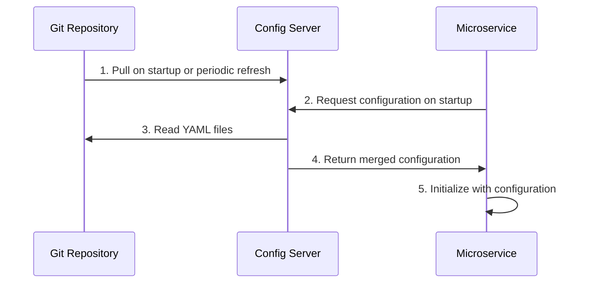

## Descripción General

El repositorio de configuración de SGIVU es la fuente de verdad para todas las configuraciones de los microservicios. Las buenas prácticas de control de versiones aseguran que los cambios de configuración se rastreen, revisen y puedan revertirse si es necesario.

<Info>
  Los cambios de configuración pueden tener un impacto significativo en los servicios en ejecución. Trata la configuración con el mismo cuidado que el código de la aplicación.
</Info>

## Flujo de Trabajo Git

El repositorio sigue un flujo de trabajo Git estándar con consideraciones específicas por entorno:

<Steps>
  <Step title="Crear un Branch de Funcionalidad">
    Siempre crea un branch para los cambios de configuración
    
    ```bash
    git checkout -b config/update-auth-database-settings
    ```
    
    Usa nombres de branch descriptivos:
    - Prefijo `config/` para cambios de configuración
    - Servicio o área que se está modificando
    - Breve descripción del cambio
  </Step>
  
  <Step title="Realizar los Cambios">
    Edita los archivos YAML correspondientes:
    
    ```bash
    # Edit configuration files
    vim sgivu-auth-dev.yml
    vim sgivu-auth-prod.yml
    
    # Validate with yamllint
    yamllint *.yml
    ```
  </Step>
  
  <Step title="Hacer Commit con Mensajes Descriptivos">
    Escribe mensajes de commit claros que expliquen el cambio
    
    ```bash
    git add sgivu-auth-dev.yml sgivu-auth-prod.yml
    git commit -m "Update auth service database connection pool settings
    
    - Increase max pool size from 10 to 20 for better throughput
    - Add connection timeout of 30s to prevent hanging connections
    - Applied to both dev and prod environments"
    ```
  </Step>
  
  <Step title="Push y Crear Pull Request">
    Sube tu branch y abre un pull request para revisión
    
    ```bash
    git push origin config/update-auth-database-settings
    ```
    
    Crea un pull request con:
    - Título claro describiendo el cambio
    - Descripción detallada de qué cambió y por qué
    - Qué servicios y entornos se ven afectados
    - Pruebas realizadas
  </Step>
  
  <Step title="Revisión y Merge">
    Después de la aprobación, haz merge a la rama main
    
    ```bash
    git checkout main
    git pull origin main
    git merge --no-ff config/update-auth-database-settings
    git push origin main
    ```
  </Step>
</Steps>

## Buenas Prácticas para Mensajes de Commit

### Estructura

Sigue este formato para los mensajes de commit:

```text
<summary line: what changed>

<detailed description: why it changed>
- Impact on services
- Environments affected
- Any related changes
```

### Buenos Ejemplos

```bash
# ✅ Good - clear and descriptive
git commit -m "Enable SQL logging in dev environment for auth service

Added show-sql and format_sql properties to aid in debugging
login issues reported by QA team. Only affects dev environment.

- sgivu-auth-dev.yml: spring.jpa.show-sql = true
- sgivu-auth-dev.yml: spring.jpa.properties.hibernate.format_sql = true"

# ✅ Good - explains security change
git commit -m "Restrict actuator endpoints in production

Limited exposed actuator endpoints to health, info, and prometheus
for security hardening. Development remains fully open for debugging.

- sgivu-gateway-prod.yml: management.endpoints.web.exposure.include
- Affects production only
- Aligns with security audit recommendations"

# ✅ Good - documents synchronization
git commit -m "Synchronize Redis configuration across all environments

Standardized Redis connection settings for gateway session storage:
- Consistent timeout: 1h
- Namespace: spring:session:sgivu-gateway
- Connection pooling parameters aligned

Affects: sgivu-gateway.yml, sgivu-gateway-dev.yml, sgivu-gateway-prod.yml"
```

### Malos Ejemplos

```bash
# ❌ Bad - too vague
git commit -m "Update config"

# ❌ Bad - no context
git commit -m "Change database URL"

# ❌ Bad - missing why
git commit -m "Modified sgivu-auth-dev.yml"
```

<Tip>
  Un buen mensaje de commit responde: **Qué** cambió, **Por qué** cambió y **Dónde** (en qué servicios/entornos) aplica.
</Tip>

## Documentación de Cambios Críticos

De las convenciones del repositorio:

> **Documenta en PRs cambios que afecten comportamiento crítico.**

Ciertos cambios de configuración requieren documentación adicional en los pull requests:

### Cambios Críticos que Necesitan Documentación

<CardGroup cols={2}>
  <Card title="Configuración de Seguridad" icon="shield-halved">
    Configuración OAuth2, autenticación, autorización, CORS, CSP
  </Card>
  <Card title="Cambios de Base de Datos" icon="database">
    Cadenas de conexión, credenciales, tamaños de pool, migraciones de esquema
  </Card>
  <Card title="Dependencias de Servicios" icon="link">
    Configuración de Eureka, URLs de servicios, balanceo de carga, circuit breakers
  </Card>
  <Card title="Ajuste de Rendimiento" icon="gauge-high">
    Timeouts, pools de hilos, tamaños de caché, límites de tasa
  </Card>
</CardGroup>

### Ejemplo de Plantilla para Pull Request

```markdown
## Summary
Update database connection pool settings for auth service to handle increased load

## Changes
- **sgivu-auth-dev.yml**: Increased max pool size from 10 to 20
- **sgivu-auth-prod.yml**: Increased max pool size from 10 to 30
- Added connection timeout of 30 seconds to both environments

## Motivation
QA reported slow login times during load testing. Database connection
pool was saturated under 100 concurrent users. These changes allow the
auth service to handle up to 200 concurrent connections.

## Impact
- **Services Affected**: sgivu-auth
- **Environments**: dev, prod
- **Breaking Changes**: None
- **Requires Restart**: Yes, sgivu-auth service must be restarted

## Testing
- [x] Validated YAML syntax with yamllint
- [x] Tested in local Docker environment
- [x] Load tested with 150 concurrent users in dev
- [x] Verified no connection timeout errors

## Rollback Plan
If issues occur, revert to previous commit:
```bash
git revert <this-commit-hash>
```
Or manually reduce pool size back to original values.

## Related Issues
Closes #42 - Auth service connection pool saturation
```

## Sincronización de Valores entre Entornos

De las convenciones del repositorio:

> **Sincroniza puertos, URLs y credenciales entre entornos.**

Ciertos valores de configuración deben mantenerse consistentes entre entornos:

### Valores a Sincronizar

**Puertos de Servicios**: Mantén los puertos base de los servicios consistentes (usa variables de entorno para sobrescrituras si es necesario)

```yaml
# sgivu-auth.yml (base)
server:
  port: ${PORT:9000}
```

**URLs de Service Discovery**: Las URLs de Eureka deben seguir el mismo patrón

```yaml
# All services
eureka:
  client:
    service-url:
      defaultZone: ${EUREKA_URL:http://sgivu-discovery:8761/eureka}
```

**Configuraciones Estructurales**: Las propiedades comunes de Spring Boot deben coincidir

```yaml
# All service base files
spring:
  jpa:
    open-in-view: false
```

**Líneas Base de Seguridad**: Las configuraciones de seguridad principales deben estar sincronizadas (con ajustes específicos por entorno)

```yaml
# Base: restrict by default
management:
  endpoints:
    web:
      exposure:
        include: health, info

# Dev: can be more permissive
management:
  endpoints:
    web:
      exposure:
        include: "*"
```

### Detección de Desvíos

Compara periódicamente las configuraciones de los entornos para detectar desvíos:

```bash
# Compare dev and prod configurations
diff -u sgivu-auth-dev.yml sgivu-auth-prod.yml

# Or use a visual diff tool
git diff --no-index sgivu-auth-dev.yml sgivu-auth-prod.yml
```

## Pruebas Antes de Hacer Merge

Siempre valida los cambios de configuración antes de hacer merge:

### Pruebas Locales con Docker Compose

<Steps>
  <Step title="Iniciar el Config Server">
    Levanta el Config Server con tus cambios
    
    ```bash
    cd ../sgivu-docker-compose
    docker compose up -d sgivu-config
    ```
  </Step>
  
  <Step title="Verificar el Endpoint de Configuración">
    Comprueba que el Config Server puede leer tus cambios
    
    ```bash
    # Test dev profile
    curl http://localhost:8888/sgivu-auth/dev | jq .
    
    # Test prod profile
    curl http://localhost:8888/sgivu-auth/prod | jq .
    ```
  </Step>
  
  <Step title="Iniciar los Servicios Afectados">
    Levanta los servicios que usan la configuración modificada
    
    ```bash
    docker compose up -d sgivu-auth
    
    # Check service logs for configuration errors
    docker compose logs -f sgivu-auth
    ```
  </Step>
  
  <Step title="Pruebas Funcionales">
    Verifica que los servicios funcionan correctamente con la nueva configuración
    
    ```bash
    # Health check
    curl http://localhost:9000/actuator/health
    
    # Test actual functionality
    # (login, API calls, etc.)
    ```
  </Step>
</Steps>

### Lista de Verificación

- [ ] Sintaxis YAML validada con `yamllint`
- [ ] El Config Server puede parsear todos los archivos
- [ ] Los servicios inician correctamente con la nueva configuración
- [ ] No hay logs de error relacionados con propiedades faltantes o inválidas
- [ ] Las pruebas funcionales pasan
- [ ] El rendimiento cumple las expectativas (si son cambios de ajuste)
- [ ] Las configuraciones de seguridad están verificadas (si son cambios de seguridad)

## Cómo se Propagan los Cambios de Configuración

Entender el flujo de propagación ayuda con las pruebas y la resolución de problemas:



### Métodos de Propagación

<Accordion title="Reinicio del Config Server">
  **Cuándo**: Aplica cambios inmediatamente reiniciando el Config Server
  
  ```bash
  docker compose restart sgivu-config
  ```
  
  **Impacto**: Todos los servicios obtendrán la nueva configuración en su próximo reinicio o refresh
  
  **Caso de uso**: Cualquier cambio de configuración
</Accordion>

<Accordion title="Reinicio de Servicio">
  **Cuándo**: El servicio se reinicia y obtiene configuración actualizada del Config Server
  
  ```bash
  docker compose restart sgivu-auth
  ```
  
  **Impacto**: Solo el servicio reiniciado obtiene la nueva configuración
  
  **Caso de uso**: Aplicar cambios a servicios específicos
</Accordion>

<Accordion title="Endpoint de Refresh vía Actuator">
  **Cuándo**: Refresh dinámico sin reinicio (si el servicio lo soporta)
  
  ```bash
  curl -X POST http://localhost:9000/actuator/refresh
  ```
  
  **Impacto**: El servicio recarga la configuración sin tiempo de inactividad
  
  **Caso de uso**: Cambios no estructurales (ej. feature flags, niveles de logging)
  
  **Limitación**: No todas las propiedades soportan refresh dinámico
</Accordion>

<Accordion title="Reinicio Completo">
  **Cuándo**: Reiniciar tanto el Config Server como todos los servicios
  
  ```bash
  docker compose restart sgivu-config
  docker compose restart  # All services
  ```
  
  **Impacto**: Refresh completo del sistema con toda la nueva configuración
  
  **Caso de uso**: Cambios mayores de configuración, resolución de problemas
</Accordion>

## Estrategias de Rollback

Cuando los cambios de configuración causan problemas, revierte rápidamente:

### Git Revert (Recomendado)

Crea un commit de reversión para deshacer los cambios:

```bash
# Find the problematic commit
git log --oneline

# Revert the commit
git revert <commit-hash>

# Push the revert
git push origin main

# Restart Config Server to apply
docker compose restart sgivu-config
```

<Info>
  Usar `git revert` mantiene el historial y deja claro cuándo y por qué se realizó un rollback.
</Info>

### Edición Manual de Emergencia

Para problemas críticos en producción, edita directamente y haz commit:

```bash
# Edit the problematic file
vim sgivu-auth-prod.yml

# Commit the fix
git add sgivu-auth-prod.yml
git commit -m "HOTFIX: Rollback database connection pool to stable values

Reverted max pool size from 30 to 10 due to database CPU saturation.
Production auth service experiencing 500 errors.

Reverting to last known stable configuration."

git push origin main

# Restart services immediately
docker compose restart sgivu-config sgivu-auth
```

### Reset a un Commit Específico

Para problemas severos, restablece a un estado conocido como estable:

```bash
# Find the last good commit
git log --oneline

# Reset to that commit
git reset --hard <good-commit-hash>

# Force push (use with caution!)
git push --force origin main

# Restart all services
docker compose restart
```

<Warning>
  Usa `git reset --hard` y force push solo en emergencias. Reescribe el historial y puede causar problemas a otros miembros del equipo.
</Warning>

### Pruebas Post-Rollback

Después del rollback:

```bash
# Verify configuration is loaded
curl http://localhost:8888/sgivu-auth/prod | jq .

# Check service health
curl http://localhost:9000/actuator/health

# Monitor logs
docker compose logs -f sgivu-auth

# Verify functionality
# (test login, API calls, etc.)
```

## Configuration Change Workflow Summary

<Steps>
  <Step title="Plan">
    - Identify what needs to change and why
    - Determine which environments are affected
    - Consider rollback approach
  </Step>
  
  <Step title="Implement">
    - Create feature branch
    - Edit YAML files
    - Validate with yamllint
    - Write descriptive commit messages
  </Step>
  
  <Step title="Test">
    - Test locally with Docker Compose
    - Verify Config Server can parse changes
    - Ensure services start and function correctly
  </Step>
  
  <Step title="Review">
    - Create detailed pull request
    - Document critical changes
    - Get team approval
  </Step>
  
  <Step title="Deploy">
    - Merge to main branch
    - Restart Config Server
    - Restart affected services
    - Monitor for issues
  </Step>
  
  <Step title="Verify">
    - Check service health
    - Test functionality
    - Monitor logs and metrics
    - Roll back if needed
  </Step>
</Steps>

## Best Practices Summary

1. **Use feature branches** - Never commit directly to main
2. **Write descriptive commits** - Explain what, why, and where
3. **Document critical changes** - Security, performance, and dependencies need extra detail
4. **Synchronize across environments** - Keep ports, URLs, and structures consistent
5. **Test before merging** - Validate locally with Docker Compose
6. **Understand propagation** - Know how changes reach running services
7. **Have a rollback plan** - Be ready to revert quickly if issues arise
8. **Monitor after changes** - Watch logs and metrics after deploying configuration changes
9. **Review as a team** - Configuration changes should be peer-reviewed like code
10. **Keep history clean** - Use meaningful commits and avoid force pushes unless necessary
