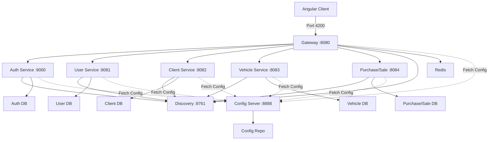

<Info>
  Esta guía cubre los flujos de trabajo de desarrollo local, incluyendo la configuración de Docker Compose, la recarga en caliente de configuración y estrategias de depuración.
</Info>

## Arquitectura del Entorno de Desarrollo

La plataforma SGIVU utiliza una arquitectura de microservicios con los siguientes componentes clave:



## Configuración con Docker Compose

La plataforma SGIVU utiliza `sgivu-docker-compose` para la orquestación local. Esta sección asume que tienes acceso al repositorio `sgivu-docker-compose`.

<Steps>
  <Step title="Clonar los Repositorios Necesarios">
    Clona los repositorios necesarios:

    ```bash
    # Config repository
    git clone <config-repo-url> ~/projects/sgivu-config-repo

    # Docker Compose orchestration
    git clone <docker-compose-repo-url> ~/projects/sgivu-docker-compose

    # Individual service repositories (as needed)
    git clone <sgivu-auth-url> ~/projects/sgivu-auth
    git clone <sgivu-gateway-url> ~/projects/sgivu-gateway
    # ... etc
    ```
  </Step>

  <Step title="Configurar Variables de Entorno">
    Crea un archivo `.env` en el directorio `sgivu-docker-compose` con los valores de desarrollo:

    ```bash .env
    # Database Configuration
    DEV_AUTH_DB_HOST=postgres
    DEV_AUTH_DB_PORT=5432
    DEV_AUTH_DB_NAME=sgivu_auth
    DEV_AUTH_DB_USERNAME=postgres
    DEV_AUTH_DB_PASSWORD=dev_password

    DEV_USER_DB_HOST=postgres
    DEV_USER_DB_PORT=5432
    DEV_USER_DB_NAME=sgivu_user
    DEV_USER_DB_USERNAME=postgres
    DEV_USER_DB_PASSWORD=dev_password

    DEV_CLIENT_DB_HOST=postgres
    DEV_CLIENT_DB_PORT=5432
    DEV_CLIENT_DB_NAME=sgivu_client
    DEV_CLIENT_DB_USERNAME=postgres
    DEV_CLIENT_DB_PASSWORD=dev_password

    # Redis
    REDIS_HOST=redis
    REDIS_PORT=6379
    REDIS_PASSWORD=dev_redis_password

    # Service Discovery
    EUREKA_URL=http://sgivu-discovery:8761/eureka

    # Service URLs (Docker internal)
    SGIVU_AUTH_URL=http://sgivu-auth:9000
    SGIVU_GATEWAY_URL=http://sgivu-gateway:8080
    DEV_ANGULAR_APP_URL=http://localhost:4200

    # Security
    SGIVU_GATEWAY_SECRET=dev-gateway-secret-change-in-prod
    SERVICE_INTERNAL_SECRET_KEY=dev-internal-key-change-in-prod

    # JWT Configuration
    JWT_KEYSTORE_LOCATION=classpath:keystore.jks
    JWT_KEYSTORE_PASSWORD=dev_keystore_pass
    JWT_KEY_ALIAS=sgivu-jwt
    JWT_KEY_PASSWORD=dev_key_pass

    # Flyway
    FLYWAY_BASELINE_ON_MIGRATE=true
    ```

    <Warning>
      Utiliza valores fuertes y únicos para entornos de producción. Estos son valores exclusivamente para desarrollo.
    </Warning>
  </Step>

  <Step title="Iniciar los Servicios de Infraestructura">
    Inicia primero los servicios fundacionales:

    ```bash
    cd ~/projects/sgivu-docker-compose

    # Start PostgreSQL and Redis
    docker compose up -d postgres redis

    # Wait for databases to be ready
    docker compose exec postgres pg_isready

    # Start Config Server
    docker compose up -d sgivu-config

    # Start Service Discovery
    docker compose up -d sgivu-discovery
    ```

    Verifica que los servicios estén saludables:

    ```bash
    # Check Config Server
    curl http://localhost:8888/actuator/health

    # Verificar Eureka
    curl http://localhost:8761/actuator/health
    # O visita http://localhost:8761 en el navegador
    ```
  </Step>

  <Step title="Iniciar los Servicios de Aplicación">
    Inicia los microservicios en orden de dependencia:

    ```bash
    # Servicio de auth (requerido por los demás)
    docker compose up -d sgivu-auth

    # Esperar a que auth esté saludable
    docker compose logs -f sgivu-auth
    # Buscar "Started SgivuAuthApplication"

    # Iniciar los demás servicios de negocio
    docker compose up -d sgivu-user sgivu-client sgivu-vehicle sgivu-purchase-sale

    # Iniciar Gateway (depende de todos los servicios)
    docker compose up -d sgivu-gateway
    ```

    <Note>
      Los servicios obtienen automáticamente su configuración desde `sgivu-config` al iniciar, utilizando el perfil `dev`.
    </Note>
  </Step>

  <Step title="Verificar el Stack">
    Comprueba que todos los servicios estén registrados en Eureka:

    ```bash
    curl http://localhost:8761/eureka/apps | xmllint --format -
    ```

    Prueba el Gateway:

    ```bash
    # Verificación de salud
    curl http://localhost:8080/actuator/health

    # Probar flujo de autenticación (debe redirigir al login)
    curl -I http://localhost:8080/
    ```
  </Step>
</Steps>

## Trabajar con Cambios de Configuración

Una de las ventajas clave de Spring Cloud Config es la capacidad de actualizar la configuración sin necesidad de redesplegar los servicios.

### Realizar Cambios de Configuración

<Steps>
  <Step title="Editar Archivos de Configuración">
    Modifica los archivos YAML en el repositorio de configuración:

    ```bash
    cd ~/projects/sgivu-config-repo

    # Edit a configuration file
    vim sgivu-auth-dev.yml
    ```

    Por ejemplo, habilitar el logging de SQL:

    ```yaml sgivu-auth-dev.yml
    spring:
      jpa:
        show-sql: true
        properties:
          hibernate:
            format_sql: true
    
    logging:
      level:
        org.hibernate.SQL: DEBUG
        org.hibernate.type.descriptor.sql.BasicBinder: TRACE
    ```
  </Step>

  <Step title="Confirmar Cambios (si se usa backend Git)">
    Si el Config Server utiliza un backend Git, confirma tus cambios:

    ```bash
    git add sgivu-auth-dev.yml
    git commit -m "Enable SQL debug logging for auth service"
    git push
    ```

    <Note>
      Con el perfil `native` (sistema de archivos), los cambios se detectan inmediatamente sin necesidad de hacer commit.
    </Note>
  </Step>

  <Step title="Refrescar la Configuración">
    Existen tres formas de refrescar la configuración:

    <Tabs>
      <Tab title="Refresco Manual (Recomendado para Dev)">
        Llama al endpoint `/actuator/refresh` en cada servicio:

        ```bash
        # Refresh auth service
        curl -X POST http://localhost:9000/actuator/refresh

        # Refresh gateway
        curl -X POST http://localhost:8080/actuator/refresh
        ```

        Esto requiere la anotación `@RefreshScope` en los beans que usan `@Value` o `@ConfigurationProperties`.
      </Tab>

      <Tab title="Reiniciar Servicio">
        Reinicia el contenedor del servicio específico:

        ```bash
        docker compose restart sgivu-auth
        ```

        Los servicios obtienen la configuración actualizada al iniciar.
      </Tab>

      <Tab title="Spring Cloud Bus (Avanzado)">
        Usa Spring Cloud Bus con RabbitMQ o Kafka para emitir eventos de refresco a todos los servicios:

        ```bash
        # Trigger bus refresh (refreshes all services)
        curl -X POST http://localhost:8888/actuator/busrefresh
        ```

        Requiere configuración adicional con un message broker.
      </Tab>
    </Tabs>
  </Step>

  <Step title="Verificar los Cambios">
    Comprueba que la nueva configuración esté activa:

    ```bash
    # View current configuration
    curl http://localhost:8888/sgivu-auth/dev | jq '.propertySources[0].source'

    # Check service logs for confirmation
    docker compose logs -f sgivu-auth
    ```
  </Step>
</Steps>

## Flujos de Trabajo de Desarrollo

### Configuración de Recarga en Caliente (Hot-Reload)

Para desarrollo activo en un servicio específico:

```bash
# Stop the Docker container for the service you're developing
docker compose stop sgivu-auth

# Run the service locally with your IDE or CLI
cd ~/projects/sgivu-auth
./mvnw spring-boot:run -Dspring.profiles.active=dev

# The service will:
# - Fetch config from Config Server at http://localhost:8888
# - Connect to databases in Docker
# - Register with Eureka in Docker
# - Support hot-reload via Spring DevTools
```

<Info>
  Asegúrate de que tu servicio local pueda alcanzar los servicios Docker. Usa `host.docker.internal` o `localhost` para las conexiones a base de datos cuando ejecutes localmente.
</Info>

### Probar la Configuración Localmente

Antes de confirmar cambios de configuración, pruébalos:

```bash
# 1. Make changes to config files
vi ~/projects/sgivu-config-repo/sgivu-auth-dev.yml

# 2. Validate YAML syntax
yamllint sgivu-auth-dev.yml

# 3. Test via Config Server
curl http://localhost:8888/sgivu-auth/dev | jq

# 4. Refresh the service
curl -X POST http://localhost:9000/actuator/refresh

# 5. Verify behavior
curl http://localhost:9000/actuator/env | jq '.propertySources[] | select(.name | contains("sgivu-auth"))'
```

### Depuración de Problemas de Configuración

<Tabs>
  <Tab title="Verificar Config Server">
    Verifica que el Config Server esté sirviendo la configuración correcta:

    ```bash
    # Test endpoint
    curl http://localhost:8888/sgivu-auth/dev

    # Check Config Server logs
    docker compose logs sgivu-config

    # Verify Git repo is up to date (if using Git backend)
    docker compose exec sgivu-config cat /config-repo/sgivu-auth-dev.yml
    ```
  </Tab>

  <Tab title="Verificar Configuración del Servicio">
    Visualiza la configuración activa en un servicio:

    ```bash
    # View all property sources
    curl http://localhost:9000/actuator/env | jq

    # View specific property
    curl http://localhost:9000/actuator/env/spring.datasource.url | jq

    # View configuration properties beans
    curl http://localhost:9000/actuator/configprops | jq
    ```
  </Tab>

  <Tab title="Revisar Logs">
    Habilita el logging de depuración para Spring Cloud Config:

    ```yaml
    logging:
      level:
        org.springframework.cloud.config: DEBUG
        org.springframework.boot.context.properties: DEBUG
    ```

    Luego revisa los logs:

    ```bash
    docker compose logs -f sgivu-auth | grep -i config
    ```
  </Tab>
</Tabs>

## Tareas Comunes de Desarrollo

### Agregar una Nueva Variable de Entorno

<Steps>
  <Step title="Agregar al Archivo de Configuración">
    ```yaml sgivu-auth-dev.yml
    my-service:
      new-feature:
        enabled: ${MY_NEW_FEATURE_ENABLED:false}
        timeout: ${MY_FEATURE_TIMEOUT:5000}
    ```
  </Step>

  <Step title="Agregar al Archivo .env">
    ```bash .env
    MY_NEW_FEATURE_ENABLED=true
    MY_FEATURE_TIMEOUT=10000
    ```
  </Step>

  <Step title="Reiniciar o Refrescar el Servicio">
    ```bash
    docker compose restart sgivu-auth
    ```
  </Step>
</Steps>

### Cambiar Entre Perfiles

Cambia el perfil activo de un servicio:

```yaml docker-compose.yml
services:
  sgivu-auth:
    environment:
      - SPRING_PROFILES_ACTIVE=prod  # Change from 'dev' to 'prod'
```

O para ejecuciones locales:

```bash
./mvnw spring-boot:run -Dspring.profiles.active=prod
```

### Usar Diferentes Esquemas de Base de Datos

Para probar migraciones o cambios de esquema:

```yaml sgivu-auth-dev.yml
spring:
  flyway:
    baseline-on-migrate: true
    clean-disabled: false  # Allow cleaning database in dev
  jpa:
    hibernate:
      ddl-auto: validate  # or 'update' for auto-schema changes (not recommended)
```

```bash
# Clean and recreate database
docker compose exec postgres psql -U postgres -c "DROP DATABASE sgivu_auth;"
docker compose exec postgres psql -U postgres -c "CREATE DATABASE sgivu_auth;"
docker compose restart sgivu-auth
```

## Solución de Problemas

### La Configuración No Se Carga

**Síntomas:** El servicio inicia con valores por defecto, ignorando el Config Server.

**Soluciones:**
- Verifica que `bootstrap.yml` o `bootstrap.properties` exista y especifique la URI del Config Server
- Comprueba que `spring.application.name` coincida con el nombre del archivo de configuración
- Asegúrate de que el Config Server esté en ejecución y saludable
- Verifica la conectividad de red entre el servicio y el Config Server
- Busca errores en los logs de inicio del servicio

```bash
# Check service can reach Config Server
docker compose exec sgivu-auth curl http://sgivu-config:8888/actuator/health
```

### Las Variables de Entorno No Se Resuelven

**Síntomas:** La configuración contiene literales `${VARIABLE}` o los servicios fallan al iniciar.

**Soluciones:**
- Verifica que las variables estén definidas en el archivo `.env`
- Comprueba que Docker Compose esté cargando el archivo `.env`
- Asegúrate de que las variables se pasen a los contenedores en `docker-compose.yml`
- Usa `docker compose config` para ver la configuración resuelta

```bash
# View resolved Docker Compose configuration
docker compose config | grep -A 5 sgivu-auth

# Check environment variables in running container
docker compose exec sgivu-auth env | grep DEV_
```

### Los Servicios No Se Registran en Eureka

**Síntomas:** Los servicios no aparecen en el dashboard de Eureka.

**Soluciones:**
- Verifica que la URL de Eureka sea correcta en la configuración
- Comprueba que `eureka.client.enabled` no esté configurado como `false`
- Asegúrate de que haya conectividad de red con el servicio Discovery
- Busca errores en los logs del servicio relacionados con Eureka

```bash
# Check Eureka dashboard
open http://localhost:8761

# Check Eureka apps via API
curl http://localhost:8761/eureka/apps/SGIVU-AUTH | xmllint --format -
```

### Fallos de Conexión a Base de Datos

**Síntomas:** Los servicios fallan al iniciar con errores de conexión.

**Soluciones:**
- Verifica que los contenedores de base de datos estén en ejecución: `docker compose ps postgres`
- Comprueba las credenciales de base de datos en el archivo `.env`
- Asegúrate de que las bases de datos existan: `docker compose exec postgres psql -U postgres -l`
- Prueba la conexión manualmente:

```bash
# Test database connection
docker compose exec postgres psql -U postgres -d sgivu_auth -c "SELECT 1;"

# Check database logs
docker compose logs postgres
```

### Problemas de Conexión con Redis (Gateway)

**Síntomas:** El Gateway falla al iniciar o las sesiones no persisten.

**Soluciones:**
- Verifica que Redis esté en ejecución: `docker compose ps redis`
- Comprueba que las credenciales de Redis coincidan con la configuración
- Prueba la conexión a Redis:

```bash
# Test Redis connection
docker compose exec redis redis-cli -a "${REDIS_PASSWORD}" ping

# View Redis keys
docker compose exec redis redis-cli -a "${REDIS_PASSWORD}" keys "spring:session:*"
```

## Consejos de Rendimiento

### Reducir el Tiempo de Inicio

- Usa el inicio selectivo de servicios (solo inicia los servicios que necesites)
- Deshabilita funcionalidades innecesarias en desarrollo:
  ```yaml
  management:
    tracing:
      enabled: false  # Disable Zipkin tracing
  ```
- Usa validación DDL más rápida para la base de datos:
  ```yaml
  spring:
    jpa:
      hibernate:
        ddl-auto: none  # Skip schema validation
    flyway:
      enabled: false  # Skip migrations if DB is already migrated
  ```

### Optimizar el Rendimiento de Docker

- Asigna recursos suficientes a Docker (se recomiendan 8GB+ de RAM)
- Usa montajes de volumen para un I/O más rápido
- Considera usar `docker compose up --no-recreate` para evitar la recreación de contenedores

## Siguientes Pasos

<CardGroup cols={2}>
  <Card title="Referencia de Configuración" icon="book" href="/config/reference/spring-configuration">
    Explora las opciones de configuración detalladas para cada servicio
  </Card>
  <Card title="Arquitectura de Servicios" icon="diagram-project" href="/config/architecture">
    Comprende la arquitectura de microservicios y sus dependencias
  </Card>
  <Card title="Resumen de Servicios" icon="server" href="/config/services/overview">
    Explora todos los microservicios configurados
  </Card>
  <Card title="Gestión de Entornos" icon="layer-group" href="/config/environments/overview">
    Gestiona entornos de desarrollo, producción y personalizados
  </Card>
</CardGroup>
