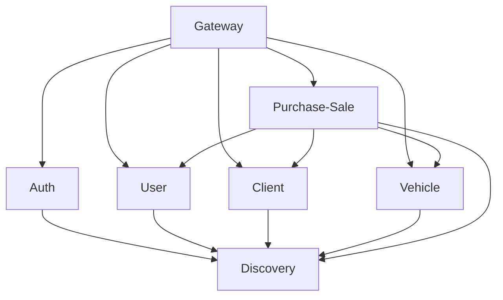

La plataforma SGIVU está compuesta por múltiples microservicios, cada uno con su propia configuración gestionada a través de Spring Cloud Config. Esta página ofrece una visión general de todos los servicios y los patrones de configuración comunes.

## Arquitectura de Servicios

<CardGroup cols={2}>
  <Card title="Servicio Auth" icon="shield-halved" href="/config/services/auth">
    Servidor de autorización OAuth2/OIDC en el puerto 9000
  </Card>
  <Card title="Servicio Gateway" icon="door-open" href="/config/services/gateway">
    API Gateway con gestión de sesiones en el puerto 8080
  </Card>
  <Card title="Servicio Discovery" icon="compass" href="/config/services/discovery">
    Registro de servicios Eureka en el puerto 8761
  </Card>
  <Card title="Servicio User" icon="user" href="/config/services/user">
    Microservicio de gestión de usuarios en el puerto 8081
  </Card>
  <Card title="Servicio Client" icon="users" href="/config/services/client">
    Microservicio de gestión de clientes en el puerto 8082
  </Card>
  <Card title="Servicio Vehicle" icon="car" href="/config/services/vehicle">
    Catálogo de vehículos con integración S3 en el puerto 8083
  </Card>
  <Card title="Servicio Purchase-Sale" icon="handshake" href="/config/services/purchase-sale">
    Servicio de orquestación de transacciones en el puerto 8084
  </Card>
</CardGroup>

## Asignación de Puertos por Servicio

| Servicio | Puerto | Propósito | Base de Datos |
|----------|--------|-----------|---------------|
| **sgivu-auth** | 9000 | Servidor de Autorización OAuth2 | PostgreSQL |
| **sgivu-gateway** | 8080 | API Gateway y Gestión de Sesiones | Redis |
| **sgivu-discovery** | 8761 | Registro de Servicios Eureka | Ninguna |
| **sgivu-user** | 8081 | Gestión de Usuarios | PostgreSQL |
| **sgivu-client** | 8082 | Gestión de Clientes | PostgreSQL |
| **sgivu-vehicle** | 8083 | Catálogo de Vehículos y AWS S3 | PostgreSQL |
| **sgivu-purchase-sale** | 8084 | Orquestación de Transacciones | PostgreSQL |

## Patrones de Configuración Comunes

### Descubrimiento de Servicios con Eureka

La mayoría de los servicios se registran en Eureka para el descubrimiento de servicios:

```yaml
eureka:
  instance:
    instance-id: ${spring.cloud.client.hostname}:${spring.application.name}:${random.value}
  client:
    service-url:
      defaultZone: ${EUREKA_URL:http://sgivu-discovery:8761/eureka}
```

<Info>
El `instance-id` incluye un valor aleatorio para soportar múltiples instancias del mismo servicio.
</Info>

### Configuración de Base de Datos

Todos los servicios de datos utilizan PostgreSQL con migraciones Flyway:

<Tabs>
  <Tab title="Desarrollo">
    ```yaml
    spring:
      datasource:
        url: jdbc:postgresql://${DEV_*_DB_HOST:host.docker.internal}:${DEV_*_DB_PORT:5432}/${DEV_*_DB_NAME}
        username: ${DEV_*_DB_USERNAME}
        password: ${DEV_*_DB_PASSWORD}
      jpa:
        hibernate:
          ddl-auto: validate
        show-sql: true
      flyway:
        baseline-on-migrate: true
        clean-disabled: false
    ```
  </Tab>
  <Tab title="Producción">
    ```yaml
    spring:
      datasource:
        url: jdbc:postgresql://${PROD_*_DB_HOST}:${PROD_*_DB_PORT}/${PROD_*_DB_NAME}
        username: ${PROD_*_DB_USERNAME}
        password: ${PROD_*_DB_PASSWORD}
      jpa:
        hibernate:
          ddl-auto: validate
      flyway:
        clean-disabled: true
        baseline-on-migrate: ${FLYWAY_BASELINE_ON_MIGRATE:false}
    ```
  </Tab>
</Tabs>

<Warning>
Los entornos de producción tienen `clean-disabled: true` para prevenir la eliminación accidental de la base de datos.
</Warning>

### Autenticación entre Servicios

Todos los microservicios utilizan un secreto compartido para las llamadas internas entre APIs:

```yaml
service:
  internal:
    secret-key: "${SERVICE_INTERNAL_SECRET_KEY}"
```

<Note>
Este secreto debe ser el mismo en todos los servicios para habilitar la comunicación segura entre ellos.
</Note>

### Trazabilidad Distribuida

Todos los servicios se integran con Zipkin para la trazabilidad distribuida:

```yaml
management:
  tracing:
    sampling:
      probability: 0.1  # Sample 10% of requests
  zipkin:
    tracing:
      endpoint: http://sgivu-zipkin:9411/api/v2/spans
```

### Patrón de Registro de Servicios

Los servicios mantienen un mapa de otros servicios de los que dependen:

```yaml
services:
  map:
    sgivu-auth:
      name: sgivu-auth
      url: ${SGIVU_AUTH_URL:http://sgivu-auth:9000}
```

### Endpoints de Actuator

<Tabs>
  <Tab title="Desarrollo">
    ```yaml
    management:
      endpoints:
        web:
          exposure:
            include: "*"  # All endpoints exposed
      endpoint:
        health:
          show-details: always
    ```
  </Tab>
  <Tab title="Producción">
    ```yaml
    management:
      endpoints:
        web:
          exposure:
            include: health, info, prometheus
      endpoint:
        health:
          show-details: never  # Hide internal details
    ```
  </Tab>
</Tabs>

### Documentación OpenAPI

Cada servicio expone su documentación de API a través del Gateway:

```yaml
springdoc:
  swagger-ui:
    url: /docs/{service-name}/v3/api-docs
    configUrl: /docs/{service-name}/v3/api-docs/swagger-config
```

## Variables de Entorno

### Comunes a Todos los Servicios

- `SERVICE_INTERNAL_SECRET_KEY` - Secreto compartido para la autenticación entre servicios
- `EUREKA_URL` - URL del servidor Eureka (por defecto: `http://sgivu-discovery:8761/eureka`)
- `PORT` - Puerto del servicio (sobrescribe el valor por defecto)

### Específicas por Perfil

Cada servicio requiere credenciales de base de datos según su perfil:

**Desarrollo:**
- `DEV_{SERVICE}_DB_HOST`
- `DEV_{SERVICE}_DB_PORT`
- `DEV_{SERVICE}_DB_NAME`
- `DEV_{SERVICE}_DB_USERNAME`
- `DEV_{SERVICE}_DB_PASSWORD`

**Producción:**
- `PROD_{SERVICE}_DB_HOST`
- `PROD_{SERVICE}_DB_PORT`
- `PROD_{SERVICE}_DB_NAME`
- `PROD_{SERVICE}_DB_USERNAME`
- `PROD_{SERVICE}_DB_PASSWORD`

## Capas de Configuración

Spring Cloud Config utiliza una estrategia de configuración en tres niveles:

1. **Configuración base** (`{service-name}.yml`) - Ajustes comunes para todos los entornos
2. **Configuración por perfil** (`{service-name}-{profile}.yml`) - Sobrescrituras específicas por entorno
3. **Variables de entorno** - Sobrescrituras en tiempo de ejecución

<Accordion title="Orden de Resolución de Configuración">
Spring Boot resuelve la configuración en este orden (mayor prioridad gana):

1. Variables de entorno
2. YAML específico del perfil (`-dev`, `-prod`)
3. Archivo YAML base
4. Valores por defecto de la aplicación

Esto permite establecer valores por defecto en la configuración base y sobrescribirlos por entorno.
</Accordion>

## Dependencias entre Servicios



## Próximos Pasos

<CardGroup cols={2}>
  <Card title="Servicio Auth" icon="shield-halved" href="/config/services/auth">
    Configurar la autorización OAuth2
  </Card>
  <Card title="Servicio Gateway" icon="door-open" href="/config/services/gateway">
    Configurar el API Gateway y el enrutamiento
  </Card>
  <Card title="Servicio Discovery" icon="compass" href="/config/services/discovery">
    Configurar el registro de servicios
  </Card>
  <Card title="Servicios de Negocio" icon="briefcase" href="/config/services/user">
    Configurar los microservicios
  </Card>
</CardGroup>
