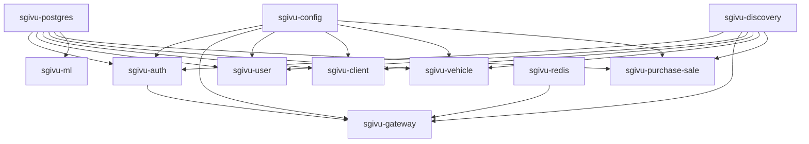

SGIVU utiliza Docker Compose para orquestar su arquitectura de microservicios. Esta guía explica la arquitectura de contenedores, la red, las dependencias y las estrategias de despliegue.

## Visión general de la arquitectura

La configuración de Docker Compose de SGIVU orquesta múltiples servicios:

- **7 servicios Backend con Spring Boot** (auth, gateway, config, discovery, user, client, vehicle, purchase-sale)
- **1 servicio ML con FastAPI**
- **2 bases de datos** (PostgreSQL, Redis)

### Grafo de dependencias de servicios



## Archivos de Docker Compose

SGIVU proporciona dos configuraciones de Docker Compose:

### docker-compose.dev.yml (Desarrollo)

- Usa el perfil `native` para Config Server (carga desde el sistema de archivos local)
- Monta el repositorio de configuración local como volumen
- Variables de entorno de desarrollo desde `.env.dev`
- Todos los puertos expuestos al host para depuración

### docker-compose.yml (Producción)

- Usa el perfil `git` para Config Server (carga desde repositorio Git)
- Variables de entorno de producción desde `.env`
- Solo se exponen los puertos necesarios
- Optimizado para despliegue en la nube (AWS EC2/ECS)
- Usa servicios gestionados cuando sea aplicable (RDS en lugar de contenedores)

## Definiciones de servicios

### Servicios de infraestructura

#### Base de datos PostgreSQL

```yaml
sgivu-postgres:
  container_name: sgivu-postgres
  image: postgres:16
  ports:
    - "5432:5432"
  networks:
    - sgivu-network
  volumes:
    - postgres-data:/var/lib/postgresql/data
    - ./postgres-init:/docker-entrypoint-initdb.d
  healthcheck:
    test: ["CMD-SHELL", "pg_isready -U $${POSTGRES_USER}"]
    interval: 10s
    timeout: 5s
    retries: 5
    start_period: 15s
```

**Propósito**: Instancia compartida de PostgreSQL para todos los servicios Backend. Cada servicio utiliza una base de datos separada dentro de esta instancia.

**Bases de datos creadas** (automáticamente por `postgres-init/create-databases.sh` en el primer inicio):
- `sgivu_auth_db`
- `sgivu_user_db`
- `sgivu_client_db`
- `sgivu_vehicle_db`
- `sgivu_purchase_sale_db`
- `sgivu_ml_db`

<Info>
  El healthcheck (`pg_isready`) garantiza que los servicios con `depends_on: condition: service_healthy` no inicien hasta que PostgreSQL acepte conexiones y las bases de datos estén creadas.
</Info>

#### Redis

```yaml
sgivu-redis:
  container_name: sgivu-redis
  image: redis:7
  command: >
    sh -c "redis-server --requirepass \"$PROD_REDIS_PASSWORD\""
  env_file: .env
  ports:
    - "6379:6379"
  networks:
    - sgivu-network
  volumes:
    - redis-data:/data
```

En `docker-compose.dev.yml` la variable es `DEV_REDIS_PASSWORD` y el `env_file` apunta a `.env.dev`.

**Propósitos**:
- **Sesiones HTTP** en `sgivu-gateway` (patrón BFF). Permite escalar horizontalmente el Gateway sin perder las sesiones del usuario. Namespace `spring:session:sgivu-gateway`.
- **Caché de agregados del dashboard** en `sgivu-purchase-sale`. Namespace `sgivu:cache:purchase-sale:`, TTL 60 s.

<Note>
Redis no se usa para rate limiting ni acceso directo con `RedisTemplate`.
</Note>

### Servicios Backend principales

#### Config Server

```yaml
sgivu-config:
  container_name: sgivu-config
  image: stevenrq/sgivu-config:0.1.0
  ports:
    - "8888:8888"
  networks:
    - sgivu-network
  volumes:
    - ../../../../sgivu-config-repo:/config-repo  # Dev only
  environment:
    - SPRING_PROFILES_ACTIVE=native  # or 'git' in prod
```

**Propósito**: Servidor de configuración centralizado. Todos los servicios Spring Boot obtienen su configuración desde aquí.

**Orden de inicio**: Debe iniciar **antes** que todos los demás servicios Backend.

#### Servidor de descubrimiento (Eureka)

```yaml
sgivu-discovery:
  container_name: sgivu-discovery
  image: stevenrq/sgivu-discovery:0.1.0
  ports:
    - "8761:8761"
  networks:
    - sgivu-network
```

**Propósito**: Registro de servicios para descubrimiento dinámico. El Gateway usa Eureka para enrutar solicitudes a los servicios Backend.

**Orden de inicio**: Debe iniciar **antes** que el Gateway y los servicios de negocio.

#### Servicio de autenticación

```yaml
sgivu-auth:
  container_name: sgivu-auth
  image: stevenrq/sgivu-auth:0.1.0
  ports:
    - "9000:9000"
  networks:
    - sgivu-network
  depends_on:
    sgivu-postgres:
      condition: service_healthy
    sgivu-config:
      condition: service_started
    sgivu-discovery:
      condition: service_started
```

**Propósito**: Servidor de autorización OAuth 2.1 / OIDC. Emite tokens JWT y gestiona la autenticación de usuarios.

**Dependencias**:
- PostgreSQL (para datos de usuario y clientes OAuth2) — espera a que esté saludable
- Config Server (para configuración)
- Eureka (para registro de servicios)

#### Gateway (BFF)

```yaml
sgivu-gateway:
  container_name: sgivu-gateway
  image: stevenrq/sgivu-gateway:0.1.0
  ports:
    - "8080:8080"
  networks:
    - sgivu-network
  depends_on:
    sgivu-redis:
      condition: service_started
    sgivu-config:
      condition: service_started
    sgivu-discovery:
      condition: service_started
    sgivu-auth:
      condition: service_started
```

**Propósito**: API Gateway que implementa el patrón Backend-For-Frontend (BFF). Enruta solicitudes, gestiona sesiones y almacena tokens OAuth2.

**Dependencias**:
- Redis (sesiones del gateway; también lo usa `sgivu-purchase-sale` como caché)
- Config Server
- Eureka (para enrutamiento mediante descubrimiento de servicios)
- Servicio de autenticación (para el flujo OAuth2)

### Servicios de negocio

#### Servicio de usuarios

```yaml
sgivu-user:
  container_name: sgivu-user
  image: stevenrq/sgivu-user:0.1.0
  ports:
    - "8081:8081"
  networks:
    - sgivu-network
  depends_on:
    sgivu-postgres:
      condition: service_healthy
    sgivu-config:
      condition: service_started
    sgivu-discovery:
      condition: service_started
```

**Propósito**: Servicio de gestión de usuarios.

#### Servicio de clientes

```yaml
sgivu-client:
  container_name: sgivu-client
  image: stevenrq/sgivu-client:0.1.0
  ports:
    - "8082:8082"
  networks:
    - sgivu-network
  depends_on:
    sgivu-postgres:
      condition: service_healthy
    sgivu-config:
      condition: service_started
    sgivu-discovery:
      condition: service_started
```

**Propósito**: Servicio de gestión de clientes.

#### Servicio de vehículos

```yaml
sgivu-vehicle:
  container_name: sgivu-vehicle
  image: stevenrq/sgivu-vehicle:0.1.0
  ports:
    - "8083:8083"
  networks:
    - sgivu-network
  depends_on:
    sgivu-postgres:
      condition: service_healthy
    sgivu-config:
      condition: service_started
    sgivu-discovery:
      condition: service_started
```

**Propósito**: Gestión de inventario de vehículos con integración S3 para imágenes.

#### Servicio de compra-venta

```yaml
sgivu-purchase-sale:
  container_name: sgivu-purchase-sale
  image: stevenrq/sgivu-purchase-sale:0.1.0
  ports:
    - "8084:8084"
  networks:
    - sgivu-network
  depends_on:
    sgivu-postgres:
      condition: service_healthy
    sgivu-config:
      condition: service_started
    sgivu-discovery:
      condition: service_started
```

**Propósito**: Gestión de transacciones de compra y venta de vehículos.

### Servicio de Machine Learning

```yaml
sgivu-ml:
  container_name: sgivu-ml
  image: stevenrq/sgivu-ml:0.1.0
  ports:
    - "8000:8000"
  networks:
    - sgivu-network
  depends_on:
    sgivu-postgres:
      condition: service_healthy
```

**Propósito**: Servicio ML basado en FastAPI para predicción de demanda. **No** utiliza Config Server (usa Pydantic Settings directamente).

## Red

### Red Docker

Todos los servicios se comunican a través de una red bridge personalizada:

```yaml
networks:
  sgivu-network:
    driver: bridge
```

Los servicios pueden comunicarse entre sí usando los nombres de contenedor como hostnames:
- `http://sgivu-auth:9000`
- `http://sgivu-gateway:8080`
- `http://sgivu-postgres:5432`

### Mapeo de puertos

| Servicio | Puerto interno | Puerto externo | Propósito |
|---------|---------------|---------------|----------|
| Gateway | 8080 | 8080 | Punto de entrada principal de la API |
| Auth | 9000 | 9000 | Endpoints OAuth2/OIDC |
| Config | 8888 | 8888 | Servidor de configuración |
| Discovery | 8761 | 8761 | Dashboard de Eureka |
| User | 8081 | 8081 | API de usuarios |
| Client | 8082 | 8082 | API de clientes |
| Vehicle | 8083 | 8083 | API de vehículos |
| Purchase-Sale | 8084 | 8084 | API de transacciones |
| ML | 8000 | 8000 | Predicciones ML |
| PostgreSQL | 5432 | 5432 | Base de datos |
| Redis | 6379 | 6379 | Sesiones (gateway) y caché del dashboard (purchase-sale) |

<Warning>
En producción, exponga solo los puertos necesarios (Gateway: 8080, Auth: 9000). Mantenga los servicios internos (bases de datos, Eureka, Config) detrás de un firewall.
</Warning>

## Volúmenes

Los datos persistentes se almacenan en volúmenes Docker:

```yaml
volumes:
  postgres-data:  # PostgreSQL databases
  redis-data:     # Sesiones del gateway y caché de purchase-sale
```

Para eliminar todos los datos:

```bash
docker compose -f docker-compose.dev.yml down -v
```

## Ejecutar el stack

### Modo desarrollo

<Steps>

<Step title="Crear archivo de entorno">

```bash
cd infra/compose/sgivu-docker-compose
cp .env.dev.example .env.dev
```

</Step>

<Step title="Iniciar el stack">

```bash
chmod +x run.sh
./run.sh --dev
```

O manualmente:

```bash
docker compose -f docker-compose.dev.yml --env-file .env.dev up -d --build
```

</Step>

<Step title="Monitorear el inicio">

```bash
# Watch all logs
docker compose -f docker-compose.dev.yml logs -f

# Watch specific service
docker compose -f docker-compose.dev.yml logs -f sgivu-gateway

# Verificar estado de los servicios
docker compose -f docker-compose.dev.yml ps
```

</Step>

<Step title="Verificar los servicios">

```bash
# Eureka dashboard
curl http://localhost:8761

# Gateway health
curl http://localhost:8080/actuator/health

# Auth server
curl http://localhost:9000/.well-known/openid-configuration
```

</Step>

</Steps>

### Modo producción

<Steps>

<Step title="Preparar el entorno">

```bash
cp .env.example .env
nano .env  # Reemplazar todos los marcadores
```

Asegúrese de reemplazar todos los marcadores `your-*-here` con valores reales.

</Step>

<Step title="Validar la configuración">

```bash
# Verificar valores de marcadores sin reemplazar
grep -r "your-.*-here" .env

# Validar archivo compose
docker compose config
```

</Step>

<Step title="Iniciar el stack de producción">

```bash
./run.sh --prod
```

O:

```bash
docker compose up -d --build
```

</Step>

<Step title="Monitorear el inicio en producción">

```bash
# Verificar que los servicios estén saludables
docker compose ps

# Verificar logs en busca de errores
docker compose logs --tail=100 -f
```

</Step>

</Steps>

## Gestión de servicios

### Operaciones individuales de servicios

```bash
# Reiniciar un servicio individual
docker compose -f docker-compose.dev.yml restart sgivu-gateway

# Detener un servicio
docker compose -f docker-compose.dev.yml stop sgivu-user

# Iniciar un servicio detenido
docker compose -f docker-compose.dev.yml start sgivu-user

# Ver logs de un servicio específico
docker compose -f docker-compose.dev.yml logs -f sgivu-auth

# Ejecutar comando dentro del contenedor de un servicio
docker compose -f docker-compose.dev.yml exec sgivu-postgres psql -U postgres
```

### Reconstruir y reiniciar un servicio

Use el script proporcionado para reconstruir un servicio individual (construye localmente y recrea el contenedor):

```bash
chmod +x rebuild-service.sh
./rebuild-service.sh --dev sgivu-auth
```

Para además publicar la imagen en Docker Hub, agregue `--push`:

```bash
./rebuild-service.sh --dev --push sgivu-auth
```

Este script:
1. Reconstruye la imagen Docker localmente
2. (Opcional) La publica en Docker Hub si se pasa `--push`
3. Recrea únicamente ese contenedor en el stack en ejecución

### Verificaciones de salud

```bash
# Verificar salud de todos los servicios
for port in 8080 9000 8888 8761 8081 8082 8083 8084 8000; do
  echo "Puerto $port:"
  curl -s http://localhost:$port/actuator/health | jq '.status'
done

# Verificar registro en Eureka
curl -s http://localhost:8761/eureka/apps | grep -o '<app>[^<]*' | sed 's/<app>//'
```

## Construcción de imágenes

SGIVU proporciona scripts para construir y publicar imágenes Docker:

### Construir todas las imágenes

```bash
cd infra/compose/sgivu-docker-compose
chmod +x build-and-push-images.sh
./build-and-push-images.sh
```

Este script orquestador:
1. Recorre todos los directorios de servicios
2. Ejecuta los scripts individuales `build-image.sh`
3. Compila los proyectos Java con Maven cuando es necesario
4. Construye las imágenes Docker
5. Las publica en el registro de Docker Hub

### Construir un servicio individual

```bash
cd apps/backend/sgivu-auth
chmod +x build-image.sh
./build-image.sh          # construye localmente
./build-image.sh --push   # construye y publica en Docker Hub
```

### Etiquetas de imagen personalizadas

Para usar etiquetas de imagen personalizadas, edite el campo `image` en `docker-compose.yml`:

```yaml
sgivu-auth:
  image: stevenrq/sgivu-auth:0.1.0  # Change version tag
```

## Estrategias de despliegue en producción

### Despliegue en AWS EC2

<Steps>

<Step title="Lanzar instancia EC2">

- **Tipo de instancia**: t3.xlarge o superior
- **SO**: Ubuntu 22.04 LTS o Amazon Linux 2023
- **Almacenamiento**: Volumen EBS de 50GB o más
- **Grupos de seguridad**: Abrir puertos 80, 443, 22 (SSH)

</Step>

<Step title="Instalar Docker">

```bash
ssh -i key.pem ubuntu@your-ec2-public-ip

# Instalar Docker
curl -fsSL https://get.docker.com -o get-docker.sh
sudo sh get-docker.sh
sudo usermod -aG docker ubuntu

# Instalar Docker Compose
sudo curl -L "https://github.com/docker/compose/releases/latest/download/docker-compose-$(uname -s)-$(uname -m)" -o /usr/local/bin/docker-compose
sudo chmod +x /usr/local/bin/docker-compose
```

</Step>

<Step title="Clonar y configurar">

```bash
git clone https://github.com/your-org/sgivu.git
cd sgivu/infra/compose/sgivu-docker-compose

cp .env.example .env
nano .env  # Configurar valores de producción
```

</Step>

<Step title="Iniciar los servicios">

```bash
./run.sh --prod
```

</Step>

<Step title="Configurar proxy reverso Nginx">

Consulte la [Guía de instalación](/getting-started/installation#configure-nginx-production) para la configuración de Nginx.

</Step>

</Steps>

### Despliegue en AWS ECS

Para orquestación de contenedores con ECS:

1. Crear un clúster ECS
2. Definir las definiciones de tareas para cada servicio
3. Usar AWS RDS para bases de datos en lugar de contenedores
4. Usar ElastiCache Redis para almacenamiento de sesiones
5. Configurar un Application Load Balancer
6. Usar AWS Secrets Manager para variables sensibles

### Despliegue en Kubernetes

Convertir Docker Compose a manifiestos de Kubernetes:

```bash
# Usando Kompose
kompose convert -f docker-compose.yml

# Aplicar al clúster
kubectl apply -f .
```

Configuración recomendada de Kubernetes:
- Usar Helm charts para cada servicio
- PostgreSQL externo (Amazon RDS, Azure Database)
- Redis externo (ElastiCache, Azure Cache)
- Ingress controller para enrutamiento
- Cert-manager para certificados TLS

## Monitoreo y logs

### Ver logs

```bash
# All services
docker compose -f docker-compose.dev.yml logs -f

# Specific service
docker compose -f docker-compose.dev.yml logs -f sgivu-gateway

# Last 100 lines
docker compose -f docker-compose.dev.yml logs --tail=100

# Follow with timestamps
docker compose -f docker-compose.dev.yml logs -f -t
```

### Monitoreo de recursos

```bash
# Uso de recursos de contenedores
docker stats

# Servicio específico
docker stats sgivu-gateway

# Uso de disco
docker system df
```

## Solución de problemas

### Los servicios no inician

**Verifique que las dependencias estén listas:**

```bash
# Config Server debe iniciar primero
docker compose -f docker-compose.dev.yml logs sgivu-config
curl http://localhost:8888/actuator/health

# Luego Discovery
curl http://localhost:8761

# Luego los servicios dependientes
docker compose -f docker-compose.dev.yml ps
```

**Verifique las variables de entorno:**

```bash
# Validar configuración
docker compose -f docker-compose.dev.yml config

# Buscar variables faltantes
docker compose -f docker-compose.dev.yml config | grep -i "null"
```

### Problemas de conexión a la base de datos

```bash
# Verificar que PostgreSQL esté corriendo
docker compose -f docker-compose.dev.yml ps sgivu-postgres

# Probar conexión
docker compose -f docker-compose.dev.yml exec sgivu-postgres psql -U postgres -c "\l"

# Verificar logs
docker compose -f docker-compose.dev.yml logs sgivu-postgres
```

### Conflictos de puertos

```bash
# Buscar proceso usando el puerto
lsof -i :8080

# Terminar proceso
kill -9 <PID>

# O cambiar el mapeo de puertos en docker-compose.yml
```

### Memoria insuficiente

```bash
# Verificar uso de memoria
docker stats --no-stream

# Aumentar límite de memoria de Docker (Docker Desktop)
# Settings → Resources → Memory → 8GB+

# O reducir servicios en docker-compose
```

### Problemas de red

```bash
# Inspeccionar red
docker network inspect sgivu-network

# Recrear red
docker compose -f docker-compose.dev.yml down
docker network prune
docker compose -f docker-compose.dev.yml up -d
```

### Reinicio desde cero

```bash
# Detener todo
docker compose -f docker-compose.dev.yml down -v

# Eliminar todas las imágenes de SGIVU
docker images | grep sgivu | awk '{print $3}' | xargs docker rmi -f

# Eliminar volúmenes huérfanos
docker volume prune

# Iniciar desde cero
./run.sh --dev
```

## Optimización de rendimiento

### Límites de recursos

Agregue límites de recursos para evitar que cualquier servicio consuma demasiados recursos:

```yaml
sgivu-gateway:
  # ... other config
  deploy:
    resources:
      limits:
        cpus: '1'
        memory: 1G
      reservations:
        cpus: '0.5'
        memory: 512M
```

### Escalado de servicios

Escale servicios individuales horizontalmente:

```bash
# Scale gateway to 3 instances
docker compose -f docker-compose.dev.yml up -d --scale sgivu-gateway=3
```

<Note>
El escalado requiere balanceo de carga. El Gateway puede escalar horizontalmente porque utiliza Redis para las sesiones. Los demás servicios necesitan configuración adicional para escalar.
</Note>

## Mejores prácticas de seguridad

<Warning>
**Lista de verificación de seguridad para producción:**

- ✅ No exponer los puertos de bases de datos (5432, 3306, 6379) a internet público
- ✅ Usar contraseñas seguras para todos los servicios
- ✅ Almacenar secretos en AWS Secrets Manager, no en archivos `.env`
- ✅ Solo exponer los puertos del Gateway (8080) y Auth (9000) públicamente
- ✅ Usar TLS/HTTPS con certificados válidos
- ✅ Habilitar el escaneo de seguridad de Docker
- ✅ Actualizar regularmente las imágenes base
- ✅ Usar usuarios no root en los Dockerfiles
- ✅ Habilitar Docker Content Trust
- ✅ Implementar políticas de red
</Warning>

## Siguientes pasos

<CardGroup cols={2}>
  <Card title="Referencia de configuración" icon="gear" href="/getting-started/configuration">
    Documentación detallada de variables de entorno
  </Card>
  <Card title="Visión general de la arquitectura" icon="sitemap" href="/architecture">
    Comprender la arquitectura de microservicios
  </Card>
  <Card title="Referencia de la API" icon="code" href="/api/auth/oauth2">
    Explorar la documentación de la API
  </Card>
  <Card title="Monitoreo" icon="chart-line" href="/infrastructure/monitoring">
    Configurar observabilidad y monitoreo
  </Card>
</CardGroup>