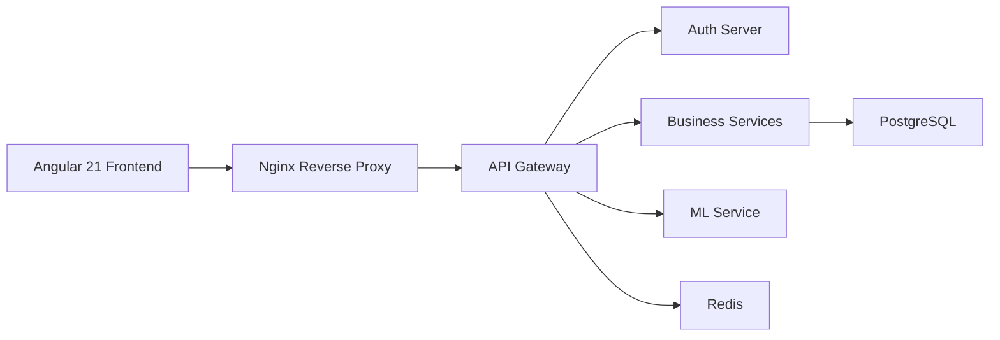

# Bienvenido a SGIVU

SGIVU es una plataforma SaaS nativa en la nube para la gestión de inventario de vehículos, diseñada para concesionarios automotrices y negocios de compraventa de vehículos. Construida sobre una arquitectura moderna de microservicios, SGIVU proporciona herramientas integrales para gestionar vehículos, clientes, compras, ventas y aprovechar el aprendizaje automático para obtener información empresarial inteligente.

## ¿Qué es SGIVU?

SGIVU (Sistema de Gestión Inteligente de Vehículos Usados) es una plataforma de nivel empresarial que centraliza todos los aspectos de las operaciones de inventario de vehículos:

- **Gestión de Vehículos**: Gestión completa del catálogo para automóviles y motocicletas con búsqueda avanzada, seguimiento de estado y gestión de imágenes vía AWS S3
- **Gestión de Clientes**: Gestión unificada de clientes individuales y corporativos con perfiles detallados e historial de transacciones
- **Contratos de Compraventa**: Gestión del ciclo de vida completo de contratos con capacidades de generación de informes (PDF, Excel, CSV)
- **Gestión de Usuarios y Roles**: Sistema de permisos granular con autenticación OAuth 2.1/OIDC
- **Aprendizaje Automático**: Analítica predictiva para pronóstico de demanda e inteligencia de negocios
- **Preparado para Multi-tenencia**: Diseñado para escalabilidad con configuración centralizada y descubrimiento de servicios

## ¿Para Quién es SGIVU?
 
<CardGroup cols={2}>
  <Card title="Concesionarios de Autos" icon="car">
    Gestiona el inventario en múltiples ubicaciones con seguimiento en tiempo real y pronóstico inteligente de demanda
  </Card>
  <Card title="Negocios de Compraventa de Vehículos" icon="handshake">
    Optimiza las operaciones de compra y venta con generación automatizada de contratos e informes
  </Card>
  <Card title="Gestores de Flotas" icon="truck">
    Realiza seguimiento del estado de vehículos, programas de mantenimiento y optimiza la utilización de la flota
  </Card>
  <Card title="Organizaciones Empresariales" icon="building">
    Escala las operaciones con arquitectura de microservicios y autenticación centralizada
  </Card>
</CardGroup>

## Capacidades Principales

### Autenticación y Seguridad

- Implementación de **OAuth 2.1 / OpenID Connect** con tokens JWT
- Patrón **BFF (Backend for Frontend)** vía API Gateway
- **Control de acceso basado en roles** granular con permisos personalizados
- Sesiones HTTP en Redis (gateway) para escalabilidad horizontal del BFF
- Autenticación entre servicios para comunicación interna

### Aspectos Destacados de la Arquitectura

<Info>
SGIVU sigue las mejores prácticas nativas en la nube con:
- **Spring Boot 4.0.1** (servicios de negocio), **Spring Boot 3.5.8** (infraestructura) y **Java 25** para servicios backend
- **Angular 21** para la SPA frontend
- **FastAPI y Python 3.12** para servicios ML
- **PostgreSQL** para persistencia de datos
- **Redis** para sesiones del gateway y caché de agregados del dashboard en `sgivu-purchase-sale`
- **Docker y Docker Compose** para contenedorización
</Info>

### Observabilidad

- Verificaciones de salud vía Spring Boot Actuator
- Registro centralizado para resolución de problemas

## Stack Tecnológico



**Frontend:**
- Angular 21 (standalone components, Signals, `ChangeDetectionStrategy.OnPush`), TypeScript 5.9
- Bootstrap 5.3.8, ng2-charts (Chart.js)
- RxJS 7.8 para programación reactiva

**Backend:**
- Spring Boot 4.0.1, Spring Cloud
- Spring Security (OAuth2/OIDC)
- Spring Data JPA
- Flyway (migraciones de base de datos)

**Aprendizaje Automático:**
- FastAPI, Uvicorn
- scikit-learn, XGBoost
- pandas, numpy

**Infraestructura:**
- Docker, Docker Compose
- Nginx como proxy inverso
- AWS (EC2 para despliegue en producción, S3 para almacenamiento de imágenes de vehículos)
- Redis 7

**Observabilidad:**
- Spring Boot Actuator
- Verificaciones de salud

## Inicio Rápido

<Steps>
  <Step title="Clonar el Repositorio">
    ```bash
    git clone https://github.com/stevenrq/sgivu.git
    cd sgivu
    ```
  </Step>

  <Step title="Configurar Variables de Entorno">
    ```bash
    cp infra/compose/sgivu-docker-compose/.env.example .env
    # Edit .env with your configuration
    ```
  </Step>

  <Step title="Iniciar el Stack Backend">
    ```bash
    cd infra/compose/sgivu-docker-compose
    ./run.sh --dev
    ```
  </Step>

  <Step title="Iniciar el Frontend Angular (en otra terminal)">
    El frontend vive en su propio repositorio y no se levanta con Docker Compose. Clónalo y arráncalo con la CLI de Angular:
    ```bash
    git clone https://github.com/stevenrq/sgivu-frontend.git
    cd sgivu-frontend
    npm install   # solo la primera vez
    npm run start
    ```
  </Step>

  <Step title="Acceder a la Aplicación">
    - **Frontend**: http://localhost:4200 (inicio manual, ver paso anterior)
    - **API Gateway**: http://localhost:8080
    - **Servidor de Autorización**: http://localhost:9000
    - **Descubrimiento de Servicios**: http://localhost:8761
    - **Servicio ML**: http://localhost:8000
  </Step>
</Steps>

<Note>
El entorno de desarrollo utiliza Docker Compose con volúmenes montados para recarga en caliente durante el desarrollo.
</Note>

## Endpoints Principales

| Servicio | Puerto | Endpoint | Descripción |
|----------|--------|----------|-------------|
| Frontend | 4200 | `http://localhost:4200` | SPA Angular |
| Gateway | 8080 | `http://localhost:8080` | API Gateway (BFF) |
| Auth | 9000 | `http://localhost:9000` | Servidor OAuth2/OIDC |
| Config | 8888 | `http://localhost:8888` | Configuración Centralizada |
| Discovery | 8761 | `http://localhost:8761` | Registro de Servicios Eureka |
| ML | 8000 | `http://localhost:8000` | API de Aprendizaje Automático |

## Siguientes Pasos

<CardGroup cols={2}>
  <Card title="Arquitectura" icon="sitemap" href="/architecture">
    Profundiza en la arquitectura de microservicios y los patrones de comunicación
  </Card>
  <Card title="Funcionalidades" icon="stars" href="/features">
    Explora la documentación completa de funcionalidades
  </Card>
</CardGroup>

<Warning>
**Aviso de Seguridad**: Las credenciales y secretos por defecto se proporcionan únicamente para desarrollo. Nunca utilices secretos por defecto en entornos de producción. Mueve todos los secretos a un gestor de secretos (AWS Secrets Manager, HashiCorp Vault, etc.).
</Warning>
