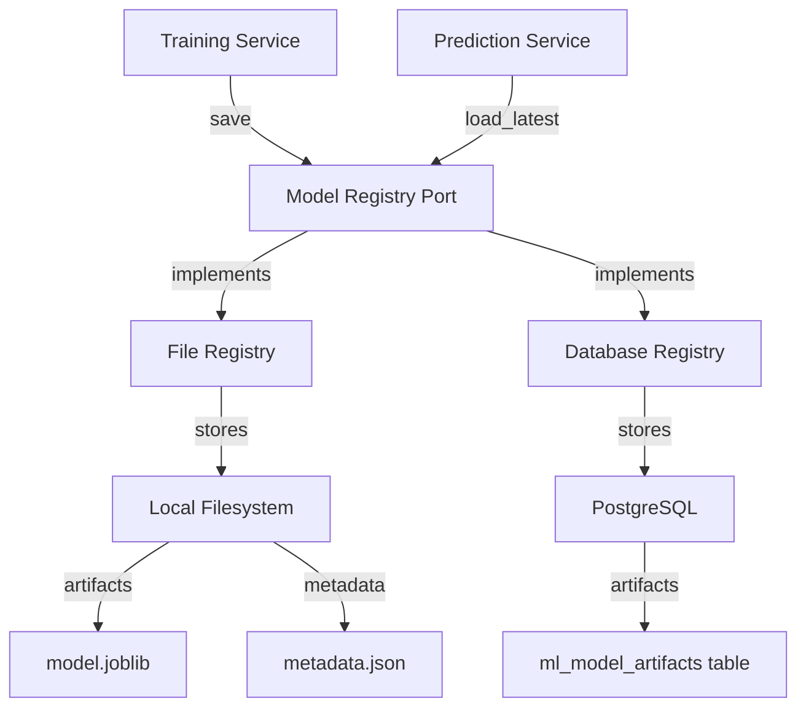
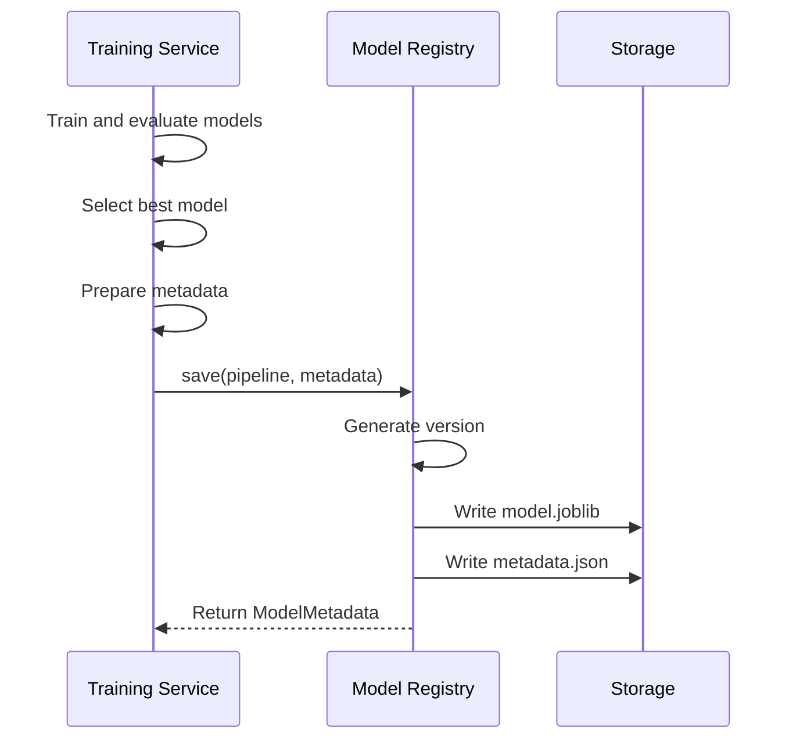
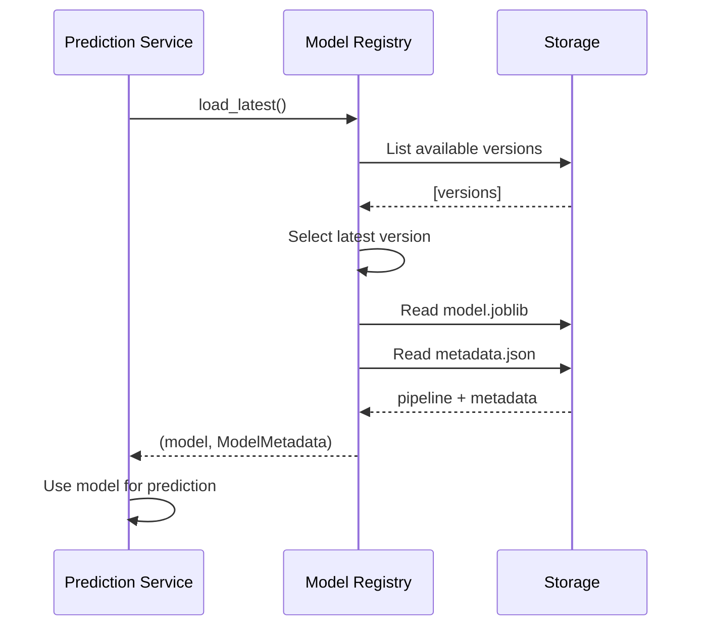

## Descripción General

El servicio ML de SGIVU implementa un sistema robusto de gestión de modelos que maneja el versionamiento, la persistencia, el seguimiento de metadatos y las operaciones del ciclo de vida del modelo. Esto garantiza reproducibilidad, trazabilidad y actualizaciones de modelos sin interrupciones.

## Registro de Modelos

El **Registro de Modelos** es el componente central para gestionar artefactos de ML, implementado a través de la interfaz `ModelRegistryPort` con implementaciones concretas para almacenamiento en sistema de archivos y base de datos.

### Arquitectura



<Info>
El servicio puede operar en **modo solo archivos** (sin base de datos) o en **modo respaldado por base de datos** para despliegues empresariales con almacenamiento centralizado.
</Info>

---

## Versionamiento de Modelos

### Formato de Versión

Los modelos se versionan utilizando identificadores basados en marcas de tiempo:

```
YYYYMMDD_HHMMSS
```

**Ejemplo**: `20260306_143022` representa un modelo entrenado el 6 de marzo de 2026 a las 14:30:22.

### ¿Por qué versionamiento por marca de tiempo?

<CardGroup cols={2}>
  <Card title="Orden Cronológico" icon="clock">
    Las versiones se ordenan naturalmente por fecha de entrenamiento
  </Card>
  <Card title="Sin Conflictos" icon="shield-check">
    Los entrenamientos concurrentes no colisionarán (precisión al segundo)
  </Card>
  <Card title="Reproducibilidad" icon="rotate">
    Fácil de identificar cuándo se creó un modelo
  </Card>
  <Card title="Simplicidad" icon="circle-check">
    No requiere gestión separada de números de versión
  </Card>
</CardGroup>

### Generación de Versiones

Las versiones se generan automáticamente al guardar el modelo:

```python
from datetime import datetime, timezone

def generate_version() -> str:
    """Generate timestamp-based version identifier"""
    return datetime.now(timezone.utc).strftime("%Y%m%d_%H%M%S")

# Example usage
version = generate_version()  # "20260306_143022"
```

---

## Persistencia de Modelos

### Almacenamiento en Sistema de Archivos

Al usar almacenamiento en sistema de archivos (configurado vía `MODEL_DIR`):

```
MODEL_DIR/
├── 20260301_093045/
│   ├── model.joblib      # Serialized sklearn pipeline
│   └── metadata.json     # Training metadata
├── 20260305_141530/
│   ├── model.joblib
│   └── metadata.json
└── 20260306_143022/      # Latest version
    ├── model.joblib
    └── metadata.json
```

#### Artefacto del Modelo (model.joblib)

El objeto `Pipeline` de sklearn entrenado, serializado con joblib:

```python
import joblib

# Save
joblib.dump(pipeline, "model.joblib")

# Load
pipeline = joblib.load("model.joblib")
```

El Pipeline incluye:
- **Preprocesador**: `ColumnTransformer` con codificadores y escaladores
- **Modelo**: Mejor estimador (LinearRegression, Random Forest o XGBoost)

#### Archivo de Metadatos (metadata.json)

```json
{
  "version": "20260306_143022",
  "trained_at": "2026-03-06T14:30:22.123456+00:00",
  "target": "sales_count",
  "features": [
    "vehicle_type",
    "brand",
    "model",
    "line",
    "purchases_count",
    "avg_margin",
    "avg_sale_price",
    "avg_purchase_price",
    "avg_days_inventory",
    "inventory_rotation",
    "lag_1",
    "lag_3",
    "lag_6",
    "rolling_mean_3",
    "rolling_mean_6",
    "month",
    "year",
    "month_sin",
    "month_cos"
  ],
  "metrics": {
    "rmse": 3.24,
    "mae": 2.15,
    "mape": 0.087,
    "r2": 0.89,
    "residual_std": 2.8
  },
  "candidates": [
    {
      "model": "linear_regression",
      "rmse": 4.12,
      "mae": 3.05,
      "mape": 0.124,
      "r2": 0.76,
      "samples": 462
    },
    {
      "model": "random_forest",
      "rmse": 3.45,
      "mae": 2.31,
      "mape": 0.095,
      "r2": 0.85,
      "samples": 462
    },
    {
      "model": "xgboost",
      "rmse": 3.24,
      "mae": 2.15,
      "mape": 0.087,
      "r2": 0.89,
      "samples": 462
    }
  ],
  "train_samples": 1847,
  "test_samples": 462,
  "total_samples": 2309
}
```

<Accordion title="Descripción de los Campos de Metadatos">
  <ParamField path="version" type="string">
    Identificador único del modelo (basado en marca de tiempo)
  </ParamField>
  
  <ParamField path="trained_at" type="string">
    Marca de tiempo ISO 8601 con zona horaria
  </ParamField>
  
  <ParamField path="target" type="string">
    Nombre de la variable objetivo (generalmente `sales_count`)
  </ParamField>
  
  <ParamField path="features" type="array">
    Lista de nombres de features en el orden esperado por el modelo
  </ParamField>
  
  <ParamField path="metrics" type="object">
    Métricas de rendimiento de la evaluación en el conjunto de prueba
    - `rmse`: Error Cuadrático Medio (Root Mean Squared Error)
    - `mae`: Error Absoluto Medio (Mean Absolute Error)
    - `mape`: Error Porcentual Absoluto Medio (Mean Absolute Percentage Error)
    - `r2`: Coeficiente de determinación (R-squared)
    - `residual_std`: Usado para intervalos de predicción
  </ParamField>
  
  <ParamField path="candidates" type="array">
    Comparación de todos los modelos evaluados con sus métricas
  </ParamField>
  
  <ParamField path="train_samples" type="integer">
    Número de muestras utilizadas para entrenamiento
  </ParamField>
  
  <ParamField path="test_samples" type="integer">
    Número de muestras utilizadas para evaluación
  </ParamField>
  
  <ParamField path="total_samples" type="integer">
    Tamaño total del dataset
  </ParamField>
</Accordion>

### Almacenamiento en Base de Datos

Para despliegues en producción, los modelos pueden almacenarse en PostgreSQL:

#### Esquema

```sql
CREATE TABLE ml_model_artifacts (
    id SERIAL PRIMARY KEY,
    version VARCHAR(50) UNIQUE NOT NULL,
    trained_at TIMESTAMP WITH TIME ZONE NOT NULL,
    metadata JSONB NOT NULL,
    artifact BYTEA NOT NULL,  -- Serialized model pipeline
    created_at TIMESTAMP WITH TIME ZONE DEFAULT NOW()
);

CREATE INDEX idx_ml_model_version ON ml_model_artifacts(version);
CREATE INDEX idx_ml_model_trained_at ON ml_model_artifacts(trained_at DESC);
```

#### Beneficios del Almacenamiento en Base de Datos

<CardGroup cols={2}>
  <Card title="Almacenamiento Centralizado" icon="database">
    Fuente única de verdad para todas las versiones de modelos
  </Card>
  <Card title="Consultas Sencillas" icon="magnifying-glass">
    Consultas SQL para comparación y análisis de modelos
  </Card>
  <Card title="Respaldos Automáticos" icon="floppy-disk">
    Los modelos se incluyen en la estrategia de respaldo de la base de datos
  </Card>
  <Card title="Escalabilidad" icon="chart-line">
    Manejo de grandes colecciones de modelos sin preocupaciones del sistema de archivos
  </Card>
</CardGroup>

---

## Ciclo de Vida del Modelo

### Entrenamiento y Registro

Cuando se entrena un nuevo modelo:



**Flujo del código** (de `app/application/services/training_service.py:88-94`):

```python
metadata_dict = {
    "trained_at": datetime.now(timezone.utc).isoformat(),
    "target": self._settings.target_column,
    "features": [
        *self._feature_engineering.category_cols,
        *self._feature_engineering.numeric_cols
    ],
    "metrics": {
        **evaluation.metrics,
        "residual_std": evaluation.residual_std,
    },
    "candidates": evaluation.candidates,
    "train_samples": evaluation.train_samples,
    "test_samples": evaluation.test_samples,
    "total_samples": len(dataset),
}

saved = await self._registry.save(evaluation.pipeline, metadata_dict)
logger.info("Model trained and versioned: %s", saved.version)
```

### Carga para Predicción

Al realizar predicciones:



**Código** (de `app/application/services/prediction_service.py:177-181`):

```python
async def _load_model(self) -> tuple[Any, ModelMetadata]:
    try:
        return await self._registry.load_latest()
    except FileNotFoundError as exc:
        raise ModelNotTrainedError("Aún no existe un modelo entrenado.") from exc
```

### Reemplazo de Modelos

<Note>
El servicio siempre utiliza el **modelo más reciente** por versión. Las versiones anteriores se conservan para auditoría pero no se usan para predicciones a menos que se carguen explícitamente.
</Note>

Cuando se entrena un nuevo modelo:

1. **Modelo anterior**: Permanece en almacenamiento con su versión
2. **Modelo nuevo**: Se guarda con una marca de tiempo de versión más reciente
3. **Predicciones**: Cambian automáticamente al nuevo modelo en la siguiente solicitud

**Sin tiempo de inactividad** ni reinicio del servicio requerido. La siguiente solicitud de predicción cargará el nuevo modelo.

---

## Snapshots de Features

Para garantizar la reproducibilidad, el servicio puede persistir datasets de features junto con los modelos.

### Propósito

Los snapshots de features permiten:
- **Predicción sin datos crudos**: Usar features pre-calculados
- **Inferencia más rápida**: No es necesario reconstruir features desde las transacciones
- **Reproducibilidad**: Asegurar que las predicciones usen las distribuciones exactas de features del entrenamiento
- **Depuración**: Comparar features entre versiones de modelos

### Esquema de Base de Datos

```sql
CREATE TABLE ml_training_features (
    id SERIAL PRIMARY KEY,
    model_version VARCHAR(50) NOT NULL,
    features JSONB NOT NULL,  -- Serialized feature DataFrame
    created_at TIMESTAMP WITH TIME ZONE DEFAULT NOW()
);

CREATE INDEX idx_ml_features_version ON ml_training_features(model_version);
```

### Uso

Los features se guardan automáticamente durante el entrenamiento (si `feature_repository` está configurado):

```python
# From app/application/services/training_service.py:90-91

if self._feature_repository:
    await self._feature_repository.save_snapshot(saved.version, dataset)
```

Y se cargan durante la predicción si están disponibles:

```python
# From app/application/services/prediction_service.py:210-216

if self._feature_repository:
    history = await self._feature_repository.load_segment_history(
        model_version, segment.model_dump()
    )
    if not history.empty:
        return history
```

<Warning>
Los snapshots de features pueden consumir espacio significativo en la base de datos para datasets grandes. Considere políticas de retención o compresión para almacenamiento a largo plazo.
</Warning>

---

## Registro de Predicciones

El servicio puede registrar todas las solicitudes y respuestas de predicción para:
- **Auditoría**: Rastrear quién solicitó qué predicciones
- **Monitoreo**: Detectar patrones de uso y anomalías
- **Evaluación del modelo**: Comparar predicciones con resultados reales
- **Depuración**: Investigar problemas en las predicciones

### Esquema de Base de Datos

```sql
CREATE TABLE ml_predictions (
    id SERIAL PRIMARY KEY,
    model_version VARCHAR(50) NOT NULL,
    request_payload JSONB NOT NULL,
    response_payload JSONB NOT NULL,
    segment JSONB NOT NULL,  -- vehicle_type, brand, model, line
    horizon INTEGER NOT NULL,
    confidence FLOAT NOT NULL,
    with_history BOOLEAN NOT NULL,
    created_at TIMESTAMP WITH TIME ZONE DEFAULT NOW()
);

CREATE INDEX idx_ml_predictions_version ON ml_predictions(model_version);
CREATE INDEX idx_ml_predictions_segment ON ml_predictions USING gin(segment);
CREATE INDEX idx_ml_predictions_created_at ON ml_predictions(created_at DESC);
```

### Información Registrada

```json
{
  "model_version": "20260306_143022",
  "request_payload": {
    "vehicle_type": "CAR",
    "brand": "TOYOTA",
    "model": "COROLLA",
    "line": "XEI 2.0",
    "horizon_months": 6,
    "confidence": 0.95
  },
  "response_payload": {
    "predictions": [
      {"month": "2026-04-01", "demand": 45.3, "lower_ci": 38.1, "upper_ci": 52.5},
      {"month": "2026-05-01", "demand": 47.8, "lower_ci": 40.2, "upper_ci": 55.4}
    ],
    "model_version": "20260306_143022",
    "metrics": {...}
  },
  "segment": {
    "vehicle_type": "CAR",
    "brand": "TOYOTA",
    "model": "COROLLA",
    "line": "XEI 2.0"
  },
  "horizon": 6,
  "confidence": 0.95,
  "with_history": false,
  "created_at": "2026-03-07T10:15:30.123456+00:00"
}
```

### Consultas al Registro de Predicciones

<CodeGroup>
```sql Predicciones Recientes
-- Get last 100 predictions
SELECT 
    created_at,
    model_version,
    segment->>'brand' as brand,
    segment->>'model' as model,
    horizon,
    response_payload->'predictions'->0->>'demand' as first_month_demand
FROM ml_predictions
ORDER BY created_at DESC
LIMIT 100;
```

```sql Predicciones por Segmento
-- Find all predictions for a specific segment
SELECT *
FROM ml_predictions
WHERE segment @> '{"brand": "TOYOTA", "model": "COROLLA"}'::jsonb
ORDER BY created_at DESC;
```

```sql Estadísticas de Uso del Modelo
-- Count predictions per model version
SELECT 
    model_version,
    COUNT(*) as prediction_count,
    MIN(created_at) as first_used,
    MAX(created_at) as last_used
FROM ml_predictions
GROUP BY model_version
ORDER BY first_used DESC;
```
</CodeGroup>

---

## Comparación de Modelos

Compare el rendimiento entre versiones de modelos para rastrear mejoras:

### Vía API

```bash
curl https://api.sgivu.com/v1/ml/models/latest \
  -H "Authorization: Bearer YOUR_TOKEN"
```

La respuesta incluye el campo `candidates` mostrando todos los modelos evaluados:

```json
{
  "version": "20260306_143022",
  "metrics": {
    "rmse": 3.24,
    "mae": 2.15,
    "r2": 0.89
  },
  "candidates": [
    {"model": "linear_regression", "rmse": 4.12, "r2": 0.76},
    {"model": "random_forest", "rmse": 3.45, "r2": 0.85},
    {"model": "xgboost", "rmse": 3.24, "r2": 0.89}
  ]
}
```

### Vía Base de Datos

```sql
-- Compare latest 5 model versions
SELECT 
    version,
    trained_at,
    metadata->>'metrics'->>'rmse' as rmse,
    metadata->>'metrics'->>'r2' as r2,
    metadata->>'total_samples' as samples
FROM ml_model_artifacts
ORDER BY trained_at DESC
LIMIT 5;
```

### Ejemplo de Visualización

```python
import pandas as pd
import matplotlib.pyplot as plt

# Fetch model history
versions = [
    {"version": "20260301_093045", "rmse": 4.2, "r2": 0.82},
    {"version": "20260305_141530", "rmse": 3.8, "r2": 0.85},
    {"version": "20260306_143022", "rmse": 3.24, "r2": 0.89},
]

df = pd.DataFrame(versions)

fig, (ax1, ax2) = plt.subplots(1, 2, figsize=(12, 4))

# RMSE over time
ax1.plot(df["version"], df["rmse"], marker="o")
ax1.set_title("RMSE Trend")
ax1.set_ylabel("RMSE")
ax1.tick_params(axis="x", rotation=45)

# R² over time
ax2.plot(df["version"], df["r2"], marker="o", color="green")
ax2.set_title("R² Trend")
ax2.set_ylabel("R² Score")
ax2.tick_params(axis="x", rotation=45)

plt.tight_layout()
plt.show()
```

---

## Rollback de Modelos

Si un nuevo modelo tiene un rendimiento deficiente en producción, puede hacer rollback de las siguientes maneras:

### Opción 1: Rollback por Sistema de Archivos

Renombrar el directorio para que una versión anterior sea la "más reciente":

```bash
# Temporarily move problematic version
mv MODEL_DIR/20260306_143022 MODEL_DIR/20260306_143022.backup

# Predictions will now use 20260305_141530
```

<Warning>
Este es un proceso manual. Pruebe exhaustivamente y considere implementar un mecanismo de rollback adecuado para producción.
</Warning>

### Opción 2: Carga Explícita de Versión

Modificar el registro para cargar una versión específica en lugar de la más reciente:

```python
# Custom implementation (not in current codebase)

class VersionedModelRegistry(ModelRegistryPort):
    def __init__(self, model_dir: Path, preferred_version: str | None = None):
        self.model_dir = model_dir
        self.preferred_version = preferred_version
    
    async def load_latest(self) -> tuple[Any, ModelMetadata]:
        if self.preferred_version:
            return await self.load_version(self.preferred_version)
        # Otherwise use actual latest
        return await super().load_latest()
```

Configurar mediante variable de entorno:

```bash
PREFERRED_MODEL_VERSION=20260305_141530
```

### Opción 3: Reentrenar con Mejores Datos

La mejor solución generalmente es reentrenar con datos corregidos:

```bash
curl -X POST https://api.sgivu.com/v1/ml/retrain \
  -H "Authorization: Bearer YOUR_TOKEN" \
  -d '{}'
```

---

## Monitoreo y Observabilidad

### Verificaciones de Salud

Verificar la disponibilidad del modelo:

```bash
curl https://api.sgivu.com/v1/ml/models/latest \
  -H "Authorization: Bearer YOUR_TOKEN"
```

Respuesta esperada:
- **200 OK**: El modelo está disponible
- **500 Error** con `"No hay modelos disponibles"`: No hay modelo entrenado

### Métricas a Monitorear

<AccordionGroup>
  <Accordion title="Métricas de Rendimiento del Modelo">
    - **RMSE**: Monitorear a lo largo del tiempo, alertar si supera el umbral
    - **R²**: Debe ser > 0.70 para buenos modelos
    - **MAPE**: Error porcentual, apuntar a < 15%
  </Accordion>
  
  <Accordion title="Métricas Operativas">
    - **Frecuencia de entrenamiento**: ¿Con qué frecuencia se reentrenan los modelos?
    - **Duración del entrenamiento**: ¿Está aumentando con el tiempo?
    - **Tamaño del modelo**: Uso de disco/memoria por versión
    - **Latencia de predicción**: Tiempo de respuesta para pronósticos
  </Accordion>
  
  <Accordion title="Métricas de Negocio">
    - **Precisión de predicciones**: Comparar pronósticos con valores reales
    - **Cobertura**: % de segmentos con datos de entrenamiento suficientes
    - **Uso**: Predicciones por segmento/día
    - **Confianza**: ¿Las predicciones están consistentemente dentro de los intervalos de confianza?
  </Accordion>
</AccordionGroup>

### Alertas

Configurar alertas para:

```yaml
alerts:
  - name: NoModelAvailable
    condition: latest_model_age > 7 days
    action: Trigger retraining
  
  - name: ModelPerformanceDegraded
    condition: rmse > 5.0 OR r2 < 0.70
    action: Review data quality, retrain
  
  - name: PredictionErrors
    condition: error_rate > 5%
    action: Check for missing segments, data issues
```

---

## Buenas Prácticas

<Card title="Política de Retención de Versiones" icon="trash">
  **Conservar**: Últimas 10 versiones o 90 días de modelos
  
  **Archivar**: Versiones más antiguas en almacenamiento frío
  
  **Eliminar**: Modelos con más de 1 año (después de revisión de cumplimiento)
</Card>

<Card title="Documentación del Modelo" icon="file-lines">
  Almacenar documentación adicional con cada versión:
  - Notebook/script de entrenamiento
  - Reporte de calidad de datos
  - Análisis de importancia de features
  - Contexto de negocio (ej., "entrenado después de temporada de fiestas")
</Card>

<Card title="Pruebas A/B" icon="flask">
  Para cambios importantes en el modelo, ejecutar pruebas A/B:
  - Dirigir el 10% del tráfico al nuevo modelo
  - Comparar predicciones y retroalimentación de usuarios
  - Aumentar gradualmente el tráfico si es exitoso
</Card>

<Card title="Reproducibilidad" icon="code-branch">
  Asegurar que los modelos puedan ser recreados:
  - Fijar versiones de dependencias (`requirements.txt`)
  - Almacenar la versión del código de feature engineering
  - Guardar semillas aleatorias en los metadatos
  - Documentar hiperparámetros
</Card>

---

## Referencia de API

Para operaciones de API relacionadas con la gestión de modelos, consulte:

<CardGroup cols={2}>
  <Card title="Obtener Modelo Más Reciente" icon="download" href="/ml/prediction-api#get-latest-model">
    Recuperar metadatos del modelo actual
  </Card>
  <Card title="Reentrenar Modelo" icon="arrows-rotate" href="/ml/prediction-api#retrain-model">
    Activar un nuevo entrenamiento del modelo
  </Card>
</CardGroup>

---

## Solución de Problemas

<AccordionGroup>
  <Accordion title="Error de modelo no encontrado">
    **Error**: `ModelNotTrainedError: Aún no existe un modelo entrenado.`
    
    **Causa**: No existen versiones del modelo en `MODEL_DIR` o en la base de datos.
    
    **Solución**:
    1. Ejecutar el entrenamiento inicial vía `/v1/ml/retrain`
    2. Verificar que la ruta de `MODEL_DIR` sea correcta
    3. Verificar la conectividad a la base de datos si usa almacenamiento en BD
  </Accordion>
  
  <Accordion title="Errores de deserialización del modelo">
    **Error**: `ValueError: unsupported pickle protocol` o errores de importación de módulos
    
    **Causa**: El modelo fue entrenado con versiones diferentes de Python o bibliotecas.
    
    **Solución**:
    - Asegurar un entorno consistente (usar Docker)
    - Fijar versiones de dependencias
    - Reentrenar el modelo en el entorno actual
  </Accordion>
  
  <Accordion title="Las predicciones cambian después del reentrenamiento">
    **Causa**: Datos de entrenamiento, features o selección de modelo diferentes.
    
    **Comportamiento esperado**: Los modelos evolucionan a medida que cambian los datos.
    
    **Para investigar**:
    - Comparar el campo `candidates` en los metadatos
    - Verificar si se seleccionó un algoritmo diferente
    - Revisar los rangos de fechas de los datos de entrenamiento
    - Comparar distribuciones de features
  </Accordion>
  
  <Accordion title="Carga lenta del modelo">
    **Causa**: Archivos de modelo grandes o latencia de red (almacenamiento en BD).
    
    **Soluciones**:
    - Cachear el modelo cargado en memoria (la implementación actual carga en cada predicción)
    - Usar almacenamiento en archivos en lugar de BD para acceso más rápido
    - Implementar precarga del modelo durante el inicio del servicio
  </Accordion>
</AccordionGroup>

---

## Próximos Pasos

<CardGroup cols={2}>
  <Card title="Proceso de Entrenamiento" icon="graduation-cap" href="/ml/training">
    Aprenda cómo se entrenan los modelos
  </Card>
  <Card title="API de Predicción" icon="chart-line" href="/ml/prediction-api">
    Utilice los modelos para pronósticos
  </Card>
  <Card title="Guía de Despliegue" icon="rocket" href="/infrastructure/deployment">
    Despliegue SGIVU en producción
  </Card>
  <Card title="Guía de Monitoreo" icon="chart-mixed" href="/infrastructure/monitoring">
    Configure el monitoreo de modelos
  </Card>
</CardGroup>