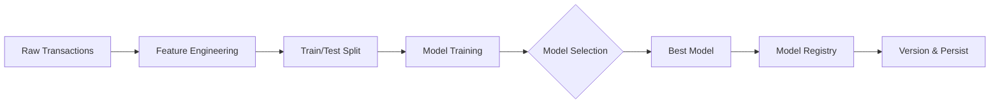

## Descripción general

El Pipeline de entrenamiento ML de SGIVU transforma datos crudos de transacciones en modelos precisos de pronóstico de demanda. El proceso incluye Feature Engineering, entrenamiento con múltiples algoritmos, evaluación y versionado.

## Arquitectura del Pipeline



## Feature Engineering

El Pipeline de Feature Engineering está implementado en `app/infrastructure/ml/feature_engineering.py` y transforma datos crudos de transacciones en features listas para Machine Learning.

### Requisitos de datos de entrada

Los datos crudos de transacciones deben incluir:

<ParamField body="vehicle_id" type="string" required>
  Identificador único para rastrear el ciclo de vida del vehículo
</ParamField>

<ParamField body="vehicle_type" type="string" required>
  Categoría del vehículo (CAR, MOTORCYCLE)
</ParamField>

<ParamField body="brand" type="string" required>
  Fabricante del vehículo
</ParamField>

<ParamField body="model" type="string" required>
  Nombre del modelo del vehículo
</ParamField>

<ParamField body="line" type="string" required>
  Versión/acabado específico - **no puede estar vacío**
</ParamField>

<ParamField body="contract_type" type="string" required>
  Tipo de transacción: `SALE` o `PURCHASE`
</ParamField>

<ParamField body="sale_price" type="float">
  Precio de la transacción de venta
</ParamField>

<ParamField body="purchase_price" type="float">
  Precio de la transacción de compra
</ParamField>

<ParamField body="created_at" type="datetime" required>
  Marca temporal de creación del registro
</ParamField>

<ParamField body="updated_at" type="datetime">
  Marca temporal de actualización del registro
</ParamField>

### Normalización de datos

Antes del Feature Engineering, todos los datos categóricos se normalizan:

<CodeGroup>
```python Normalization Example
from app.infrastructure.ml.normalization import (
    canonicalize_label,
    canonicalize_brand_model
)

# Label normalization
vehicle_type = canonicalize_label("car")  # → "CAR"
line = canonicalize_label(" xei 2.0 ")    # → "XEI 2.0"

# Brand/model canonicalization
brand, model = canonicalize_brand_model("toyota", "corolla")
# → ("TOYOTA", "COROLLA")
```

```python Source Code Reference
# app/infrastructure/ml/feature_engineering.py:63-78

for col in self.category_cols + self.optional_category_cols:
    if col in work_df:
        work_df[col] = work_df[col].fillna("UNKNOWN").apply(canonicalize_label)

if "brand" in work_df and "model" in work_df:
    pairs = work_df[["brand", "model"]].apply(
        lambda row: canonicalize_brand_model(row["brand"], row["model"]),
        axis=1,
        result_type="expand",
    )
    work_df[["brand", "model"]] = pairs.values
```
</CodeGroup>

<Note>
La normalización garantiza una segmentación consistente al manejar variaciones de mayúsculas/minúsculas, errores tipográficos y diferencias de espaciado.
</Note>

### Categorías de features

El Pipeline genera tres tipos de features:

#### 1. Features categóricas

Dimensiones de segmentación que identifican el vehículo:

```python
category_cols = [
    "vehicle_type",  # CAR, MOTORCYCLE
    "brand",         # TOYOTA, HONDA, FORD, etc.
    "model",         # COROLLA, CIVIC, F-150, etc.
    "line"           # Trim/version (mandatory)
]
```

Se codifican usando **OneHotEncoder** durante el entrenamiento del modelo.

#### 2. Métricas de negocio

Métricas mensuales agregadas por segmento:

```python
# app/infrastructure/ml/feature_engineering.py:105-117

monthly = (
    work_df.groupby(group_cols)
    .agg(
        sales_count=("is_sale", "sum"),              # Target variable
        purchases_count=("is_purchase", "sum"),      # Inventory additions
        avg_sale_price=("sale_price", "mean"),       # Average sale price
        avg_purchase_price=("purchase_price", "mean"),# Average cost
        avg_margin=("margin", "mean"),                # Profit margin
        avg_days_inventory=("days_in_inventory", "mean") # Time to sell
    )
    .reset_index()
)

# Inventory rotation: sales / purchases
monthly["inventory_rotation"] = monthly["sales_count"] / monthly[
    "purchases_count"
].clip(lower=1)
```

**Descripción de features de negocio:**

| Feature | Descripción | Indicador de negocio |
|---------|-------------|----------------------|
| `purchases_count` | Nuevas adquisiciones de inventario por mes | Actividad del lado de la oferta |
| `avg_margin` | Beneficio promedio por venta | Indicador de rentabilidad |
| `avg_sale_price` | Precio de venta promedio | Tendencias de precio |
| `avg_purchase_price` | Costo promedio de adquisición | Tendencias de costos |
| `avg_days_inventory` | Promedio de días desde compra hasta venta | Velocidad de inventario |
| `inventory_rotation` | Ratio ventas/compras | Eficiencia de rotación |

#### 3. Features de series temporales

Los valores rezagados y estadísticas móviles capturan patrones temporales:

```python
# app/infrastructure/ml/feature_engineering.py:197-209

def _add_lags(self, group: pd.DataFrame) -> pd.DataFrame:
    """Agrega columnas de lag y medias móviles al grupo."""
    group = group.sort_values("event_month")
    group["lag_1"] = group["sales_count"].shift(1)   # Last month
    group["lag_3"] = group["sales_count"].shift(3)   # 3 months ago
    group["lag_6"] = group["sales_count"].shift(6)   # 6 months ago

    # Rolling averages
    group["rolling_mean_3"] = (
        group["sales_count"].rolling(window=3, min_periods=1).mean().shift(1)
    )
    group["rolling_mean_6"] = (
        group["sales_count"].rolling(window=6, min_periods=1).mean().shift(1)
    )
    return group
```

**Descripción de features de series temporales:**

| Feature | Ventana | Propósito |
|---------|---------|-----------|
| `lag_1` | 1 mes | Señal de tendencia reciente |
| `lag_3` | 3 meses | Patrón trimestral |
| `lag_6` | 6 meses | Estacionalidad semestral |
| `rolling_mean_3` | Promedio de 3 meses | Suavizado a corto plazo |
| `rolling_mean_6` | Promedio de 6 meses | Tendencia a largo plazo |

<Warning>
Los lags se calculan **por segmento** para evitar fuga de datos entre diferentes tipos/marcas/modelos de vehículos.
</Warning>

#### 4. Features temporales

La codificación cíclica captura la estacionalidad:

```python
# app/infrastructure/ml/feature_engineering.py:211-217

def _add_time_features(self, df: pd.DataFrame) -> pd.DataFrame:
    """Agrega features temporales (mes, año, representación cíclica)."""
    df["month"] = pd.DatetimeIndex(df["event_month"]).month
    df["year"] = pd.DatetimeIndex(df["event_month"]).year

    # Cyclical encoding for seasonality
    df["month_sin"] = np.sin(2 * np.pi * df["month"] / 12)
    df["month_cos"] = np.cos(2 * np.pi * df["month"] / 12)
    return df
```

**¿Por qué codificación cíclica?**

<Info>
El uso de `sin` y `cos` garantiza que diciembre (12) y enero (1) se reconozcan como meses adyacentes, capturando los patrones de estacionalidad de fin de año.
</Info>

### Salida del Feature Engineering

El método `build_feature_table` produce un dataset agregado mensualmente:

```python
# Example output structure

   vehicle_type    brand     model      line  event_month  sales_count  purchases_count  ...
0           CAR  TOYOTA   COROLLA  XEI 2.0   2025-01-01         42.0             38.0  ...
1           CAR  TOYOTA   COROLLA  XEI 2.0   2025-02-01         38.0             35.0  ...
2           CAR  TOYOTA   COROLLA  XEI 2.0   2025-03-01         44.0             40.0  ...
```

Esta tabla contiene una fila por segmento por mes con todas las features generadas.

---

## Entrenamiento del modelo

El proceso de entrenamiento es orquestado por `TrainingService` (`app/application/services/training_service.py:46-94`).

### Flujo de entrenamiento

```python
# Simplified training flow

async def train(self, raw_df: pd.DataFrame) -> ModelMetadata:
    # 1. Feature engineering
    dataset = self._feature_engineering.build_feature_table(raw_df)

    # 2. Validate dataset
    if dataset.empty:
        raise TrainingError("No hay datos históricos para entrenar.")

    # 3. Train and evaluate models
    evaluation = await asyncio.to_thread(
        self._model_trainer.train_and_evaluate,
        dataset,
        self._feature_engineering.category_cols,
        self._feature_engineering.optional_category_cols,
        self._feature_engineering.numeric_cols,
    )

    # 4. Save best model and metadata
    metadata_dict = {
        "trained_at": datetime.now(timezone.utc).isoformat(),
        "target": self._settings.target_column,
        "features": [...],
        "metrics": evaluation.metrics,
        "candidates": evaluation.candidates,
        "train_samples": evaluation.train_samples,
        "test_samples": evaluation.test_samples,
        "total_samples": len(dataset),
    }

    saved = await self._registry.save(evaluation.pipeline, metadata_dict)
    return saved
```

### División Train/Test

La división respeta el orden temporal para prevenir fuga de datos:

```python
# app/infrastructure/ml/model_training.py:147-164

def _split_by_time(self, df: pd.DataFrame) -> tuple[pd.DataFrame, pd.DataFrame]:
    """Divide en train/test respetando el orden temporal del historial."""
    unique_months = sorted(df["event_month"].unique())

    # Require minimum history (default: 6 months)
    if len(unique_months) < self._settings.min_history_months:
        raise ValueError(
            f"Se requieren al menos {self._settings.min_history_months} meses "
            f"para entrenar."
        )

    # 80/20 split by time
    cutoff_index = int(len(unique_months) * 0.8)
    cutoff_date = unique_months[max(1, cutoff_index - 1)]

    train = df[df["event_month"] <= cutoff_date]
    test = df[df["event_month"] > cutoff_date]

    return train, test
```

<Info>
**Ejemplo**: Con 12 meses de datos:
- **Conjunto de entrenamiento**: Primeros 9-10 meses
- **Conjunto de prueba**: Últimos 2-3 meses

Esto simula un pronóstico real donde se predicen meses futuros basándose en datos históricos.
</Info>

### Pipeline de preprocesamiento

Antes del ajuste del modelo, los datos pasan por el preprocesamiento de sklearn:

```python
# app/infrastructure/ml/model_training.py:166-186

@staticmethod
def _build_preprocessor(
    category_cols: list[str],
    optional_cols: list[str],
    numeric_cols: list[str],
) -> ColumnTransformer:
    """Construye el ColumnTransformer con encoding categórico y escalado numérico."""

    # One-hot encoding for categories
    categorical = OneHotEncoder(handle_unknown="ignore")

    # Imputation + standardization for numerics
    numeric = Pipeline(
        steps=[
            ("imputer", SimpleImputer(strategy="median")),
            ("scaler", StandardScaler()),
        ]
    )

    return ColumnTransformer(
        transformers=[
            ("categorical", categorical, category_cols + optional_cols),
            ("numeric", numeric, numeric_cols),
        ],
        remainder="drop",
    )
```

**Pasos de preprocesamiento:**

1. **Variables categóricas**: Codificadas con One-Hot (crea columnas binarias por categoría)
2. **Variables numéricas**:
   - Valores faltantes imputados con la mediana
   - Estandarizadas a media cero y varianza unitaria

### Modelos candidatos

`ModelTrainer` evalúa **dos algoritmos** (Random Forest y XGBoost) y, opcionalmente, ejecuta una búsqueda aleatoria de hiperparámetros (`RandomizedSearchCV` con `cv_n_iter=10` y `cv_n_jobs=-1`) usando `TimeSeriesSplit(n_splits=3)` para validación temporal.

<Tabs>
  <Tab title="Random Forest">
    ```python
    RandomForestRegressor(
        n_estimators=300,
        max_depth=15,
        random_state=7
    )
    ```

    **Ventajas:**
    - Maneja relaciones no lineales
    - Robusto frente a valores atípicos
    - Información sobre importancia de features

    **Desventajas:**
    - Más lento que los modelos lineales
    - Puede sobreajustar con árboles poco profundos
  </Tab>

  <Tab title="XGBoost">
    ```python
    XGBRegressor(
        n_estimators=500,
        max_depth=6,
        learning_rate=0.05,
        subsample=0.9,
        colsample_bytree=0.9,
        objective="reg:squarederror",
        random_state=7
    )
    ```

    **Ventajas:**
    - Rendimiento de vanguardia
    - Maneja interacciones complejas
    - La regularización previene el sobreajuste

    **Desventajas:**
    - Requiere más ajuste de hiperparámetros
    - Mayor tiempo de entrenamiento
    - Menos interpretable
  </Tab>
</Tabs>

### Evaluación del modelo

Cada candidato se evalúa sobre el conjunto de prueba, registrando RMSE, MAE, MAPE, **WAPE** y R²:

```python
# Esquema simplificado del flujo en app/infrastructure/ml/model_training.py

for name, estimator in candidates_list:
    pipeline = Pipeline(
        steps=[("preprocess", preprocessor), ("model", estimator)],
    )
    pipeline.fit(x_train, y_train)
    preds = np.asarray(pipeline.predict(x_test))

    rmse = np.sqrt(mean_squared_error(y_test, preds))
    mae = mean_absolute_error(y_test, preds)
    mape = mean_absolute_percentage_error(y_test, preds)
    wape = np.sum(np.abs(y_test - preds)) / np.sum(np.abs(y_test))
    r2 = r2_score(y_test, preds)

    evaluated.append({
        "model": name,
        "rmse": rmse, "mae": mae, "mape": mape, "wape": wape, "r2": r2,
        "samples": len(y_test),
    })
```

#### Selección del mejor candidato

El criterio de selección es configurable vía `MODEL_SELECTION_METRIC` (variable de entorno):

| Modo | Score (menor es mejor) |
|---|---|
| `weighted` (por defecto) | `(1 - mape_weight) * RMSE + mape_weight * WAPE` con `mape_weight = 0.4` |
| `rmse` | RMSE puro |
| `mape` | MAPE puro |

WAPE (`Σ|y - ŷ| / Σ|y|`) reemplaza a MAPE en el modo `weighted` para evitar inestabilidades cuando hay meses con ventas cercanas a cero.

Adicionalmente, `_compute_baselines` calcula métricas de referencia naive (p.ej. `naive_lag1_rmse`) sobre el conjunto de prueba. Si el mejor candidato no supera ambos baselines, se registra una advertencia para que el operador valide los datos.

**Métricas de evaluación:**

<AccordionGroup>
  <Accordion title="RMSE (Root Mean Squared Error)">
    Penaliza los errores grandes de forma más severa. Mismas unidades que la variable objetivo.

    ```
    RMSE = √(Σ(predicted - actual)² / n)
    ```

    **Menor es mejor**. Métrica principal para la selección del modelo.
  </Accordion>

  <Accordion title="MAE (Mean Absolute Error)">
    Diferencia absoluta promedio entre predicciones y valores reales.

    ```
    MAE = Σ|predicted - actual| / n
    ```

    **Menor es mejor**. Más interpretable que RMSE.
  </Accordion>

  <Accordion title="MAPE (Mean Absolute Percentage Error)">
    Error porcentual, independiente de la escala.

    ```
    MAPE = Σ|predicted - actual| / |actual| / n
    ```

    **Menor es mejor**. Ejemplo: 0.087 = 8.7% de error promedio. Inestable cuando los valores reales son cercanos a cero (división por valores pequeños amplifica el error).
  </Accordion>

  <Accordion title="WAPE (Weighted Absolute Percentage Error)">
    Error porcentual ponderado por el volumen real, mucho más estable que MAPE en segmentos de baja demanda.

    ```
    WAPE = Σ|predicted - actual| / Σ|actual|
    ```

    **Menor es mejor**. Métrica usada por defecto (modo `weighted`) para seleccionar el mejor modelo.
  </Accordion>

  <Accordion title="R² (Coeficiente de determinación)">
    Proporción de varianza explicada por el modelo.

    ```
    R² = 1 - (SS_residual / SS_total)
    ```

    **Más cercano a 1.0 es mejor**. 0.89 = el modelo explica el 89% de la varianza.
  </Accordion>

  <Accordion title="Desviación estándar residual">
    Desviación estándar de los errores de predicción. Se usa para intervalos de confianza.

    ```python
    residuals = y_test - predictions
    residual_std = np.std(residuals)
    ```

    Se utiliza para calcular los límites superior e inferior en las predicciones.
  </Accordion>
</AccordionGroup>

### Selección del modelo y reentrenamiento

Después de la evaluación, el mejor modelo según `MODEL_SELECTION_METRIC` se **refita** sobre el dataset completo:

```python
# Esquema simplificado de model_training.py

# Mejor candidato según el score elegido (weighted | rmse | mape)
best_pipeline = select_best(evaluated)

# Refit sobre todo el histórico para producción
final_model = best_pipeline.fit(dataset[feature_cols], dataset["sales_count"])

# Estadísticas de residuos por horizonte para intervalos de confianza
residual_std = float(np.std(test_residuals)) if len(test_residuals) else 1.0
horizon_residuals = compute_horizon_residuals(test_df, best_pipeline)

return TrainingEvaluation(
    pipeline=final_model,
    metrics={**best_metrics, "residual_std": residual_std,
             "horizon_residuals": horizon_residuals,
             "baselines": baselines},
    candidates=evaluated,
    train_samples=len(train_df),
    test_samples=len(test_df),
)
```

<Note>
Reentrenar con el dataset completo le da al modelo acceso a toda la información disponible para predicciones en producción.
</Note>

---

## Generación de predicciones

Una vez entrenado, el modelo genera pronósticos multi-horizonte usando **predicción directa multi-paso** (`direct multi-step forecasting`).

### Pronóstico directo multi-paso

El método `_forecast` en `PredictionService` (`app/application/services/prediction_service.py:362-424`) congela el historial en el origen de la predicción y evalúa el modelo de forma independiente para cada paso del horizonte. Esto elimina la acumulación de error que ocurre cuando las predicciones previas se usan como features del siguiente paso.

```python
def _forecast(self, model, metadata, history, horizon, confidence):
    """Genera pronóstico directo multi-step usando el modelo entrenado.

    Los lags se leen del historial real congelado en el origen de la
    predicción: no se usan predicciones anteriores como features, por
    lo que no hay acumulación de error entre pasos.
    """
    frozen_history = history.copy()          # historial nunca se modifica
    origin_month = frozen_history["event_month"].max()
    baseline = self._compute_segment_baseline(frozen_history)

    for step in range(1, horizon + 1):
        target_month = origin_month + pd.offsets.MonthBegin(step)
        future_row = fe.build_future_row_at_origin(
            frozen_history, target_month, step   # step pasado como feature
        )
        raw_prediction = float(model.predict(features)[0])

        # Amortiguación y calibración de residuos (ver subsecciones)
        alpha = max(floor, 1.0 - rate * step)
        prediction = alpha * raw_prediction + (1 - alpha) * baseline
        step_std = self._resolve_horizon_residual(metrics, step)
        ...
```

### Construcción de features futuras

El método `build_future_row_at_origin` (`app/infrastructure/ml/feature_engineering.py`) construye una fila de features para cualquier paso `horizon_step` directamente desde el historial original congelado:

- **Lags** (`lag_1`, `lag_3`, `lag_6`): tomados del historial real, sin usar valores predichos.
- **Medias móviles** (`rolling_mean_3`, `rolling_mean_6`): ídem.
- **Métricas de negocio**: promedios de los últimos `lag_window_short` meses del historial (precios, márgenes, rotación).
- **`horizon_step`**: el paso numérico (1, 2, …, n) se incluye como feature explícita, permitiendo al modelo aprender que la incertidumbre crece con el horizonte.
- **Features temporales**: mes, año, `month_sin`, `month_cos`, `quarter`, `quarter_sin`, `quarter_cos` calculados para el `target_month`.

<Info>
**Diferencia clave vs. pronóstico iterativo**: `build_future_row_at_origin` nunca añade la predicción al historial. Los lags de los pasos 2, 3, … siguen siendo los del historial real, no valores sintéticos. Esto hace que el modelo sea menos preciso en horizontes largos para segmentos volátiles, pero también más honesto — el `horizon_step` y la amortiguación compensan la incertidumbre creciente de forma explícita.
</Info>

### Amortiguación hacia el baseline del segmento

Para horizontes largos, el pronóstico crudo se mezcla con el baseline histórico del segmento mediante un factor de amortiguación decreciente:

```
alpha = max(floor, 1.0 - rate * step)
prediction = alpha * raw_prediction + (1 - alpha) * baseline
```

| Parámetro | Variable de entorno | Default | Descripción |
|---|---|---|---|
| `rate` | `FORECAST_DAMPENING_RATE` | `0.05` | Tasa de decaimiento por paso |
| `floor` | `FORECAST_DAMPENING_FLOOR` | `0.5` | Peso mínimo de la predicción cruda |

El `baseline` es la media de ventas de los últimos `lag_window_long` meses (`LAG_WINDOW_LONG`, default `6`).

**Ejemplo** con `rate=0.05`, `floor=0.5`:

| Paso (mes) | alpha | Peso predicción | Peso baseline |
|---|---|---|---|
| 1 | 0.95 | 95% | 5% |
| 6 | 0.70 | 70% | 30% |
| 10 | 0.50 | 50% | 50% |
| 12+ | 0.50 | 50% | 50% (piso) |

### Calibración de residuos por horizonte

Los intervalos de confianza usan residuales calibrados por horizonte en lugar de un único `residual_std` global:

```python
@staticmethod
def _resolve_horizon_residual(metrics, step):
    """Prioriza horizon_residuals[step] calculado durante el entrenamiento
    multi-step. Si no existe, usa residual_std global como fallback."""
    horizon_residuals = metrics.get("horizon_residuals", {})
    if horizon_residuals:
        h_std = horizon_residuals.get(step) or horizon_residuals.get(str(step))
        if h_std is not None:
            return float(h_std)
    return float(metrics.get("residual_std", 1.0))
```

Los `horizon_residuals` se calculan durante el entrenamiento: el modelo se entrena con `horizon_step` como feature y los residuales se agrupan por paso, produciendo un `residual_std` realista por horizonte.

### Intervalos de confianza

Los límites de confianza se calculan usando distribución normal con el Z-score exacto vía `scipy.stats.norm.ppf`:

```python
# app/application/services/prediction_service.py
@staticmethod
def _z_value(confidence: float) -> float:
    conf = min(max(confidence, 0.5), 0.99)
    return float(norm.ppf((1 + conf) / 2))
```

**Referencia de Z-scores:**

| Nivel de confianza | Z-score aprox. | Interpretación |
|--------------------|----------------|----------------|
| 80% | 1.28 | ±1.28σ contiene el 80% de los valores |
| 90% | 1.64 | ±1.64σ contiene el 90% de los valores |
| 95% | 1.96 | ±1.96σ contiene el 95% de los valores |
| 99% | 2.58 | ±2.58σ contiene el 99% de los valores |

**Cálculo del intervalo** (usando `step_std` calibrado por horizonte):

```
lower_ci = max(0, prediction - z * step_std)
upper_ci = prediction + z * step_std
```

El `max(0, ...)` asegura que las predicciones de demanda nunca sean negativas.

---

## Entrenamiento vía API

### Activar reentrenamiento

El reentrenamiento puede activarse programáticamente:

<CodeGroup>
```bash cURL
curl -X POST https://api.sgivu.com/v1/ml/retrain \
  -H "Authorization: Bearer YOUR_TOKEN" \
  -H "Content-Type: application/json" \
  -d '{
    "start_date": "2024-01-01",
    "end_date": "2026-03-06"
  }'
```

```python Python Client
import httpx
from datetime import date, timedelta

async def retrain_model(token: str):
    """Retrain model with last 2 years of data"""
    end_date = date.today()
    start_date = end_date - timedelta(days=730)

    async with httpx.AsyncClient(timeout=300.0) as client:
        response = await client.post(
            "https://api.sgivu.com/v1/ml/retrain",
            headers={"Authorization": f"Bearer {token}"},
            json={
                "start_date": start_date.isoformat(),
                "end_date": end_date.isoformat()
            }
        )
        response.raise_for_status()
        result = response.json()

    print(f"✓ New model version: {result['version']}")
    print(f"  RMSE: {result['metrics']['rmse']:.2f}")
    print(f"  R²: {result['metrics']['r2']:.3f}")
    print(f"  Samples: {result['samples']['total']}")

    return result
```

```javascript JavaScript
async function retrainModel(token) {
  const endDate = new Date();
  const startDate = new Date(endDate);
  startDate.setFullYear(startDate.getFullYear() - 2);

  const response = await fetch('https://api.sgivu.com/v1/ml/retrain', {
    method: 'POST',
    headers: {
      'Authorization': `Bearer ${token}`,
      'Content-Type': 'application/json'
    },
    body: JSON.stringify({
      start_date: startDate.toISOString().split('T')[0],
      end_date: endDate.toISOString().split('T')[0]
    }),
    signal: AbortSignal.timeout(300000) // 5 minute timeout
  });

  const result = await response.json();
  console.log(`New model: ${result.version}`);
  console.log(`RMSE: ${result.metrics.rmse.toFixed(2)}`);

  return result;
}
```
</CodeGroup>

### Reentrenamiento automatizado

Para entornos de producción, considere el reentrenamiento programado:

```yaml
# Example: Kubernetes CronJob
apiVersion: batch/v1
kind: CronJob
metadata:
  name: ml-retrain-monthly
spec:
  schedule: "0 2 1 * *"  # 2 AM on the 1st of each month
  jobTemplate:
    spec:
      template:
        spec:
          containers:
          - name: retrain
            image: sgivu-ml-client:latest
            command:
            - python
            - scripts/retrain.py
            env:
            - name: ML_SERVICE_URL
              value: "http://sgivu-ml:8000"
            - name: INTERNAL_SERVICE_KEY
              valueFrom:
                secretKeyRef:
                  name: sgivu-secrets
                  key: internal-service-key
          restartPolicy: OnFailure
```

---

## Buenas prácticas

### Calidad de datos

<Card title="Asegurar información completa de línea" icon="circle-check">
  Todas las transacciones deben tener el campo `line` no vacío. Es obligatorio para la segmentación.
</Card>

<Card title="Requisitos mínimos de historial" icon="calendar">
  Al menos 6 meses de datos por segmento (configurable mediante `MIN_HISTORY_MONTHS`). Más datos es mejor para capturar la estacionalidad.
</Card>

<Card title="Nomenclatura consistente" icon="text">
  Usar nombres consistentes de marca/modelo/línea. El Pipeline de normalización maneja algunas variaciones, pero las inconsistencias mayores deben corregirse en el origen.
</Card>

### Frecuencia de entrenamiento

<Warning>
Reentrene los modelos regularmente para adaptarse a los patrones de demanda cambiantes:
- **Mensual**: Para negocios estables
- **Semanal**: Para mercados de cambio rápido
- **Bajo demanda**: Después de eventos de negocio importantes
</Warning>

### Monitoreo del modelo

Rastree estos indicadores para la salud del modelo:

1. **Degradación de métricas**: ¿El RMSE aumenta con el tiempo?
2. **Precisión de predicciones**: Compare las predicciones con los valores reales de meses anteriores
3. **Cobertura**: ¿Se están añadiendo nuevos segmentos de vehículos que carecen de datos de entrenamiento?
4. **Patrones residuales**: ¿Los errores son sistemáticos o aleatorios?

### Personalización del Feature Engineering

Extienda las features para su caso de uso específico:

```python
# Ejemplo: Agregar features personalizadas

class CustomFeatureEngineering(FeatureEngineering):
    def __init__(self, settings: Settings):
        super().__init__(settings)
        # Agregar features numéricas personalizadas
        self.numeric_cols.extend([
            "marketing_spend",      # Factor externo
            "competitor_price",     # Dinámica de mercado
            "economic_indicator"    # Macroeconomic signal
        ])
```

---

## Solución de problemas

<AccordionGroup>
  <Accordion title="El entrenamiento falla con error de 'line' faltante">
    **Error**: `ValueError: La columna 'line' es obligatoria para entrenar el modelo.`

    **Causa**: Los datos de entrada no contienen la columna `line` o tiene valores vacíos.

    **Solución**:
    1. Asegurar que todas las transacciones incluyan el campo `line`
    2. Completar retroactivamente los datos históricos con información de línea
    3. Usar un valor por defecto (ej. "STANDARD") para registros sin información específica de acabado
  </Accordion>

  <Accordion title="Error de historial insuficiente">
    **Error**: `ValueError: Se requieren al menos 6 meses para entrenar.`

    **Causa**: No hay suficientes meses históricos en el dataset.

    **Solución**:
    - Ajustar la configuración `MIN_HISTORY_MONTHS` (no se recomienda por debajo de 3)
    - Esperar a que se acumulen más datos
    - Usar datos sintéticos/de demostración para pruebas
  </Accordion>

  <Accordion title="Rendimiento deficiente del modelo (RMSE alto)">
    **Síntomas**: RMSE > 10, MAPE > 0.30, R² < 0.50

    **Posibles causas**:
    1. Datos de entrenamiento insuficientes (< 12 meses)
    2. Alta varianza en los patrones de ventas
    3. Features importantes faltantes
    4. Problemas de calidad de datos (valores atípicos, errores)

    **Soluciones**:
    - Recopilar más datos históricos
    - Agregar features externas (promociones, indicadores de estacionalidad)
    - Revisar los datos en busca de anomalías
    - Considerar modelos específicos por segmento para productos heterogéneos
  </Accordion>

  <Accordion title="El entrenamiento toma demasiado tiempo">
    **Causa**: Dataset grande o modelos complejos (XGBoost con muchos estimadores)

    **Soluciones**:
    - Reducir `n_estimators` en XGBoost/Random Forest
    - Muestrear datos para iteraciones más rápidas durante el desarrollo
    - Usar recursos de cómputo más potentes
    - Considerar enfoques de aprendizaje incremental
  </Accordion>
</AccordionGroup>

## Próximos pasos

<CardGroup cols={2}>
  <Card title="Gestión de modelos" icon="database" href="/ml/model-management">
    Aprenda sobre versionado y ciclo de vida de modelos
  </Card>
  <Card title="API de predicciones" icon="code" href="/ml/prediction-api">
    Use modelos entrenados para pronósticos
  </Card>
  <Card title="Descripción general del servicio ML" icon="brain" href="/ml/overview">
    Arquitectura completa del servicio ML
  </Card>
  <Card title="Infraestructura" icon="server" href="/infrastructure/deployment">
    Despliegue del servicio ML en producción
  </Card>
</CardGroup>
