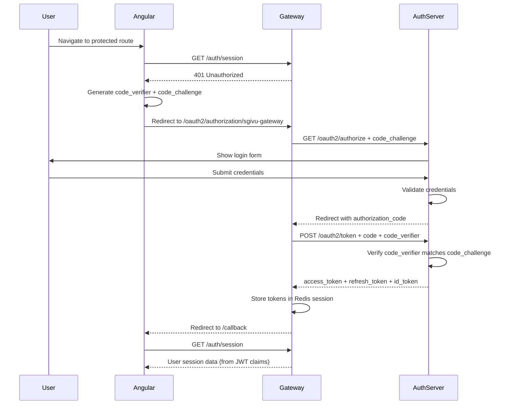

## Descripción general

SGIVU implementa **OAuth2.1** con **OpenID Connect (OIDC)** para autenticación y autorización. El servicio `sgivu-auth` actúa como Authorization Server, emitiendo tokens JWT que son validados por todos los microservicios.

<Note>
El servidor de autorización usa Spring Authorization Server con cumplimiento completo de OIDC, incluyendo soporte para el flujo Authorization Code con PKCE (Proof Key for Code Exchange).
</Note>

## Authorization Server (sgivu-auth)

### Características principales

- **Cumplimiento de estándares**: OAuth2.1 + OIDC certificado
- **Formato de tokens**: JWT firmado con RSA (keystore JKS)
- **Tipos de concesión**: Authorization Code, Refresh Token
- **Autenticación de clientes**: CLIENT_SECRET_BASIC
- **PKCE**: Requerido para todos los clientes (seguridad mejorada)
- **Almacenamiento de sesiones**: PostgreSQL (sesiones JDBC)

### Endpoints OIDC

| Endpoint | Propósito |
|----------|----------|
| `/.well-known/openid-configuration` | Metadatos de descubrimiento OIDC |
| `/oauth2/authorize` | Endpoint de autorización (inicia el login) |
| `/oauth2/token` | Endpoint de tokens (intercambia código por tokens) |
| `/oauth2/jwks` | JSON Web Key Set (claves públicas para verificación JWT) |
| `/oauth2/introspect` | Introspección de tokens |
| `/oauth2/revoke` | Revocación de tokens |
| `/login` | Página de login (autenticación basada en formulario) |

### Clientes registrados

El servidor de autorización registra clientes OAuth2 al iniciar mediante `ClientRegistrationRunner`:

#### 1. sgivu-gateway (Cliente de producción)

```java
RegisteredClient.builder()
  .clientId("sgivu-gateway")
  .clientSecret(passwordEncoder.encode(gatewayClientProperties.getSecret()))
  .clientAuthenticationMethod(ClientAuthenticationMethod.CLIENT_SECRET_BASIC)
  .authorizationGrantType(AuthorizationGrantType.AUTHORIZATION_CODE)
  .authorizationGrantType(AuthorizationGrantType.REFRESH_TOKEN)
  .redirectUri(gatewayUrl + "/login/oauth2/code/sgivu-gateway")
  .postLogoutRedirectUri(angularUrl + "/login")
  .scope(OidcScopes.OPENID)
  .scope("offline_access") // Enables refresh tokens
  .scope("api")
  .tokenSettings(tokenSettings())
  .clientSettings(ClientSettings.builder()
    .requireAuthorizationConsent(true)
    .requireProofKey(true) // PKCE required
    .build())
  .build();
```

**Configuración de tokens:**
- TTL del Access Token: **30 minutos**
- TTL del Refresh Token: **30 días**
- Reutilización del Refresh Token: **Deshabilitada** (rotación habilitada)

#### 2. postman-client y oauth2-debugger-client

Clientes de desarrollo y pruebas con configuración similar para las herramientas Postman y OAuth2 Debugger.

<Warning>
Los secretos de cliente por defecto (`postman-secret`, `oauth2-debugger-secret`) **NO** son seguros para producción. Estos clientes deben deshabilitarse o reconfigurarse en entornos de producción.
</Warning>

## Flujo Authorization Code con PKCE

SGIVU utiliza el flujo **Authorization Code con PKCE** para todos los clientes OAuth2:



### Protección PKCE

PKCE (RFC 7636) protege contra ataques de interceptación del Authorization Code:

1. **Code Verifier**: Cadena aleatoria de 43-128 caracteres generada por el cliente
2. **Code Challenge**: Hash SHA-256 del code_verifier
3. **Flujo**: El challenge se envía con `/authorize`, el verifier se envía con `/token`
4. **Verificación**: El servidor de autorización valida que `SHA256(code_verifier) == code_challenge`

El Gateway maneja automáticamente PKCE mediante `OAuth2AuthorizationRequestCustomizers.withPkce()`:

```java
@Bean
ServerOAuth2AuthorizationRequestResolver authorizationRequestResolver(
    ReactiveClientRegistrationRepository clientRegistrationRepository) {
  DefaultServerOAuth2AuthorizationRequestResolver resolver =
      new DefaultServerOAuth2AuthorizationRequestResolver(clientRegistrationRepository);
  resolver.setAuthorizationRequestCustomizer(OAuth2AuthorizationRequestCustomizers.withPkce());
  return resolver;
}
```

## Estructura del token JWT

### Claims del Access Token

El servidor de autorización emite JWTs con claims personalizados mediante `OAuth2TokenCustomizer`:

```json
{
  "sub": "12345",
  "username": "john.doe",
  "rolesAndPermissions": [
    "ROLE_ADMIN",
    "user:read",
    "user:write",
    "vehicle:read"
  ],
  "isAdmin": true,
  "iss": "http://localhost:9000",
  "aud": "sgivu-gateway",
  "exp": 1234567890,
  "iat": 1234567800
}
```

**Claims principales:**
- `sub`: ID del usuario (¡no el nombre de usuario!)
- `username`: Nombre de usuario para login
- `rolesAndPermissions`: Roles (con prefijo `ROLE_`) y permisos combinados
- `isAdmin`: Flag booleano para detección del rol administrador

### Claims del ID Token

El ID Token de OIDC incluye:

```json
{
  "sub": "12345",
  "userId": 12345,
  "iss": "http://localhost:9000",
  "aud": "sgivu-gateway",
  "exp": 1234567890,  // 30 days (matches refresh token TTL)
  "iat": 1234567800
}
```

<Info>
El ID Token tiene un **TTL de 30 días** (igual que el Refresh Token) porque se usa como `id_token_hint` durante el OIDC RP-Initiated Logout. Spring Security nunca refresca el ID Token, por lo que debe permanecer válido durante toda la vida útil de la sesión.
</Info>

## Firma y validación de tokens

### Configuración del keystore

El servidor de autorización firma los JWTs con un par de claves RSA almacenado en un keystore JKS:

```yaml
sgivu:
  jwt:
    keystore:
      location: classpath:keystore.jks
      password: ${KEYSTORE_PASSWORD}
    key:
      alias: sgivu-jwt-key
      password: ${KEY_PASSWORD}
```

**Seguridad:**
- El keystore **NO debe** subirse a Git (requiere entrada en `.gitignore`)
- En producción, cargarlo desde un gestor de secretos (AWS Secrets Manager, HashiCorp Vault)
- Rotar las claves periódicamente usando el claim `kid` (key ID)

### Descubrimiento de clave pública

Los microservicios validan los JWTs obteniendo la clave pública desde el Endpoint JWKS:

```java
@Bean
JwtDecoder jwtDecoder() {
  return NimbusJwtDecoder.withIssuerLocation(
      servicesProperties.getMap().get("sgivu-auth").getUrl())
    .build();
}
```

Esto automáticamente:
1. Obtiene `/.well-known/openid-configuration`
2. Recupera el JWKS desde `/oauth2/jwks`
3. Valida la firma del JWT usando la clave pública
4. Verifica los claims `iss` (emisor) y `exp` (expiración)

## Scopes y consentimiento

### Scopes estándar

- `openid`: Requerido para OIDC (activa la emisión del ID Token)
- `profile`: Claims del perfil de usuario
- `email`: Claim de correo electrónico
- `offline_access`: Habilita la emisión de Refresh Tokens
- `api`: Acceso general a la API

### Consentimiento de autorización

Todos los clientes requieren consentimiento del usuario (`requireAuthorizationConsent: true`):

- Los usuarios ven una pantalla de consentimiento listando los scopes solicitados
- El consentimiento se almacena en la tabla `authorization_consents` (PostgreSQL)
- Los logins posteriores omiten el consentimiento si ya fue otorgado previamente

## Gestión de sesiones

El servidor de autorización usa **Spring Session JDBC** para persistir sesiones:

- **Tabla**: `SPRING_SESSION` (PostgreSQL)
- **Nombre de cookie**: `AUTH_SESSION`
- **Configuración de cookie**: `HttpOnly=true`, `SameSite=Lax`, `Secure=false` (usar `true` en producción con HTTPS)
- **Sesiones máximas**: 5 sesiones concurrentes por usuario

```java
@Bean
CookieSerializer cookieSerializer() {
  DefaultCookieSerializer serializer = new DefaultCookieSerializer();
  serializer.setCookieName("AUTH_SESSION");
  serializer.setCookiePath("/");
  serializer.setSameSite("Lax");
  serializer.setUseHttpOnlyCookie(true);
  serializer.setUseSecureCookie(false); // Set true in production
  return serializer;
}
```

## Revocación de tokens

El Gateway revoca tokens durante el logout mediante `TokenRevocationServerLogoutHandler`:

```java
@Bean
ServerLogoutHandler tokenRevocationLogoutHandler(
    ServerOAuth2AuthorizedClientRepository authorizedClientRepository) {
  return new TokenRevocationServerLogoutHandler(authorizedClientRepository);
}
```

Esto envía una solicitud de revocación a `/oauth2/revoke` antes de limpiar la sesión.

## Flujo de Refresh Token

El Gateway refresca automáticamente los Access Tokens expirados usando el Refresh Token almacenado en la sesión de Redis. Consulta [JWT Tokens](/security/jwt-tokens#token-refresh) para más detalles.

## Consideraciones para producción

### URL del emisor (Issuer)

Establece la variable de entorno `ISSUER_URL` para que coincida con la URL pública:

```yaml
sgivu:
  issuer:
    url: https://api.example.com  # Must match actual hostname
```

**Por qué es importante:**
- El claim `iss` del JWT debe coincidir con la URL del emisor
- Los metadatos de descubrimiento OIDC incluyen esta URL
- Las discrepancias causan fallos en la validación de tokens

### HTTPS y cookies seguras

En producción:
- Habilitar el flag `Secure` en las cookies (`setUseSecureCookie(true)`)
- Usar HTTPS para todos los Endpoints OAuth2
- Configurar CORS para permitir solo orígenes de confianza

### Gestión de secretos de clientes

- Almacenar los secretos de cliente en variables de entorno o gestores de secretos
- Usar secretos fuertes generados aleatoriamente (no `gateway-client.secret`)
- Rotar los secretos periódicamente

## Documentación relacionada

- [Patrón BFF](/security/bff-pattern) - Cómo el Gateway gestiona tokens para Angular
- [JWT Tokens](/security/jwt-tokens) - Estructura y validación de JWT
- [Comunicación entre servicios](/security/service-communication) - Autenticación interna entre servicios
