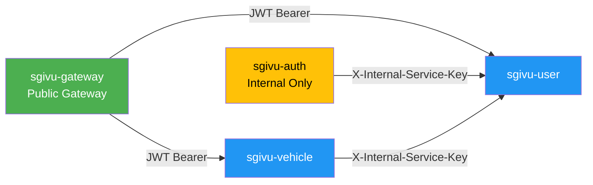

## Descripción General

Los microservicios de SGIVU soportan **dos mecanismos de autenticación**:

1. **JWT Tokens** (desde el Gateway/usuarios) - Autenticación estándar OAuth2 Bearer
2. **Internal Service Keys** (servicio a servicio) - Secreto compartido para llamadas internas

Este documento cubre el patrón de **autenticación interna entre servicios** usando el header `X-Internal-Service-Key`.

<Note>
Las internal service keys se utilizan para la **comunicación servidor a servidor** dentro de la red privada. Evitan los flujos OAuth2 para mejorar el rendimiento y simplificar la lógica cuando un microservicio necesita llamar a otro.
</Note>

## ¿Por qué Internal Service Keys?

### Problemas con autenticación solo por JWT

Si todas las llamadas internas requirieran JWT de usuario:

- **Problema del huevo y la gallina**: El servicio Auth necesita llamar al servicio User para validar credenciales, pero el servicio User requiere un JWT emitido por Auth
- **Sobrecarga de rendimiento**: Obtener JWT a nivel de servicio agrega latencia
- **Expiración de tokens**: Los servicios necesitan lógica de refresh token para operaciones de larga duración
- **Complejidad**: El flujo client credentials de OAuth2 añade complejidad innecesaria para llamadas internas

### Beneficios de Internal Service Keys

✅ **Simple**: Un solo secreto compartido por servicio  
✅ **Rápido**: Sin intercambio de tokens, solo validación de header  
✅ **Sin estado**: No hay expiración de tokens que gestionar  
✅ **Aislado en red**: Solo accesible dentro de la red privada  
✅ **Flexible**: Funciona para tareas en segundo plano, tareas programadas y manejadores de eventos  

<Warning>
**Supuesto de seguridad:** Las internal service keys dependen del **aislamiento a nivel de red**. Los servicios **NO** deben estar expuestos a internet público. Use AWS VPC, políticas de red de Kubernetes u otro mecanismo de aislamiento equivalente.
</Warning>

## Implementación

### Arquitectura



**Ejemplo:** El servicio `sgivu-auth` llama a `sgivu-user` para validar credenciales durante el login:

```http
POST /api/validate-credentials HTTP/1.1
Host: sgivu-user:8081
X-Internal-Service-Key: internal-secret-key-value
Content-Type: application/json

{
  "username": "john.doe",
  "password": "hashedPassword"
}
```

### Implementación del Filtro

Cada microservicio implementa un `InternalServiceAuthenticationFilter` que se ejecuta **antes** del filtro de autenticación JWT:

```java
@Component
public class InternalServiceAuthenticationFilter extends OncePerRequestFilter {
  
  private static final String INTERNAL_KEY_HEADER = "X-Internal-Service-Key";
  
  private final String internalServiceKey;
  private final List<SimpleGrantedAuthority> internalAuthorities = List.of(
    new SimpleGrantedAuthority("car:read"),
    new SimpleGrantedAuthority("car:create"),
    new SimpleGrantedAuthority("car:update"),
    new SimpleGrantedAuthority("car:delete"),
    new SimpleGrantedAuthority("motorcycle:read"),
    new SimpleGrantedAuthority("motorcycle:create"),
    new SimpleGrantedAuthority("motorcycle:update"),
    new SimpleGrantedAuthority("motorcycle:delete"),
    new SimpleGrantedAuthority("vehicle:read"),
    new SimpleGrantedAuthority("vehicle:create"),
    new SimpleGrantedAuthority("vehicle:delete")
  );
  
  public InternalServiceAuthenticationFilter(
      @Value("${service.internal.secret-key}") String internalServiceKey) {
    this.internalServiceKey = internalServiceKey;
  }
  
  @Override
  protected void doFilterInternal(
      HttpServletRequest request, 
      HttpServletResponse response, 
      FilterChain filterChain) throws ServletException, IOException {
    
    if (shouldAuthenticate(request)) {
      UsernamePasswordAuthenticationToken authentication =
        new UsernamePasswordAuthenticationToken(
          "internal-service",  // Principal
          null,                // Credentials
          internalAuthorities  // Authorities
        );
      authentication.setDetails(
        new WebAuthenticationDetailsSource().buildDetails(request)
      );
      SecurityContextHolder.getContext().setAuthentication(authentication);
    }
    
    filterChain.doFilter(request, response);
  }
  
  private boolean shouldAuthenticate(HttpServletRequest request) {
    // Skip if already authenticated (JWT took precedence)
    if (SecurityContextHolder.getContext().getAuthentication() != null) {
      return false;
    }
    
    String providedKey = request.getHeader(INTERNAL_KEY_HEADER);
    return internalServiceKey.equals(providedKey);
  }
}
```

**Puntos clave:**

1. **Verifica autenticación existente**: Si el JWT ya fue validado, omite la verificación de la internal key
2. **Comparación en tiempo constante**: Usar `equals()` para resistencia a ataques de temporización (o `MessageDigest.isEqual()` para mayor seguridad)
3. **Authorities fijos**: Todas las llamadas internas obtienen los mismos permisos (CRUD completo)
4. **Nombre del principal**: `"internal-service"` identifica las llamadas internas en los logs

### Configuración de Seguridad

El filtro se agrega **antes** del filtro de autenticación JWT:

```java
@Configuration
@EnableWebSecurity
@EnableMethodSecurity
public class SecurityConfig {
  
  private final InternalServiceAuthenticationFilter internalServiceAuthenticationFilter;
  
  @Bean
  SecurityFilterChain securityFilterChain(HttpSecurity http) throws Exception {
    http
      .oauth2ResourceServer(oauth2 -> oauth2.jwt(...))
      .authorizeHttpRequests(authz -> authz
        .requestMatchers("/v1/cars/**", "/v1/motorcycles/**")
        .access(internalOrAuthenticatedAuthorizationManager())
        .anyRequest().authenticated()
      )
      .csrf(AbstractHttpConfigurer::disable)
      .addFilterBefore(
        internalServiceAuthenticationFilter, 
        BearerTokenAuthenticationFilter.class  // Run before JWT validation
      );
    
    return http.build();
  }
  
  @Bean
  AuthorizationManager<RequestAuthorizationContext> internalOrAuthenticatedAuthorizationManager() {
    AuthorizationManager<RequestAuthorizationContext> authenticatedManager =
      (authenticationSupplier, context) -> {
        Authentication authentication = authenticationSupplier.get();
        boolean isAuthenticated = authentication != null 
          && authentication.isAuthenticated() 
          && !(authentication instanceof AnonymousAuthenticationToken);
        return new AuthorizationDecision(isAuthenticated);
      };
    
    return AuthorizationManagers.anyOf(
      internalServiceAuthManager,  // Check internal key
      authenticatedManager         // OR check JWT
    );
  }
}
```

**Lógica de autorización:**

- **`anyOf`**: La petición se permite si **cualquiera** de las dos condiciones se cumple: la internal key es válida **O** el JWT es válido
- **Orden de filtros**: El filtro interno se ejecuta primero, el filtro JWT se ejecuta segundo
- **Cortocircuito**: Si la internal key coincide, se omite la validación JWT

### Authorization Manager

El `InternalServiceAuthorizationManager` verifica si la autenticación actual proviene de un servicio interno:

```java
@Component
public class InternalServiceAuthorizationManager 
    implements AuthorizationManager<RequestAuthorizationContext> {
  
  @Override
  public AuthorizationDecision check(
      Supplier<Authentication> authentication, 
      RequestAuthorizationContext context) {
    
    Authentication auth = authentication.get();
    
    if (auth == null || !auth.isAuthenticated()) {
      return new AuthorizationDecision(false);
    }
    
    // Check if principal is "internal-service"
    boolean isInternal = "internal-service".equals(auth.getName());
    return new AuthorizationDecision(isInternal);
  }
}
```

## Configuración

### Variables de Entorno

**Cada microservicio:**

```bash
# Shared secret for internal service authentication
SERVICE_INTERNAL_SECRET_KEY=your-strong-random-secret-here
```

<Warning>
**Todos los microservicios deben usar la MISMA clave secreta.** Si las claves no coinciden, las llamadas internas fallarán con 401/403.
</Warning>

**YAML de aplicación:**

```yaml
service:
  internal:
    secret-key: ${SERVICE_INTERNAL_SECRET_KEY}
```

### Generación de una Clave Segura

Use una cadena aleatoria criptográficamente segura:

```bash
# Generate 32-byte (256-bit) random key
openssl rand -base64 32

# Or use UUID (128-bit)
uuidgen
```

**Ejemplo:**
```
SERVICE_INTERNAL_SECRET_KEY=8x9Y2mP4kL7qR3nV5wT1bN6jH0sF8dG9
```

## Casos de Uso

### 1. Auth Service → User Service (Validación de Credenciales)

**Escenario:** Durante el login, `sgivu-auth` necesita validar las credenciales del usuario.

**Llamada desde el servicio Auth:**

```java
@Service
public class CredentialsValidationService {
  
  private final WebClient webClient;
  
  @Value("${service.internal.secret-key}")
  private String internalServiceKey;
  
  public Mono<CredentialsValidationResponse> validateCredentials(
      String username, String password) {
    
    return webClient.post()
      .uri(userServiceUrl + "/api/validate-credentials")
      .header("X-Internal-Service-Key", internalServiceKey)
      .bodyValue(new CredentialsValidationRequest(username, password))
      .retrieve()
      .bodyToMono(CredentialsValidationResponse.class);
  }
}
```

**Endpoint en el servicio User:**

```java
@RestController
public class CredentialsValidationController {
  
  @PostMapping("/api/validate-credentials")
  public CredentialsValidationResponse validate(
      @RequestBody CredentialsValidationRequest request) {
    
    // This endpoint is protected by InternalServiceAuthenticationFilter
    User user = userRepository.findByUsername(request.username())
      .orElseThrow(() -> new UsernameNotFoundException("User not found"));
    
    boolean matches = passwordEncoder.matches(
      request.password(), 
      user.getPassword()
    );
    
    if (!matches) {
      throw new BadCredentialsException("Invalid password");
    }
    
    return new CredentialsValidationResponse(
      user.getId(),
      user.getUsername(),
      user.getRoles(),
      user.getPermissions()
    );
  }
}
```

### 2. Vehicle Service → User Service (Verificación de Permisos)

**Escenario:** El servicio de vehículos necesita verificar si un usuario tiene permisos para realizar una acción.

```java
@Service
public class VehicleService {
  
  @Value("${service.internal.secret-key}")
  private String internalServiceKey;
  
  public void deleteVehicle(Long vehicleId, Long userId) {
    // Check if user has delete permission
    UserPermissionsResponse permissions = webClient.get()
      .uri(userServiceUrl + "/api/users/" + userId + "/permissions")
      .header("X-Internal-Service-Key", internalServiceKey)
      .retrieve()
      .bodyToMono(UserPermissionsResponse.class)
      .block();
    
    if (!permissions.hasPermission("vehicle:delete")) {
      throw new AccessDeniedException("User lacks vehicle:delete permission");
    }
    
    vehicleRepository.deleteById(vehicleId);
  }
}
```

### 3. Tareas en Segundo Plano

**Escenario:** Una tarea programada necesita llamar a microservicios sin un contexto de usuario.

```java
@Scheduled(cron = "0 0 2 * * *")  // Daily at 2 AM
public void cleanupExpiredVehicles() {
  webClient.delete()
    .uri(vehicleServiceUrl + "/api/vehicles/expired")
    .header("X-Internal-Service-Key", internalServiceKey)
    .retrieve()
    .bodyToMono(Void.class)
    .block();
}
```

## Consideraciones de Seguridad

### Aislamiento de Red

<Warning>
**Crítico:** Los endpoints internos **NO DEBEN** estar expuestos a internet público.
</Warning>

**Despliegue en AWS:**
```
┌─────────────────────────────────────┐
│  Public Subnet (DMZ)                │
│  - ALB (HTTPS only)                 │
│  - Nginx (reverse proxy)            │
│    └──> Routes to Gateway only      │
└─────────────────────────────────────┘
              │
              ▼
┌─────────────────────────────────────┐
│  Private Subnet                     │
│  - sgivu-gateway (public routes)    │
│  - sgivu-auth (internal only)       │
│  - sgivu-user (internal only)       │
│  - sgivu-vehicle (internal only)    │
│    └──> All accessible via          │
│         X-Internal-Service-Key      │
└─────────────────────────────────────┘
```

**Kubernetes NetworkPolicies:**

```yaml
apiVersion: networking.k8s.io/v1
kind: NetworkPolicy
metadata:
  name: allow-internal-only
spec:
  podSelector:
    matchLabels:
      app: sgivu-user
  policyTypes:
  - Ingress
  ingress:
  - from:
    - podSelector:
        matchLabels:
          app: sgivu-auth
    - podSelector:
        matchLabels:
          app: sgivu-vehicle
    - podSelector:
        matchLabels:
          app: sgivu-gateway
```

### Gestión de Secretos

**Desarrollo:**
```bash
# .env file (never commit)
SERVICE_INTERNAL_SECRET_KEY=dev-secret-key-12345
```

**Producción:**

- **AWS Secrets Manager**: Obtener el secreto al iniciar el servicio
- **HashiCorp Vault**: Secretos dinámicos con rotación
- **Kubernetes Secrets**: Inyectar como variable de entorno

**Ejemplo (AWS Secrets Manager):**

```java
@Configuration
public class SecretsConfig {
  
  @Bean
  public String internalServiceKey(SecretsManagerClient secretsClient) {
    GetSecretValueRequest request = GetSecretValueRequest.builder()
      .secretId("sgivu/internal-service-key")
      .build();
    
    GetSecretValueResponse response = secretsClient.getSecretValue(request);
    return response.secretString();
  }
}
```

### Rotación de Claves

**Proceso de rotación sin tiempo de inactividad:**

1. **Agregar nueva clave**: Actualizar el gestor de secretos con `NEW_SERVICE_INTERNAL_SECRET_KEY`
2. **Actualizar servicios**: Desplegar servicios con soporte de doble clave:
   ```java
   private boolean isValidKey(String providedKey) {
     return internalServiceKey.equals(providedKey) 
         || newInternalServiceKey.equals(providedKey);
   }
   ```
3. **Actualizar llamadores**: Desplegar los servicios que realizan llamadas con la nueva clave
4. **Eliminar clave antigua**: Después de que todos los servicios usen la nueva clave, eliminar el soporte de la clave antigua

**Frecuencia de rotación:** Cada 90 días (o cuando se comprometa)

### Rate Limiting

Agregar rate limiting a los endpoints internos para prevenir abusos:

```java
@Component
public class InternalServiceRateLimitFilter extends OncePerRequestFilter {
  
  private final RateLimiter rateLimiter = RateLimiter.create(100.0); // 100 req/sec
  
  @Override
  protected void doFilterInternal(...) {
    if ("internal-service".equals(authentication.getName())) {
      if (!rateLimiter.tryAcquire()) {
        response.setStatus(HttpStatus.TOO_MANY_REQUESTS.value());
        return;
      }
    }
    filterChain.doFilter(request, response);
  }
}
```

### Logging y Monitorización

Registrar todas las llamadas de servicios internos para auditoría:

```java
private boolean shouldAuthenticate(HttpServletRequest request) {
  String providedKey = request.getHeader(INTERNAL_KEY_HEADER);
  boolean isValid = internalServiceKey.equals(providedKey);
  
  if (providedKey != null) {
    if (isValid) {
      log.info("Internal service authenticated [path={}, ip={}]",
        request.getRequestURI(),
        request.getRemoteAddr());
    } else {
      log.warn("Invalid internal service key [path={}, ip={}]",
        request.getRequestURI(),
        request.getRemoteAddr());
    }
  }
  
  return isValid;
}
```

**Métricas de CloudWatch/Prometheus:**
```
internal_service_requests_total{service="sgivu-user",status="success"} 1523
internal_service_requests_total{service="sgivu-user",status="invalid_key"} 3
```

## Comparación: Internal Key vs JWT

| Aspecto | Internal Service Key | JWT Bearer Token |
|---------|---------------------|------------------|
| **Caso de uso** | Servicio a servicio (interno) | Usuario a servicio (externo) |
| **Red** | Solo red privada | Puede atravesar red pública |
| **Expiración** | Sin expiración (rotación manual) | 30 minutos (auto-refresh) |
| **Permisos** | Fijos (CRUD completo) | Específicos por usuario (claims) |
| **Rendimiento** | Rápido (comparación simple de cadenas) | Más lento (validación criptográfica) |
| **Auditoría** | Solo identidad del servicio | Identidad de usuario + servicio |
| **Revocación** | Rotar clave (impacta todos los servicios) | Revocar token individual |

**Cuándo usar cada uno:**

- **Internal Key**: `sgivu-auth` → `sgivu-user`, tareas en segundo plano, tareas programadas
- **JWT**: Gateway → microservicios (peticiones de usuario), llamadas a APIs externas

## Alternativa: Mutual TLS (mTLS)

Para **arquitecturas zero-trust**, considere reemplazar las internal keys con **mTLS**:

**Beneficios:**
- Identidad criptográfica del servicio (certificados de cliente)
- Seguridad a nivel de red (TLS 1.3)
- Rotación automática de claves (expiración de certificados)

**Desventajas:**
- Gestión compleja de certificados (CA, CRLs)
- Mayor carga operativa
- Requiere service mesh de Kubernetes/Istio o distribución manual de certificados

**Cuándo usar mTLS:**
- Entornos multi-tenant
- Requisitos de cumplimiento (PCI-DSS, HIPAA)
- Servicios en diferentes VPCs/clusters

## Documentación Relacionada

- [OAuth2 & OIDC](/security/oauth2-oidc) - Flujos de autenticación externa
- [JWT Tokens](/security/jwt-tokens) - Autenticación de usuarios con JWT
- [Patrón BFF](/security/bff-pattern) - Cómo el Gateway gestiona las sesiones de usuario
